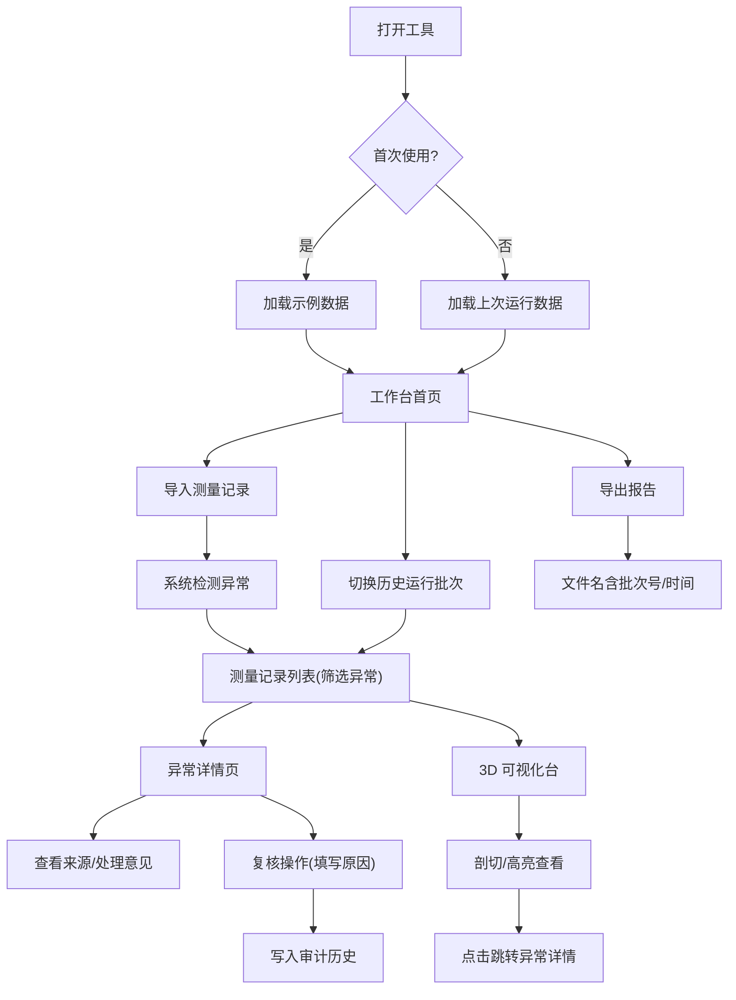

## 1. 产品概述

船舱货物配载 3D 台是面向水利工程师的专业货物配载复核工具，解决评审会中时间轴不同步导致数据不一致、异常追溯困难的问题。以测量记录为主线，实现导入筛选、异常追溯、3D 可视化与剖切分析、报告导出的全链路统一数据驱动。

## 2. 核心功能

### 2.1 用户角色

| 角色 | 说明 | 核心权限 |
|------|------|----------|
| 水利工程师 | 主要使用者，负责配载复核 | 导入数据、查看异常、3D 剖切、复核操作、导出报告 |
| 评审人员 | 验收追溯使用 | 查看异常详情、追溯测量记录与处理意见、查看历史审计 |

### 2.2 功能模块

1. **工作台首页**：数据概览、运行批次选择、快速导入、异常统计卡片
2. **测量记录列表**：导入数据、异常筛选过滤、列表展示、跳转详情
3. **异常详情页**：异常信息、测量记录来源、处理意见、完整追溯链路
4. **3D 可视化台**：船舱 3D 渲染、货物配载展示、剖切平面控制、异常货物高亮
5. **历史审计**：操作时间线、复核记录、修改人/时间/原因查询
6. **报告导出**：按运行批次区分文件名与内容，包含异常清单与处理意见

### 2.3 页面详情

| 页面名称 | 模块名称 | 功能描述 |
|----------|----------|----------|
| 工作台首页 | 运行批次切换 | 下拉选择历史运行批次，区分当前与历史数据 |
| 工作台首页 | 数据导入区 | 支持 CSV/Excel 导入测量记录，首次打开自动加载示例数据 |
| 工作台首页 | 异常统计卡片 | 按异常类型分类统计数量，点击跳转到筛选后的列表 |
| 测量记录列表 | 筛选栏 | 按异常类型、时间轴状态、船舱编号、货物编号多条件筛选 |
| 测量记录列表 | 数据表格 | 展示测量记录核心字段，异常行高亮标识 |
| 异常详情页 | 异常基本信息 | 异常类型、严重等级、关联货物、检出时间 |
| 异常详情页 | 测量记录来源 | 原始测量数据、采集设备、采集时间、原始报文快照 |
| 异常详情页 | 处理意见区 | 处理人、处理时间、处理意见、复核状态（待复核/已通过/已驳回） |
| 异常详情页 | 追溯链路 | 从异常→测量记录→处理意见的可视化时间线 |
| 3D 可视化台 | 船舱渲染 | 基于测量数据渲染 3D 船舱与货物布局 |
| 3D 可视化台 | 剖切控制 | X/Y/Z 轴剖切平面滑块，实时查看内部配载 |
| 3D 可视化台 | 异常高亮 | 异常货物红色高亮，点击跳转异常详情 |
| 3D 可视化台 | 时间轴同步 | 与列表、详情共用同一批处理记录，切换批次 3D 同步刷新 |
| 历史审计 | 操作时间线 | 按时间倒序展示所有复核、修改操作 |
| 历史审计 | 审计详情 | 操作人、操作时间、修改原因、修改前后数据对比 |
| 报告导出 | 导出配置 | 选择导出范围（全部/仅异常）、格式（PDF/Excel） |
| 报告导出 | 批次命名 | 文件名含运行批次号与导出时间，内容区分本次与上次运行差异 |

## 3. 核心流程

水利工程师打开工具后，系统自动加载示例数据（首次）或上次运行数据。工程师可导入新的测量记录批次，系统自动检测异常并分类展示。在列表中筛选异常后，进入详情页查看测量来源与处理意见。切换至 3D 台查看配载情况与剖切分析，数据与列表保持同步。对时间轴不同步等异常进行复核操作时，需填写修改原因，操作记录进入审计历史。最终导出报告时，文件名与内容自动标记运行批次，便于区分。

## 4. 用户界面设计

### 4.1 设计风格

- **主色调**：深蓝工业色 `#1e3a5f`（专业感、水利行业色），辅以警示橙 `#f59e0b`（异常标识）
- **中性色**：锌灰 zinc 系列，保持工程工具的沉稳感
- **按钮风格**：方角微圆角 (2px)，实线边框，工业风
- **字体**：标题使用思源黑体 SemiBold，正文使用 JetBrains Mono（工程数据等宽对齐）
- **布局**：左侧导航 + 顶部状态栏 + 主内容区，三栏式专业工具布局
- **图标**：Lucide 线性图标，工程感线条风格

### 4.2 页面设计概览

| 页面名称 | 模块名称 | UI 元素 |
|----------|----------|---------|
| 工作台首页 | 顶部状态栏 | 运行批次下拉、当前用户、导出按钮、深色背景 |
| 工作台首页 | 异常统计卡片 | 4 张卡片网格，异常类型+数量，hover 微上浮 |
| 工作台首页 | 导入区 | 拖拽上传框，虚线边框，示例数据提示 |
| 测量记录列表 | 筛选栏 | 紧凑多条件筛选，标签式异常类型选择 |
| 测量记录列表 | 数据表格 | 斑马纹行、异常行橙底红字、固定表头 |
| 异常详情页 | 主内容 | 两栏布局：左侧异常信息与来源，右侧处理意见与时间线 |
| 异常详情页 | 追溯时间线 | 垂直时间轴，节点标注状态与操作人 |
| 3D 可视化台 | 主视区 | 全幅 Canvas，顶部工具条（剖切控制、视角重置） |
| 3D 可视化台 | 右侧面板 | 异常货物列表，可勾选高亮 |
| 历史审计 | 列表 | 操作时间线列表，展开查看修改前后对比 |

### 4.3 响应性

- 桌面端优先（水利工程师在大屏工作站使用）
- 最小支持宽度 1280px
- 3D 画布区域自适应，保持 16:9 比例

### 4.4 3D 场景指导

- **环境**：暗调工业室内光照，冷色主光 + 暖色补光，模拟船舱检查环境
- **光照设置**：AmbientLight(0.4) + DirectionalLight(0x88aaff, 0.8) + PointLight(0xffaa44, 0.5)
- **相机**：PerspectiveCamera，初始 45° 俯视角，支持 OrbitControls 环绕
- **交互**：货物 hover 高亮，click 选中，剖切平面实时裁剪
- **后处理**：轻微 Bloom 效果，SSAO 增加体积感
