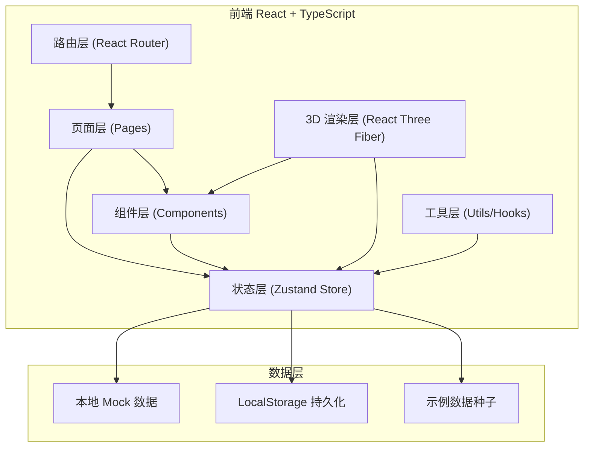
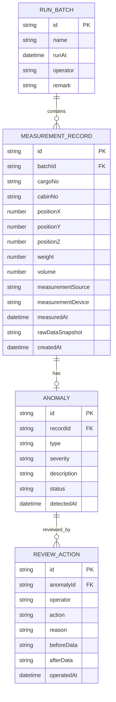

## 1. 架构设计



## 2. 技术描述

- **前端**：React@18 + TypeScript + Vite + TailwindCSS@3
- **状态管理**：Zustand（集中管理批次数据、测量记录、异常、3D 剖切状态，确保数据唯一数据源）
- **3D 渲染**：three + @react-three/fiber + @react-three/drei + @react-three/postprocessing
- **路由**：react-router-dom
- **图标**：lucide-react
- **数据持久化**：LocalStorage（存储运行批次、复核记录、审计历史）
- **导出**：前端生成 CSV/Excel，使用 xlsx 库

## 3. 路由定义

| 路由 | 页面 | 用途 |
|------|------|------|
| / | DashboardPage | 工作台首页：概览、导入、批次切换 |
| /records | RecordsPage | 测量记录列表：筛选、展示、跳转详情 |
| /records/:id | RecordDetailPage | 异常详情：来源、处理意见、追溯链路 |
| /3d | Scene3DPage | 3D 可视化台：渲染、剖切、高亮 |
| /audit | AuditPage | 历史审计：操作时间线、修改记录 |

## 4. 数据模型

### 4.1 数据模型定义



### 4.2 核心数据结构 TypeScript 定义

```typescript
interface RunBatch {
  id: string;
  name: string;
  runAt: string;
  operator: string;
  remark?: string;
}

interface MeasurementRecord {
  id: string;
  batchId: string;
  cargoNo: string;
  cabinNo: string;
  positionX: number;
  positionY: number;
  positionZ: number;
  weight: number;
  volume: number;
  measurementSource: string;
  measurementDevice: string;
  measuredAt: string;
  rawDataSnapshot: string;
  createdAt: string;
}

interface Anomaly {
  id: string;
  recordId: string;
  type: 'TIMESTAMP_MISMATCH' | 'WEIGHT_OVERLOAD' | 'POSITION_OUTLIER' | 'VOLUME_MISMATCH';
  severity: 'CRITICAL' | 'WARNING' | 'INFO';
  description: string;
  status: 'PENDING' | 'APPROVED' | 'REJECTED';
  detectedAt: string;
}

interface ReviewAction {
  id: string;
  anomalyId: string;
  operator: string;
  action: 'APPROVE' | 'REJECT' | 'MODIFY';
  reason: string;
  beforeData?: string;
  afterData?: string;
  operatedAt: string;
}

interface CutPlaneState {
  x: number | null;
  y: number | null;
  z: number | null;
}
```

## 5. Zustand Store 设计

```typescript
interface AppState {
  // 运行批次
  batches: RunBatch[];
  currentBatchId: string | null;
  
  // 测量记录与异常
  records: MeasurementRecord[];
  anomalies: Anomaly[];
  
  // 审计记录
  reviewActions: ReviewAction[];
  
  // 3D 状态（与列表共用数据）
  cutPlanes: CutPlaneState;
  selectedRecordId: string | null;
  
  // Actions
  setCurrentBatch: (id: string) => void;
  importRecords: (batchName: string, records: MeasurementRecord[]) => void;
  loadSampleData: () => void;
  reviewAnomaly: (anomalyId: string, action: 'APPROVE' | 'REJECT', reason: string, operator: string) => void;
  setCutPlane: (axis: 'x' | 'y' | 'z', value: number | null) => void;
  setSelectedRecord: (id: string | null) => void;
  exportReport: (options: { onlyAnomalies: boolean; format: 'xlsx' | 'csv' }) => Blob;
}
```
