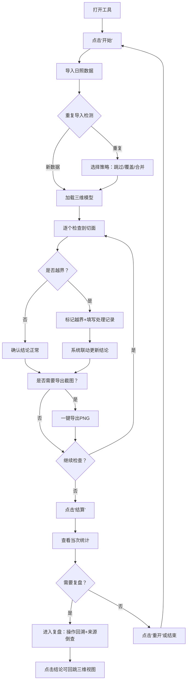

## 1. 产品概述
教学楼日照体块盒是一款面向物理教师的日照分析交互式工具，将繁琐的剖面图核查、剖切面越界处理、同事沟通、截图清单整理等工作转化为浏览器内可操作的游戏化流程。目标用户为需要在巡检复盘前快速交付教学楼日照分析结论的教学人员。

产品核心价值：将"查剖面图→问同事→改截图清单"的反复人工流程，转化为有开始、暂停、重开、结算、复盘的结构化游戏体验，支持三维模型与结论双向追溯，杜绝重复导入导致的数据混乱。

---

## 2. 核心功能

### 2.1 用户角色
| 角色 | 注册方式 | 核心权限 |
|------|---------|---------|
| 物理教师 | 本地工具直接使用 | 导入日照数据、操作剖切面、导出截图、查看复盘记录 |

### 2.2 功能模块
1. **主界面（游戏工作台）**：游戏状态控制栏、三维模型视口、剖切面操作面板、结论联动面板
2. **日照数据导入与去重**：数据导入入口、重复导入检测提示、合并策略选择
3. **剖切面越界处理**：越界记录列表、单条追溯链路、修正操作记录
4. **截图导出中心**：日常快速导出、批量清单导出、与结论联动
5. **复盘模式**：结算统计、操作回溯、来源倒查、结论溯源

### 2.3 页面详情
| 页面名称 | 模块名称 | 功能描述 |
|---------|---------|-----------|
| 主界面 | 游戏控制栏 | 开始/暂停/重开/结算/复盘 五个状态按钮，显示当前回合时长、处理记录数、越界告警数 |
| 主界面 | 三维模型视口 | 渲染教学校园体块模型，可旋转缩放，剖切面以半透明平面显示，越界区域高亮闪烁 |
| 主界面 | 剖切面操作面板 | 选择剖面编号、调整剖切位置、标记越界、输入修正备注、一键跳转到对应结论 |
| 主界面 | 结论联动面板 | 展示当前剖面的日照分析结论，点击可回跳三维视图中对应剖切面位置 |
| 数据导入 | 重复导入检测 | 基于文件名+内容哈希双重校验，重复时展示差异对比，支持"跳过/覆盖/合并备注"三种策略 |
| 越界处理 | 追溯链路 | 单条越界记录的完整链路：来源数据→导入时间→操作人→修正动作→最终结论 |
| 截图导出 | 日常快速导出 | 将当前三维视口+结论面板一键导出为PNG，自动以"日期_楼号_剖面号"命名 |
| 复盘模式 | 结算统计 | 当次处理回合的统计：有效记录数、越界修正数、重复拦截数、导出截图数 |
| 复盘模式 | 操作回溯 | 时间轴形式回放本回合所有操作步骤，支持点击跳转到对应三维状态 |

---

## 3. 核心流程

### 3.1 主工作流程
物理教师打开工具 → 点击"开始"进入回合 → 导入日照体块数据（重复时触发去重检测） → 在三维视图中逐个检查剖切面 → 发现越界时标记并输入处理记录 → 系统联动更新对应结论 → 日常工作中随时导出截图 → 回合结束时点击"结算"查看统计 → 需要时进入"复盘"回溯操作链路 → 从任意结论可回跳三维模型定位。

### 3.2 Mermaid 流程图

---

## 4. 用户界面设计

### 4.1 设计风格
- **主色调**：深空蓝 `#0B1D3A` 为基底，搭配青柠绿 `#7CFFB2` 作为操作强调色，警示橙 `#FF8A3D` 标记越界，冷静蓝 `#5B9DFF` 标记正常结论
- **按钮风格**：圆角胶囊形（16px radius），悬浮时有柔和的光晕扩散动效，按下时轻微内缩
- **字体**：标题使用等宽科技风 `JetBrains Mono`，正文使用人文无衬线 `Noto Sans SC`
- **布局风格**：三栏不对称布局——左栏为游戏控制+剖切面列表，中间大区域为三维视口，右栏为结论面板与处理记录。背景使用深蓝径向渐变 + 细微网格纹理。
- **图标风格**：线性描边图标，2px 线条，端点圆润，颜色与功能语义对应

### 4.2 页面设计概览
| 页面名称 | 模块名称 | UI元素 |
|---------|---------|--------|
| 主界面 | 游戏控制栏 | 5个胶囊按钮（开始/暂停/重开/结算/复盘），状态指示灯，计时器，统计徽标 |
| 主界面 | 三维视口 | 深色背景的 Canvas，体块模型以线框+半透明面混合渲染，剖切面为可拖拽半透明平面，越界区域橙色脉冲高亮 |
| 主界面 | 剖切面列表面板 | 折叠式卡片，每张卡片显示剖面编号、状态徽章（正常/越界）、处理人头像、快捷跳转按钮 |
| 主界面 | 结论联动面板 | 毛玻璃卡片，显示结论文本、生成时间、操作记录摘要，底部有"回跳三维视图"按钮 |
| 数据导入弹窗 | 重复检测提示 | 左右分栏对比新旧数据差异，三选一策略按钮，内容哈希校验码显示 |
| 复盘模式 | 时间轴 | 垂直时间轴，每步操作带时间戳+缩略图，点击高亮对应三维状态 |
| 复盘模式 | 追溯链路 | 横向流程图节点：数据来源→导入→越界标记→处理→结论，每个节点可点击展开详情 |

### 4.3 响应式
桌面端优先（1440px 宽度基准），三栏固定布局。在 1024px 以下自动折叠左右面板为可抽屉式拉出。三维视口始终占据主要可视区域，支持鼠标拖拽旋转、滚轮缩放、触摸双指手势。

### 4.4 3D 场景指导
- **环境/HDRI**：使用深蓝色渐变 + 方向光模拟日照方向，添加淡蓝色雾效营造深度
- **光照设置**：主光源模拟太阳光（暖白色，与水平面成45度角），辅助环境光填充阴影，越界区域叠加自发光橙色材质
- **相机设置**：默认采用 45° 俯视角透视相机，支持轨道控制器自由旋转缩放
- **构图与焦点**：教学楼体块居中，剖切面默认沿 Y 轴方向分布，用户选中的剖切面自动推近到视野中心
- **交互与动画**：选中剖切面时平面轻微上浮+发光增强，越界区域有 2 秒周期的呼吸闪烁动效，点击结论回跳时相机平滑过渡到对应位置
- **后处理效果**：轻微 Bloom 发光效果作用于高亮元素，FXAA 抗锯齿
- **资源来源与性能预算**：体块模型使用程序几何生成（BoxGeometry组合），总顶点数控制在 5000 以内，确保 60fps 流畅运行
