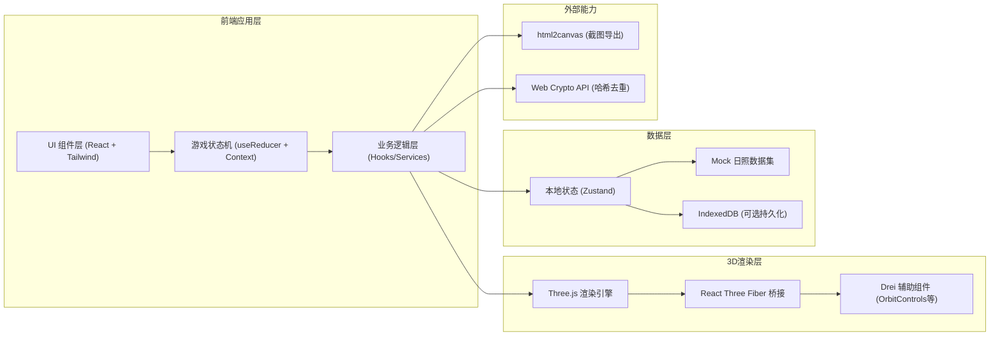
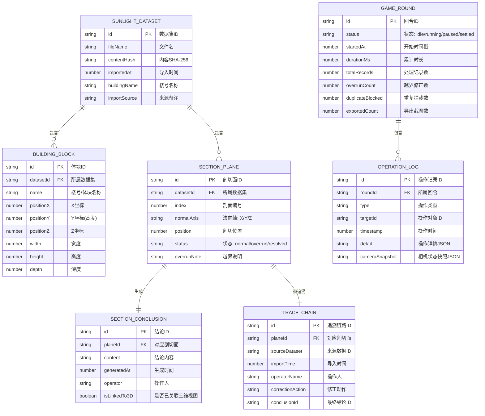

## 1. 架构设计



---

## 2. 技术描述

- **前端框架**: React 18 + TypeScript + Vite 5
- **样式方案**: Tailwind CSS 3 + CSS Variables (深色主题变量)
- **状态管理**: Zustand (全局游戏/数据状态) + React Context (UI主题)
- **3D引擎**: Three.js r160 + @react-three/fiber 8 + @react-three/drei 9
- **后处理**: @react-three/postprocessing (Bloom, FXAA)
- **截图导出**: html2canvas (DOM截图) + three.js Canvas toDataURL (3D视口截图)
- **去重校验**: Web Crypto API SHA-256 + 文件名指纹
- **图标**: lucide-react
- **字体**: Google Fonts - JetBrains Mono + Noto Sans SC
- **后端**: 无后端，纯前端应用 + Mock 数据
- **数据库**: 无服务端数据库，使用 localStorage/IndexedDB 本地持久化

---

## 3. 路由定义

| Route | 用途 |
|-------|------|
| `/` | 主工作台（三维视口+控制面板+结论联动，默认入口） |
| `/review` | 复盘模式（结算统计+操作时间轴+追溯链路） |

> 单页应用两路由切换，支持浏览器前进/后退。

---

## 4. 数据模型

### 4.1 ER 图



### 4.2 TypeScript 类型定义

```typescript
// 游戏状态
type GameStatus = 'idle' | 'running' | 'paused' | 'settled';

interface GameState {
  roundId: string;
  status: GameStatus;
  startedAt: number | null;
  accumulatedMs: number;
  stats: {
    totalRecords: number;
    overrunCount: number;
    duplicateBlocked: number;
    exportedCount: number;
  };
  selectedPlaneId: string | null;
  selectedConclusionId: string | null;
}

// 体块数据
interface BuildingBlock {
  id: string;
  datasetId: string;
  name: string;
  position: [number, number, number];
  size: [number, number, number]; // width, height, depth
}

// 剖切面
type SectionStatus = 'normal' | 'overrun' | 'resolved';
type NormalAxis = 'X' | 'Y' | 'Z';

interface SectionPlane {
  id: string;
  datasetId: string;
  index: number;
  normalAxis: NormalAxis;
  position: number;
  status: SectionStatus;
  overrunNote?: string;
  resolutionNote?: string;
}

// 结论
interface SectionConclusion {
  id: string;
  planeId: string;
  content: string;
  generatedAt: number;
  operator: string;
  isLinkedTo3D: boolean;
}

// 操作日志
interface OperationLog {
  id: string;
  roundId: string;
  type: 'import' | 'select_plane' | 'mark_overrun' | 'resolve_overrun' | 'export_screenshot' | 'link_conclusion';
  targetId: string;
  timestamp: number;
  detail: Record<string, unknown>;
  cameraSnapshot: {
    position: [number, number, number];
    target: [number, number, number];
  };
}

// 追溯链路
interface TraceChain {
  id: string;
  planeId: string;
  sourceDataset: string;
  importTime: number;
  operatorName: string;
  correctionAction: string;
  conclusionId: string;
}

// 导入去重
interface DuplicateCheckResult {
  isDuplicate: boolean;
  existingDataset?: {
    id: string;
    fileName: string;
    importedAt: number;
  };
  diffSummary?: string[];
  contentHash: string;
}
```

### 4.3 Mock 初始数据

```typescript
// 预设一组合肥/教学楼日照体块示例数据
const MOCK_DATASETS: SunlightDataset[] = [
  {
    id: 'ds-001',
    fileName: '教学楼A栋_春季日照.json',
    contentHash: 'a1b2c3d4e5f6',
    importedAt: Date.now() - 86400000,
    buildingName: '教学楼A栋',
    importSource: '同事转发_李老师',
  },
];

const MOCK_BUILDING_BLOCKS: BuildingBlock[] = [
  { id: 'b1', datasetId: 'ds-001', name: '主楼',    position: [0, 0, 0],    size: [30, 15, 20] },
  { id: 'b2', datasetId: 'ds-001', name: '东翼楼',  position: [25, 0, -5],  size: [12, 12, 10] },
  { id: 'b3', datasetId: 'ds-001', name: '西翼楼',  position: [-25, 0, -5], size: [12, 12, 10] },
];

const MOCK_SECTION_PLANES: SectionPlane[] = [
  { id: 'p1', datasetId: 'ds-001', index: 1, normalAxis: 'Y', position: 6,  status: 'normal' },
  { id: 'p2', datasetId: 'ds-001', index: 2, normalAxis: 'Y', position: 12, status: 'overrun', overrunNote: '超出日照间距控制线0.8m' },
  { id: 'p3', datasetId: 'ds-001', index: 3, normalAxis: 'Y', position: 3,  status: 'resolved' },
];
```

---

## 5. 核心模块职责划分

| 模块 | 文件路径 | 职责 |
|-----|---------|------|
| 游戏状态机 | `src/store/gameStore.ts` | 管理开始/暂停/重开/结算/复盘状态，记录回合统计 |
| 数据管理 | `src/store/dataStore.ts` | 管理日照数据集、体块、剖切面、结论、操作日志 |
| 去重服务 | `src/services/dedupService.ts` | 文件名+SHA-256双重校验，重复策略处理 |
| 截图服务 | `src/services/screenshotService.ts` | 三维视口+DOM组合导出PNG |
| 三维场景 | `src/components/scene/SceneCanvas.tsx` | R3F Canvas、相机、光照、后处理 |
| 体块渲染 | `src/components/scene/BuildingBlocks.tsx` | 程序几何生成体块模型 |
| 剖切面组件 | `src/components/scene/SectionPlane3D.tsx` | 半透明剖切平面、越界高亮、可拖拽交互 |
| 游戏控制栏 | `src/components/ui/GameControls.tsx` | 开始/暂停/重开/结算/复盘按钮+计时器 |
| 剖切面列表 | `src/components/ui/SectionList.tsx` | 左栏剖切面卡片列表、状态徽章、快捷跳转 |
| 结论联动面板 | `src/components/ui/ConclusionPanel.tsx` | 右栏结论展示、编辑、回跳三维按钮 |
| 复盘时间轴 | `src/components/review/Timeline.tsx` | 操作回溯时间轴、点击跳转相机 |
| 追溯链路 | `src/components/review/TraceChainView.tsx` | 来源→导入→处理→结论 横向链路 |
| 去重弹窗 | `src/components/ui/DuplicateDialog.tsx` | 重复导入检测弹窗、三策略选择 |
| 主工作台页面 | `src/pages/Workbench.tsx` | 三栏布局组装 |
| 复盘页面 | `src/pages/Review.tsx` | 结算统计+时间轴+追溯链路 |
