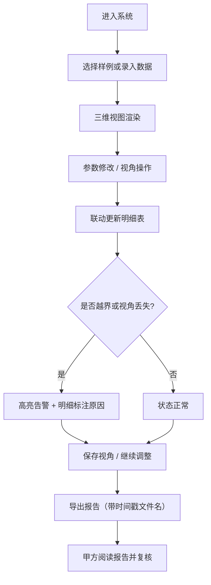

## 1. 产品概述

实验动物笼位三维排布系统，用于辅助仿真工程师在三维空间内规划、排布和审核实验动物笼位，解决相机视角丢失、离群点漂浮等常见问题。目标用户为仿真工程师和甲方评审人员，产品价值在于通过直观的三维可视化、明确的颜色编码、实时的越界提示与明细联动，降低沟通成本，提高排布质量与审核效率。

## 2. 核心功能

### 2.1 用户角色
| 角色 | 注册方式 | 核心权限 |
|------|----------|----------|
| 仿真工程师 | 本地系统登录 | 排布笼位、保存视角、导出报告、补录模型 |
| 甲方评审人员 | 本地系统登录 | 查看排布、阅读明细、下载结果报告 |

### 2.2 功能模块
1. **三维排布主页面**：笼位三维视图、参数面板、明细解释、图例与状态提示
2. **视角管理**：保存/加载相机视角、视角丢失自动检测与告警
3. **排布审核**：颜色状态编码、越界检测与提示、离群点识别
4. **报告导出**：带时间戳的文件名、视角丢失原因说明、明细数据附随
5. **样例数据**：内置三条样例记录（顺利/待确认/坏数据）供演示

### 2.3 页面详情
| 页面名称 | 模块名称 | 功能描述 |
|----------|----------|----------|
| 三维排布主页面 | 三维视窗 | 3D 笼位渲染、OrbitControls 交互、视角保存按钮 |
| 三维排布主页面 | 颜色图例 | 明确标注绿/黄/红三色含义（正常/待确认/异常） |
| 三维排布主页面 | 参数联动面板 | 修改笼位参数后三维模型与明细表同步更新 |
| 三维排布主页面 | 越界提示区 | 高亮显示越界笼位、漂浮离群点及坐标偏差值 |
| 三维排布主页面 | 明细解释区 | 每个笼位的编号、坐标、状态、备注并排展示 |
| 三维排布主页面 | 报告导出按钮 | 生成带时间戳文件名的 JSON+文本报告 |
| 三维排布主页面 | 样例切换 | 一键加载顺利/待确认/坏数据三条样例 |

## 3. 核心流程

仿真工程师进入系统后，可选择加载样例或手动录入笼位数据。系统渲染三维视图并实时联动参数面板与明细表。工程师可保存相机视角以便评审截图使用。当出现越界、离群点漂浮或相机视角丢失（例如相机位置异常、目标点越界）时，系统弹出明确告警并在明细区标注原因。完成排布后，工程师导出报告，文件名自动携带时间戳区分本次运行，报告内容包含笼位明细与视角丢失拦截原因，甲方仅看导出报告即可理解审核结果。

## 4. 用户界面设计

### 4.1 设计风格
- 主色调：深灰蓝 `#0f172a` 作为背景，搭配冷白色文字，营造专业工程软件氛围
- 强调色：正常绿 `#22c55e`、待确认黄 `#f59e0b`、异常红 `#ef4444`
- 按钮风格：圆角 6px、2px 描边、悬停微抬升阴影
- 字体：标题使用 "JetBrains Mono" 等宽字体，正文使用系统无衬线
- 布局：左侧三维视窗占 65%，右侧参数+明细占 35%，顶部工具栏
- 图标风格：Lucide 线性图标，统一 18px 尺寸

### 4.2 页面设计概览
| 页面名称 | 模块名称 | UI 元素 |
|----------|----------|---------|
| 三维排布主页面 | 顶部工具栏 | 标题、样例切换下拉、视角保存/加载、导出按钮 |
| 三维排布主页面 | 三维视窗 | Three.js Canvas、网格地面、笼位立方体、坐标轴、越界红色边框 |
| 三维排布主页面 | 颜色图例 | 三色方块 + 文字说明，置于视窗右上角悬浮卡片 |
| 三维排布主页面 | 参数面板 | 笼位数量、行数、列数、层数、间距输入，支持双向绑定 |
| 三维排布主页面 | 明细列表 | 表格展示编号/坐标/状态/备注，异常行红色高亮 |
| 三维排布主页面 | 告警提示条 | 顶部黄色/红色横幅，显示具体越界原因与视角丢失说明 |

### 4.3 响应式
桌面端优先设计，最小支持宽度 1280px。三维视窗使用固定比例画布，右侧面板可折叠。

### 4.4 三维场景指引
- 环境：冷色调方向光 + 环境光，金属度 0.3、粗糙度 0.6 的 PBR 材质
- 光照：主光方向 (5, 10, 7)，强度 1.0；环境光强度 0.4
- 相机：PerspectiveCamera 初始 fov=50，位置 (12, 10, 14)，目标点 (0, 2, 0)；启用 OrbitControls 带阻尼
- 构图：笼位位于场景中央，网格地面延伸至视窗边缘，坐标轴在左下角
- 交互：点击笼位高亮选中并联动明细行滚动；鼠标悬停显示 tooltip
- 后处理：轻微泛光与对比度提升，笼位选中时描边发光
- 性能：单场景笼位 ≤ 500 个时稳定 60fps，几何体复用 InstancedMesh
