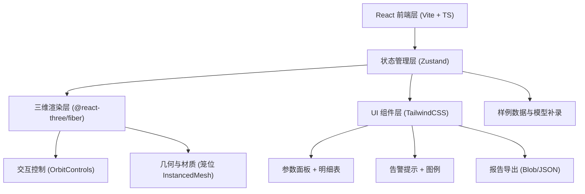
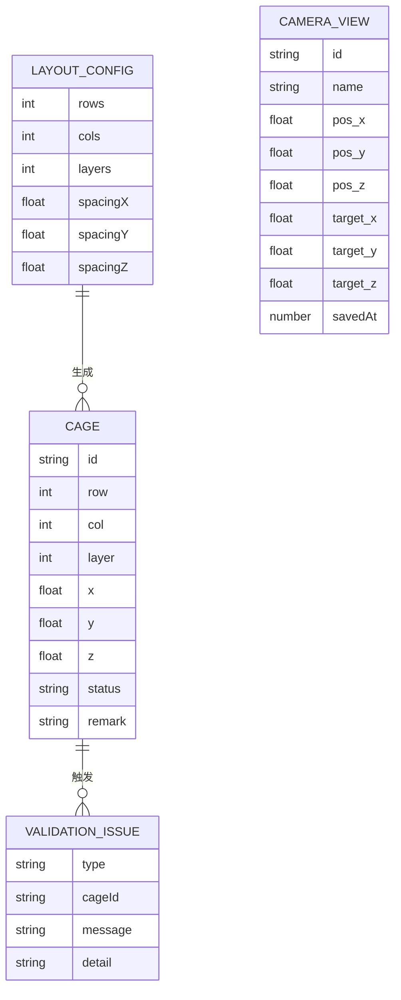

## 1. 架构设计



## 2. 技术描述
- 前端：React@18 + TypeScript + Vite@5 + TailwindCSS@3
- 三维：three@0.160 + @react-three/fiber@8 + @react-three/drei@9
- 状态：zustand@4
- 图标：lucide-react
- 后端：无（纯前端，数据本地持久化到 localStorage）
- 数据库：无，使用内置 mock 样例数据

## 3. 路由定义
| 路由 | 用途 |
|------|------|
| / | 三维排布主页面，集成所有功能模块 |

## 4. 数据模型

### 4.1 类型定义

```typescript
export type CageStatus = 'normal' | 'pending' | 'error';

export interface Cage {
  id: string;
  row: number;
  col: number;
  layer: number;
  x: number;
  y: number;
  z: number;
  status: CageStatus;
  remark: string;
}

export interface CameraView {
  id: string;
  name: string;
  position: { x: number; y: number; z: number };
  target: { x: number; y: number; z: number };
  savedAt: number;
}

export interface ValidationIssue {
  type: 'out_of_bounds' | 'floating' | 'camera_lost';
  cageId?: string;
  message: string;
  detail: string;
}

export interface LayoutConfig {
  rows: number;
  cols: number;
  layers: number;
  spacingX: number;
  spacingY: number;
  spacingZ: number;
  bounds: { minX: number; maxX: number; minY: number; maxY: number; minZ: number; maxZ: number };
}

export interface ExportReport {
  runId: string;
  exportedAt: string;
  cages: Cage[];
  config: LayoutConfig;
  issues: ValidationIssue[];
  cameraViews: CameraView[];
  summary: {
    total: number;
    normal: number;
    pending: number;
    error: number;
  };
}
```

### 4.2 数据模型 ER 图



## 5. 核心模块文件结构

```
src/
├── components/
│   ├── Scene3D.tsx          # 三维场景容器
│   ├── CageMesh.tsx         # 笼位网格（InstancedMesh）
│   ├── CameraController.tsx # 相机控制与视角保存
│   ├── Legend.tsx           # 颜色图例
│   ├── AlertBanner.tsx      # 越界/视角丢失告警
│   ├── ParameterPanel.tsx   # 参数联动面板
│   ├── DetailTable.tsx      # 明细表
│   ├── Toolbar.tsx          # 顶部工具栏（样例切换、导出）
│   └── ReportExporter.tsx   # 报告导出组件
├── hooks/
│   ├── useLayoutStore.ts    # Zustand 状态管理
│   └── useValidation.ts     # 越界与视角丢失校验逻辑
├── utils/
│   ├── validator.ts         # 越界/漂浮/视角丢失检测
│   ├── exporter.ts          # 报告生成与下载
│   └── sampleData.ts        # 三条样例数据
├── types/
│   └── index.ts             # 全局类型定义
├── pages/
│   └── Home.tsx             # 主页面
└── App.tsx
```
