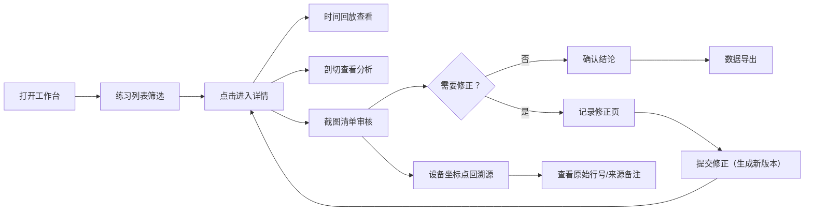
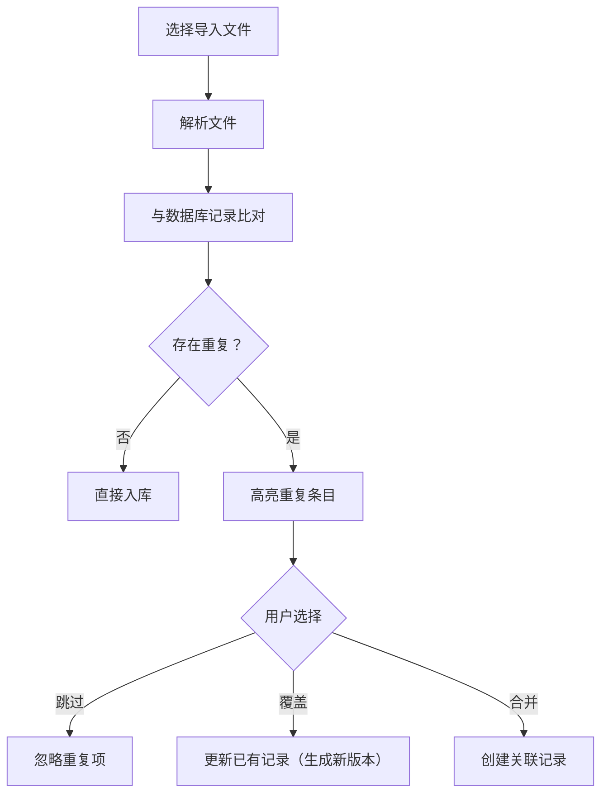

## 1. 产品概述

面向舞台统筹的"分子构象旋转练习"复盘工作台，集中管理练习记录、时间参数、截图结论，实现一键复盘、回溯溯源与审核流转。

- 核心价值：将散落的聊天记录、截图文件、时间参数统一入库，避免人工翻找与查表
- 目标用户：舞台统筹、评审人员
- 解决问题：复盘效率低、结论难溯源、截图审核无标记、重复导入数据混乱

## 2. 核心功能

### 2.1 用户角色

| 角色 | 注册方式 | 核心权限 |
|------|---------|---------|
| 舞台统筹 | 本地登录 | 创建/编辑/导入练习记录、标记截图、导出数据 |
| 评审人员 | 本地登录 | 查看练习详情、审核截图标记、复核结论 |

### 2.2 功能模块

1. **练习列表页**：搜索过滤、状态筛选、批量操作、导入入口
2. **练习详情页**：基础信息、时间回放控件、剖切查看、设备坐标跳转、截图清单
3. **记录修正页**：编辑参数、版本对比、提交修正
4. **历史版本页**：版本列表、变更对比、回滚操作
5. **数据导出页**：筛选条件、多格式导出、导出历史

### 2.3 页面详情

| 页面名称 | 模块名称 | 功能描述 |
|---------|---------|---------|
| 练习列表页 | 搜索过滤区 | 按练习名称、日期、状态、来源备注搜索 |
| 练习列表页 | 练习表格 | 行号/图片名/来源备注列，点击跳转详情，状态标签 |
| 练习列表页 | 导入区 | CSV/Excel 导入，重复检测提示，重复导入测试路径入口 |
| 练习详情页 | 时间回放 | 播放/暂停/进度条/倍速/跳转关键帧，显示实时参数 |
| 练习详情页 | 截图清单 | 缩略图网格，审核状态标记（可直接用/需复核/驳回），设备坐标点回跳转 |
| 练习详情页 | 剖切查看 | 轴向剖切（X/Y/Z）、剖切深度滑块、剖切结果与结论关联高亮 |
| 练习详情页 | 溯源面板 | 原始行号、图片名、来源备注，一键跳转到来源记录 |
| 记录修正页 | 参数编辑表单 | 时间参数、坐标参数、结论文本编辑 |
| 记录修正页 | 版本对比 | 当前值 vs 原值 diff 高亮 |
| 历史版本页 | 版本时间线 | 按时间倒序，显示修改人、修改摘要 |
| 历史版本页 | Diff 视图 | 字段级变更对比，支持回滚 |
| 数据导出页 | 筛选配置 | 时间范围、练习状态、审核状态筛选 |
| 数据导出页 | 导出操作 | JSON/CSV/ZIP（含截图）导出，导出进度条 |

## 3. 核心流程

舞台统筹日常复盘流程：打开工作台 → 列表定位目标练习 → 详情页时间回放 + 剖切查看 → 检查截图审核标记 → 如需修正则进入修正页 → 确认结论后导出数据。

数据导入防重流程：

## 4. 用户界面设计

### 4.1 设计风格

- **主色调**：深空蓝 `#0B1D3A`（背景）、冰蓝 `#4FC3F7`（主交互）、琥珀橙 `#FFB74D`（警告/待复核）、翠绿 `#66BB6A`（通过）
- **辅助色**：石板灰中性色系列，确保信息层级清晰
- **按钮风格**：直角微圆角（2px），实心按钮带细微边框，悬停时有微弱发光效果
- **字体**：标题使用 JetBrains Mono（等宽科技感），正文使用 Noto Sans SC（中文易读）
- **布局风格**：顶栏导航 + 左侧子菜单 + 主内容区的三栏布局，数据密集区域使用表格/网格
- **图标风格**：Lucide 线性图标，统一 20px 尺寸，颜色跟随语义
- **整体基调**：工业级数据工作台，冷峻、精准、高效，避免花哨装饰

### 4.2 页面设计概览

| 页面名称 | 模块名称 | UI 元素 |
|---------|---------|---------|
| 练习列表页 | 顶部搜索栏 | 深色输入框、冰蓝色聚焦边框、图标前缀、筛选下拉 |
| 练习列表页 | 数据表格 | 斑马纹、悬浮行高亮、状态彩色标签、右侧操作按钮组 |
| 练习详情页 | 时间回放区 | 类视频播放器 UI，大进度条带刻度标记、关键帧锚点、参数实时显示面板 |
| 练习详情页 | 截图清单 | 响应式网格卡片、卡片角标（审核状态色块）、点击放大预览 Lightbox |
| 练习详情页 | 剖切查看 | 左右分栏：左侧 3D/2D 视图区、右侧剖切控制滑块 + 结论对照面板 |
| 记录修正页 | Diff 对比 | 左右双栏，删除红色删除线，新增绿色下划线，不变灰色 |
| 历史版本页 | 时间线 | 垂直时间轴，节点带状态色块，悬停显示摘要气泡 |
| 数据导出页 | 导出面板 | 卡片式导出选项、格式图标、进度条动画、历史记录表格 |

### 4.3 响应式

桌面端优先设计（≥1280px），中等屏幕（768-1279px）自适应折叠侧栏，移动端（<768px）简化为列表堆叠视图，核心回放与截图功能可用。

### 4.4 3D 场景指引（剖切查看）

- **环境**：纯黑渐变背景，无 HDRI，聚焦分子模型本身
- **光照**：三光源布置——主光（正面 45° 冷白）、补光（侧面暖白）、轮廓光（背面冰蓝）
- **相机**：默认正交视角，支持轨道旋转、平移、缩放，预设三视图快捷按钮
- **交互**：剖切平面跟随滑块实时更新，剖切区域半透明高亮显示对应结论标记
- **后处理**：轻微泛光（Bloom）突出剖切边缘，FXAA 抗锯齿
