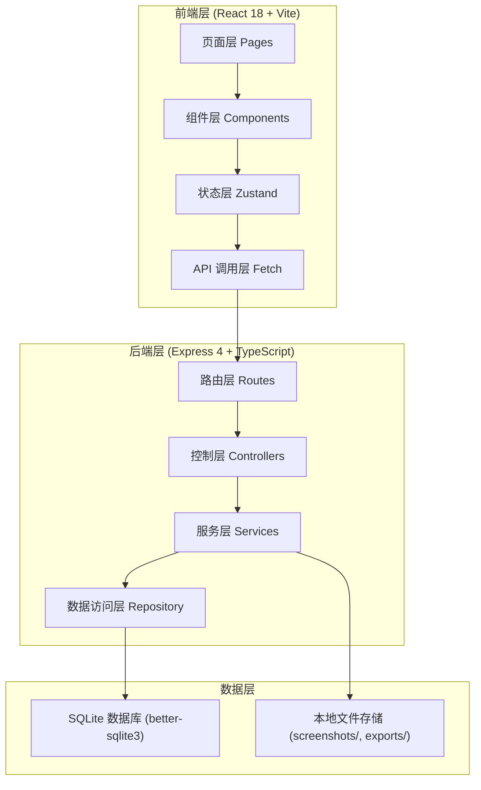
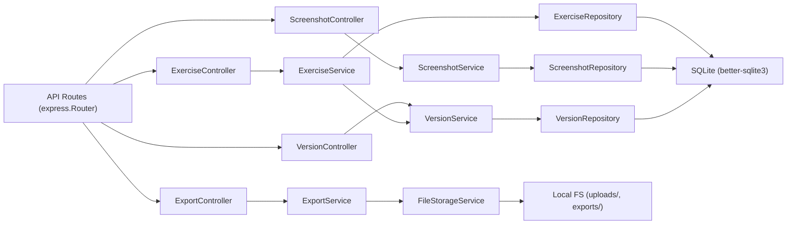
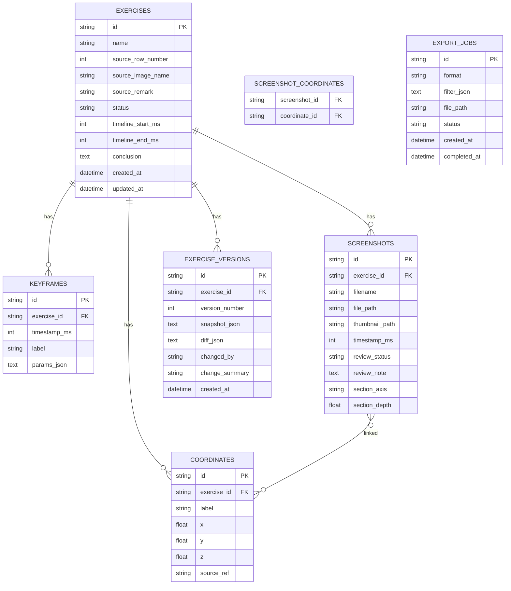

## 1. 架构设计



## 2. 技术说明

- **前端**：React@18 + TypeScript + Vite + React Router DOM + TailwindCSS@3 + Zustand + Lucide React
- **初始化工具**：vite-init（react-express-ts 模板）
- **后端**：Express@4 + TypeScript（ESM 格式）
- **数据库**：SQLite（better-sqlite3），本地文件存储，无需外部服务
- **文件存储**：本地文件系统 `./uploads/` 和 `./exports/` 目录

## 3. 路由定义

| 前端路由 | 页面用途 |
|---------|---------|
| `/` | 重定向到 `/exercises` |
| `/exercises` | 练习列表页 |
| `/exercises/:id` | 练习详情页（含时间回放、剖切查看、截图清单） |
| `/exercises/:id/revise` | 记录修正页 |
| `/exercises/:id/history` | 历史版本页 |
| `/export` | 数据导出页 |
| `/test/repeat-import` | 重复导入测试路径 |

| 后端 API 路由 | HTTP 方法 | 用途 |
|-------------|----------|------|
| `/api/exercises` | GET | 获取练习列表（支持筛选、分页） |
| `/api/exercises/:id` | GET | 获取练习详情 |
| `/api/exercises` | POST | 创建新练习 |
| `/api/exercises/:id` | PUT | 更新练习（自动生成版本） |
| `/api/exercises/:id` | DELETE | 删除练习 |
| `/api/exercises/import` | POST | 批量导入（含重复检测） |
| `/api/exercises/:id/versions` | GET | 获取历史版本列表 |
| `/api/exercises/:id/versions/:vid` | GET | 获取指定版本详情 |
| `/api/exercises/:id/versions/:vid/rollback` | POST | 回滚到指定版本 |
| `/api/screenshots/:id/mark` | PUT | 更新截图审核标记 |
| `/api/export` | POST | 提交导出任务 |
| `/api/export/:id` | GET | 下载导出文件 |
| `/api/export/list` | GET | 导出历史列表 |
| `/api/test/repeat-import` | POST | 重复导入测试专用接口 |

## 4. API 定义

```typescript
// 练习记录基础类型
interface Exercise {
  id: string;
  name: string;
  sourceRowNumber: number | null;    // 原始行号
  sourceImageName: string | null;    // 图片名
  sourceRemark: string | null;       // 来源备注
  status: 'draft' | 'reviewing' | 'confirmed' | 'archived';
  createdAt: string;
  updatedAt: string;

  // 时间参数（用于回放）
  timelineStartMs: number;
  timelineEndMs: number;
  keyframes: Keyframe[];

  // 设备坐标
  coordinates: DeviceCoordinate[];

  // 截图清单
  screenshots: Screenshot[];

  // 最终结论
  conclusion: string;
}

interface Keyframe {
  id: string;
  timestampMs: number;
  label: string;
  params: Record<string, number>;
}

interface DeviceCoordinate {
  id: string;
  label: string;
  x: number;
  y: number;
  z: number;
  sourceRef: string;  // 关联截图或结论 ID
}

interface Screenshot {
  id: string;
  filename: string;
  filePath: string;
  thumbnailPath: string;
  timestampMs: number;
  reviewStatus: 'approved' | 'pending' | 'rejected';  // 可直接用/需复核/驳回
  reviewNote: string | null;
  linkedCoordinateIds: string[];  // 关联的设备坐标
  sectionPlane?: {                // 剖切信息
    axis: 'x' | 'y' | 'z';
    depth: number;
  };
}

interface ExerciseVersion {
  id: string;
  exerciseId: string;
  versionNumber: number;
  snapshot: Exercise;
  changedBy: string;
  changeSummary: string;
  diff: Record<string, { old: any; new: any }>;
  createdAt: string;
}

// 导入结果
interface ImportResult {
  total: number;
  inserted: number;
  updated: number;
  skipped: number;
  duplicates: ImportConflict[];
}

interface ImportConflict {
  rowIndex: number;
  existingId: string;
  incomingData: Partial<Exercise>;
}
```

## 5. 服务器架构图



## 6. 数据模型

### 6.1 数据模型定义



### 6.2 数据定义语言

```sql
-- 练习主表
CREATE TABLE IF NOT EXISTS exercises (
  id TEXT PRIMARY KEY,
  name TEXT NOT NULL,
  source_row_number INTEGER,
  source_image_name TEXT,
  source_remark TEXT,
  status TEXT NOT NULL DEFAULT 'draft',
  timeline_start_ms INTEGER NOT NULL DEFAULT 0,
  timeline_end_ms INTEGER NOT NULL DEFAULT 0,
  conclusion TEXT,
  created_at TEXT NOT NULL DEFAULT (datetime('now')),
  updated_at TEXT NOT NULL DEFAULT (datetime('now'))
);

CREATE INDEX IF NOT EXISTS idx_exercises_status ON exercises(status);
CREATE INDEX IF NOT EXISTS idx_exercises_created_at ON exercises(created_at);

-- 关键帧表
CREATE TABLE IF NOT EXISTS keyframes (
  id TEXT PRIMARY KEY,
  exercise_id TEXT NOT NULL REFERENCES exercises(id) ON DELETE CASCADE,
  timestamp_ms INTEGER NOT NULL,
  label TEXT,
  params_json TEXT
);

CREATE INDEX IF NOT EXISTS idx_keyframes_exercise_id ON keyframes(exercise_id);

-- 设备坐标表
CREATE TABLE IF NOT EXISTS coordinates (
  id TEXT PRIMARY KEY,
  exercise_id TEXT NOT NULL REFERENCES exercises(id) ON DELETE CASCADE,
  label TEXT,
  x REAL NOT NULL,
  y REAL NOT NULL,
  z REAL NOT NULL,
  source_ref TEXT
);

CREATE INDEX IF NOT EXISTS idx_coordinates_exercise_id ON coordinates(exercise_id);

-- 截图表
CREATE TABLE IF NOT EXISTS screenshots (
  id TEXT PRIMARY KEY,
  exercise_id TEXT NOT NULL REFERENCES exercises(id) ON DELETE CASCADE,
  filename TEXT NOT NULL,
  file_path TEXT NOT NULL,
  thumbnail_path TEXT,
  timestamp_ms INTEGER NOT NULL,
  review_status TEXT NOT NULL DEFAULT 'pending',
  review_note TEXT,
  section_axis TEXT,
  section_depth REAL
);

CREATE INDEX IF NOT EXISTS idx_screenshots_exercise_id ON screenshots(exercise_id);
CREATE INDEX IF NOT EXISTS idx_screenshots_review_status ON screenshots(review_status);

-- 截图-坐标关联表（多对多）
CREATE TABLE IF NOT EXISTS screenshot_coordinates (
  screenshot_id TEXT NOT NULL REFERENCES screenshots(id) ON DELETE CASCADE,
  coordinate_id TEXT NOT NULL REFERENCES coordinates(id) ON DELETE CASCADE,
  PRIMARY KEY (screenshot_id, coordinate_id)
);

-- 版本历史表
CREATE TABLE IF NOT EXISTS exercise_versions (
  id TEXT PRIMARY KEY,
  exercise_id TEXT NOT NULL REFERENCES exercises(id) ON DELETE CASCADE,
  version_number INTEGER NOT NULL,
  snapshot_json TEXT NOT NULL,
  diff_json TEXT,
  changed_by TEXT NOT NULL DEFAULT 'stage-manager',
  change_summary TEXT,
  created_at TEXT NOT NULL DEFAULT (datetime('now'))
);

CREATE INDEX IF NOT EXISTS idx_versions_exercise_id ON exercise_versions(exercise_id);
CREATE UNIQUE INDEX IF NOT EXISTS idx_versions_exercise_version ON exercise_versions(exercise_id, version_number);

-- 导出任务表
CREATE TABLE IF NOT EXISTS export_jobs (
  id TEXT PRIMARY KEY,
  format TEXT NOT NULL,
  filter_json TEXT,
  file_path TEXT,
  status TEXT NOT NULL DEFAULT 'pending',
  created_at TEXT NOT NULL DEFAULT (datetime('now')),
  completed_at TEXT
);
```
