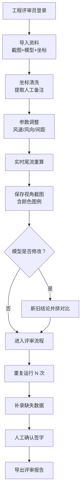

## 1. 产品概述

海上风机尾流沙盘工程评审系统，面向工程评审员，用于整合分散的沙盘资料（截图、三维模型、设备坐标、人工备注），提供参数联动分析、截图对比、评审流程管理等功能，解决日常评审中资料散、对比难、流程缺的问题。

- 解决问题：评审资料分散（截图在共享盘、三维模型在旧表、坐标夹备注）、参数变化前后对比困难、三维修改后影响范围不直观、评审流程缺乏规范
- 目标用户：海上风电工程评审员
- 核心价值：一次导入多源资料 → 参数联动即时推演 → 截图/结论并排对比 → 三步评审流程留痕

## 2. 核心功能

### 2.1 用户角色
| 角色 | 注册方式 | 核心权限 |
|------|----------|----------|
| 工程评审员 | 本地登录 | 导入资料、调整参数、截图对比、执行评审流程、导出报告 |

### 2.2 功能模块
1. **主工作台**：三维沙盘场景 + 参数控制面板 + 评审流程面板
2. **资料管理**：导入截图清单、三维模型、设备坐标（含人工备注清洗）
3. **视角与截图**：保存命名视角、颜色图例、越界提示高亮、前后对比截图
4. **参数联动**：风速、风向、间距、轮毂高度等参数调整，实时重算尾流影响
5. **评审流程**：重复运行（验证稳定性）、补录（补充缺失数据）、人工确认（签字留痕），三步缺一不可
6. **边界案例库**：单位换算错误 2-3 例（每例真实改变结果）、坐标系混用坏数据（真实工程材料风格）
7. **新旧并排对比**：三维模型修改后，旧结论与新结论双栏对照，标注差异区域

### 2.3 页面详情
| 页面名称 | 模块名称 | 功能描述 |
|----------|----------|----------|
| 主工作台 | 三维沙盘区 | 展示风机、尾流场、海面；支持视角保存/恢复；越界区域红框闪烁告警 |
| 主工作台 | 参数面板 | 风速/风向/间距/轮毂高度滑杆；参数修改实时联动三维与结论；单位切换带边界案例 |
| 主工作台 | 截图对比区 | 左右分栏：修改前截图 + 修改后截图；各自标注视角名称、颜色图例、参数值 |
| 主工作台 | 评审流程条 | 三步进度：重复运行（可点击重算 N 次）→ 补录（缺失字段弹窗）→ 人工确认（签名框）；未完成步骤灰显禁止导出 |
| 主工作台 | 并排结论区 | 旧模型结论（左）vs 新模型结论（右）；差异数值红标高亮，影响范围在三维中联动高亮 |
| 边界案例弹窗 | 单位换算案例 | 例1：节→m/s 换算错误导致尾流低估；例2：海里→km 间距错误；每例可一键加载演示 |
| 边界案例弹窗 | 坐标系混用案例 | 一条含人工备注的坐标行（如"WTG-05 备注：此处按现场放样坐标录入，非设计值"），加载后自动在三维中错位显示 |

## 3. 核心流程

评审员登录 → 导入项目资料（截图/模型/坐标）→ 系统清洗坐标中的人工备注 → 调整参数观察尾流变化 → 保存关键视角截图 → 触发模型修改后进入并排对比 → 执行评审三步流程（重复运行→补录→人工确认）→ 导出评审报告（含前后截图对比、结论差异、流程签字）。

## 4. 用户界面设计

### 4.1 设计风格
- **主色调**：深海蓝 `#0B2545`（背景）+ 海雾灰 `#EEF4ED`（面板）+ 警示橙 `#F46036`（越界/差异）+ 尾流青 `#1B998B`（正常尾流）
- **按钮风格**：扁平化方角，4px 圆角，按下内凹阴影
- **字体**：标题用 "Chakra Petch"（工程感等宽），正文用 "Noto Sans SC"
- **布局风格**：左侧参数面板（宽 320px）+ 中央三维场景 + 右侧评审流程与结论对比（宽 360px）；顶部工具条
- **图标**：lucide-react 线描图标，统一 18px 尺寸

### 4.2 页面设计概览
| 页面名称 | 模块名称 | UI 元素 |
|----------|----------|----------|
| 主工作台 | 三维沙盘区 | 深蓝色渐变海面，风机白色圆柱+三片蓝叶，尾流半透明圆锥体按速度着色（青→黄→橙→红），右上角视角缩略图，底部颜色图例条 |
| 主工作台 | 参数面板 | 每个参数带滑杆+数值输入+单位切换下拉；参数变更时左侧出现淡蓝高亮脉冲动画 |
| 主工作台 | 截图对比区 | 左右双图，顶部视角名称标签，底部参数信息条，中间可拖动分隔线，差异区域半透明橙框闪烁 |
| 主工作台 | 评审流程条 | 横向三步节点：圆圈序号 + 标签；已完成绿勾、进行中蓝描边脉冲、未完成灰；点击步骤跳转对应操作 |
| 主工作台 | 并排结论区 | 双栏卡片，顶部"旧模型/新模型"标签，数值表格差异项橙色背景，点击差异项联动三维高亮对应风机 |
| 边界案例弹窗 | 案例卡片 | 左侧案例列表，右侧案例说明+预览，"一键加载"按钮橙底白字 |

### 4.3 响应式
- 桌面优先（≥1440px 宽度），三栏布局
- 平板（1024-1439px）：右侧流程与结论折叠为底部 Tab
- 移动端：单栏滚动，三维场景固定高度 60vh

### 4.4 3D 场景指引
- **环境**：深色雾效海面，HDRI 模拟阴天海面光照，远处地平线淡蓝雾气
- **光照**：主光冷白方向光模拟天光 + 弱暖黄补光模拟海面反射
- **相机**：默认透视相机 45° FOV，初始位置俯瞰全场（高度 120m），支持轨道控制、平移、缩放
- **交互**：点击风机显示详情面板，尾流圆锥体鼠标悬停显示速度值 tooltip，视角切换带相机缓动动画
- **后期处理**：Bloom 发光用于越界告警闪烁，SSAO 增强场景深度感
- **资产**：风机使用参数化几何体生成（不依赖外部模型），尾流用自定义 ShaderMaterial 实现速度渐变与边缘羽化
