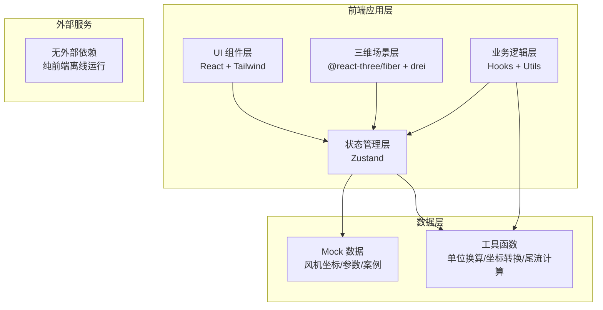
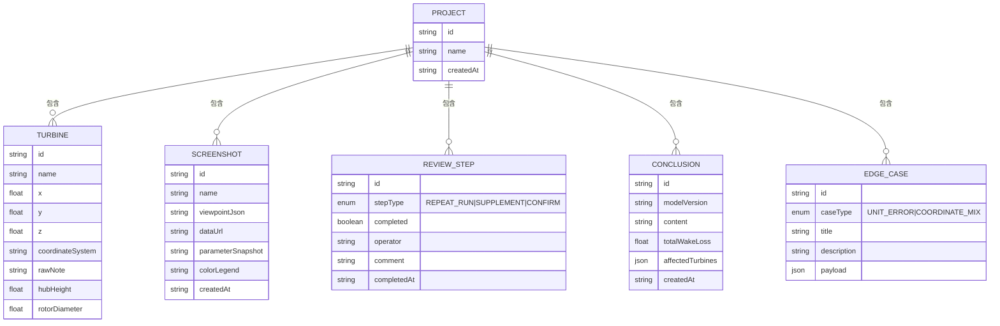

## 1. 架构设计

## 2. 技术说明

- **前端**：React@18 + TypeScript@5 + Vite@5 + TailwindCSS@3 + Zustand@4
- **三维**：three@0.160 + @react-three/fiber@8 + @react-three/drei@9 + @react-three/postprocessing@2
- **截图**：html2canvas@1.4
- **图标**：lucide-react@0.294
- **初始化工具**：vite-init（react-ts 模板）
- **后端**：无（纯前端工程工具，使用 Mock 数据）
- **数据库**：无（本地状态 + localStorage 持久化评审进度）

## 3. 路由定义
| 路由 | 用途 |
|------|------|
| / | 主工作台（唯一页面，所有功能集成） |

该系统为单页工程工具，所有功能模块在同一工作台内通过面板分区展示，无需多路由跳转。

## 4. 数据模型

### 4.1 数据模型定义

### 4.2 Mock 数据说明
- **风机数据**：预置 6 台风机（WTG-01 ~ WTG-06），坐标系统混合（3 台 WGS84 经纬度、2 台 UTM 米制、1 台含人工备注坏数据）
- **参数默认值**：风速 8m/s、风向 270°（西风）、间距 5D、轮毂高度 90m
- **边界案例**：
  - 单位换算 1：节→m/s（输入 15 节，错误按 15m/s 计算，尾流低估约 30%）
  - 单位换算 2：海里→km（间距 3 海里，错误按 3km 处理，尾流干涉范围扩大约 85%）
  - 坐标系混用：WTG-05 坐标被人工备注覆盖为现场放样值（偏移 +120m, -80m），加载后风机位置错位
- **评审流程**：三步均初始为未完成，需按顺序触发

## 5. 核心模块划分

| 模块 | 文件路径 | 职责 |
|------|----------|------|
| 主工作台 | `src/pages/Workspace.tsx` | 整体布局，协调各面板 |
| 三维场景 | `src/components/three/Scene3D.tsx` | 风机、尾流、海面、光照 |
| 尾流计算 | `src/utils/wakeCalculation.ts` | Jensen 尾流模型、速度亏损计算 |
| 坐标处理 | `src/utils/coordinateTransform.ts` | WGS84↔UTM 转换、人工备注清洗 |
| 单位换算 | `src/utils/unitConversion.ts` | 节↔m/s、海里↔km 等换算（含故意错误模式） |
| 参数面板 | `src/components/ParameterPanel.tsx` | 参数滑杆、单位切换、边界案例触发 |
| 截图对比 | `src/components/ScreenshotCompare.tsx` | 前后截图双栏、差异标注 |
| 评审流程 | `src/components/ReviewProcess.tsx` | 重复运行/补录/人工确认三步 |
| 并排结论 | `src/components/ConclusionCompare.tsx` | 新旧结论双栏、差异高亮联动 |
| 边界案例 | `src/components/EdgeCaseModal.tsx` | 案例库弹窗、一键加载 |
| 全局状态 | `src/store/useProjectStore.ts` | Zustand store：风机、参数、截图、评审状态 |
| Mock 数据 | `src/data/mockData.ts` | 风机、案例、默认参数 |
