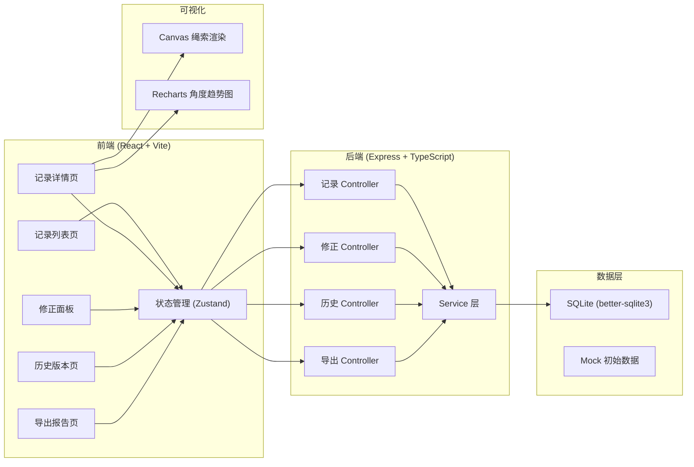
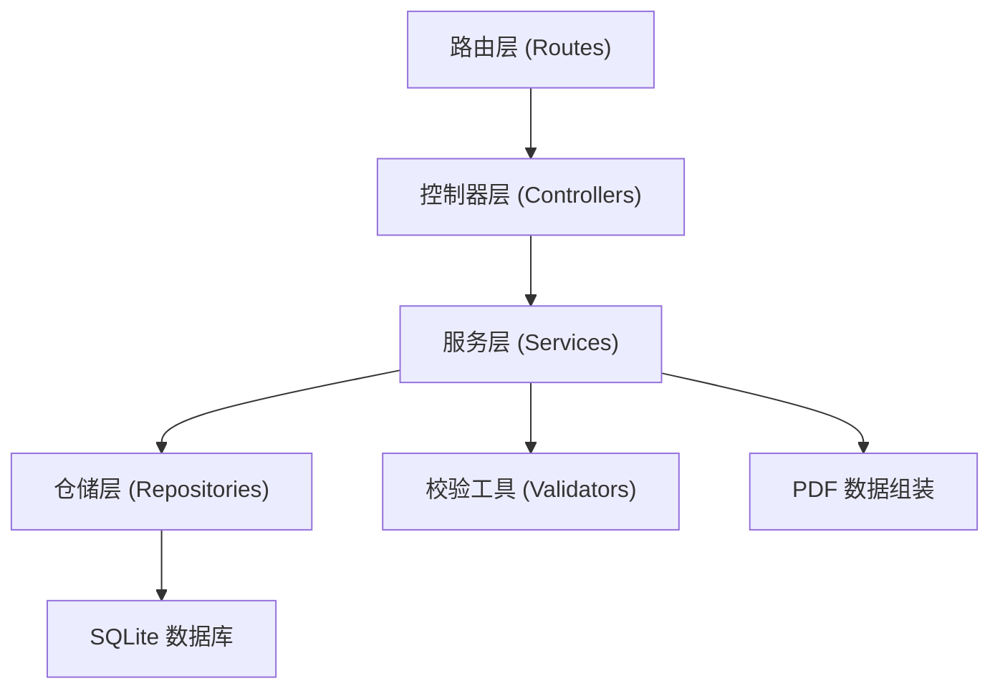
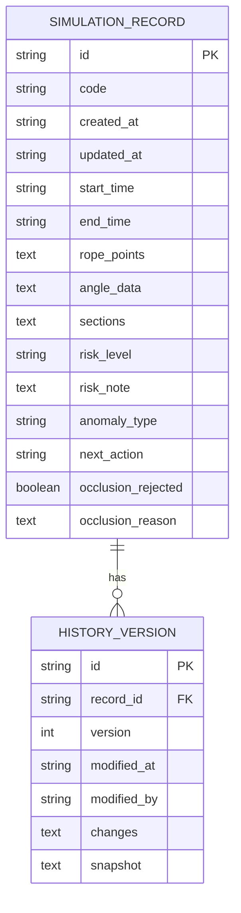

## 1. 架构设计



---

## 2. 技术说明

- **前端**：React 18 + TypeScript + Vite + TailwindCSS 3 + Zustand + React Router v6 + Recharts + Lucide React
- **后端**：Express 4 + TypeScript + better-sqlite3
- **初始化工具**：vite-init（react-express-ts 模板）
- **数据库**：SQLite（本地轻量，无需外部服务），内置 mock 数据
- **报告导出**：前端使用 html2canvas + jsPDF 生成 PDF
- **三维/图表**：Canvas 2D 绘制绳索示意图，Recharts 渲染角度折线图

---

## 3. 路由定义

### 3.1 前端路由

| 路由 | 页面 | 用途 |
|------|------|------|
| `/` | 记录列表页 | 展示所有模拟记录，筛选搜索 |
| `/records/:id` | 记录详情页 | 查看详情、三维视图、图表、明细解释、时间回放 |
| `/records/:id/history` | 历史版本页 | 查看修改历史、版本对比、回滚 |
| `/records/:id/export` | 导出报告页 | PDF 预览与下载 |

### 3.2 后端 API 路由

| 方法 | 路由 | 用途 |
|------|------|------|
| GET | `/api/records` | 获取记录列表（支持筛选参数） |
| GET | `/api/records/:id` | 获取单条记录详情 |
| GET | `/api/records/stats` | 获取异常统计摘要 |
| PUT | `/api/records/:id` | 修正记录参数/备注，生成新版本 |
| POST | `/api/records/:id/sections` | 补录剖面图数据 |
| GET | `/api/records/:id/history` | 获取记录的历史版本列表 |
| GET | `/api/records/:id/history/:versionId` | 获取指定历史版本详情 |
| POST | `/api/records/:id/rollback/:versionId` | 回滚到指定历史版本 |
| GET | `/api/records/:id/export` | 导出报告数据（供前端生成 PDF） |

---

## 4. API 类型定义

```typescript
// shared/types.ts

export type RiskLevel = 'normal' | 'warning' | 'error' | 'pending_material';
export type AnomalyType = 'time_mismatch' | 'risk_mismatch' | 'occlusion_misread' | 'section_missing' | null;
export type NextAction = 'fill_material' | 'adjust_criteria' | null;

export interface RopePoint {
  x: number;
  y: number;
  z: number;
}

export interface AngleDataPoint {
  timestamp: number;
  angle: number;
  explanation: string;
}

export interface SectionFrame {
  frameIndex: number;
  timestamp: number;
  imageUrl?: string;
  data: number[];
  note: string;
}

export interface SimulationRecord {
  id: string;
  code: string;
  createdAt: string;
  updatedAt: string;
  startTime: string;
  endTime: string;
  ropePoints: RopePoint[];
  angleData: AngleDataPoint[];
  sections: SectionFrame[];
  riskLevel: RiskLevel;
  riskNote: string;
  anomalyType: AnomalyType;
  nextAction: NextAction;
  occlusionRejected: boolean;
  occlusionReason: string;
}

export interface HistoryVersion {
  id: string;
  recordId: string;
  version: number;
  modifiedAt: string;
  modifiedBy: string;
  changes: {
    field: string;
    oldValue: string;
    newValue: string;
  }[];
  snapshot: SimulationRecord;
}

export interface ExportReportData {
  record: SimulationRecord;
  history: HistoryVersion[];
  occlusionExplanation: {
    title: string;
    criteria: string[];
    rejectionReason: string;
  };
}
```

---

## 5. 服务端架构图



---

## 6. 数据模型

### 6.1 ER 图



### 6.2 DDL 语句

```sql
-- migrations/001_init.sql

CREATE TABLE IF NOT EXISTS simulation_record (
    id TEXT PRIMARY KEY,
    code TEXT NOT NULL UNIQUE,
    created_at TEXT NOT NULL,
    updated_at TEXT NOT NULL,
    start_time TEXT NOT NULL,
    end_time TEXT NOT NULL,
    rope_points TEXT NOT NULL,
    angle_data TEXT NOT NULL,
    sections TEXT NOT NULL,
    risk_level TEXT NOT NULL CHECK (risk_level IN ('normal', 'warning', 'error', 'pending_material')),
    risk_note TEXT NOT NULL DEFAULT '',
    anomaly_type TEXT,
    next_action TEXT,
    occlusion_rejected INTEGER NOT NULL DEFAULT 0,
    occlusion_reason TEXT NOT NULL DEFAULT ''
);

CREATE TABLE IF NOT EXISTS history_version (
    id TEXT PRIMARY KEY,
    record_id TEXT NOT NULL,
    version INTEGER NOT NULL,
    modified_at TEXT NOT NULL,
    modified_by TEXT NOT NULL,
    changes TEXT NOT NULL,
    snapshot TEXT NOT NULL,
    FOREIGN KEY (record_id) REFERENCES simulation_record(id) ON DELETE CASCADE
);

CREATE INDEX IF NOT EXISTS idx_history_record_id ON history_version(record_id);
CREATE INDEX IF NOT EXISTS idx_record_risk_level ON simulation_record(risk_level);
CREATE INDEX IF NOT EXISTS idx_record_anomaly_type ON simulation_record(anomaly_type);
```

---
