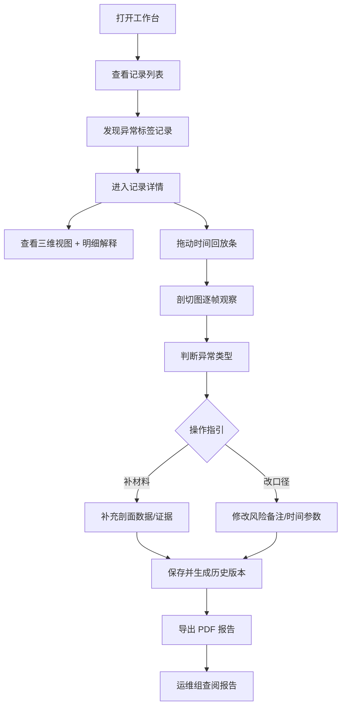

## 1. 产品概述

救援绳索角度模拟本地 Web 工作台，面向展馆讲解员，用于日常复核救援绳索角度模拟记录，解决时间参数与风险备注对不上、手工补锅频繁的问题。

- 主要问题：周会前总会冒出时间参数和风险备注对不上的记录，需要人工逐条核对修正
- 目标用户：展馆讲解员（复核、修正数据）、运维组（查看导出报告）
- 核心价值：列表-详情-修正-历史-下载全流程打通后端，剖切与回放联动，异常分级给出操作指引，导出报告自解释透明遮挡误读拦截逻辑

---

## 2. 核心功能

### 2.1 用户角色

| 角色 | 登录方式 | 核心权限 |
|------|----------|----------|
| 展馆讲解员 | 本地登录 | 查看列表/详情、修正记录、补录剖面图、查看历史、下载报告 |
| 运维组 | 无（只读报告） | 通过导出 PDF 报告理解透明遮挡误读拦截原因 |

### 2.2 功能模块

1. **记录列表页**：模拟记录表格、筛选搜索、异常状态标签、批量操作入口
2. **记录详情页**：基础信息、三维绳索视图 + 角度图表、明细解释面板、时间回放条
3. **修正面板**：时间参数编辑、风险备注编辑、剖面图补录、实时校验提示
4. **历史版本页**：版本列表、版本对比、回滚操作
5. **导出报告页**：PDF 预览、下载、透明遮挡误读专项说明章节

### 2.3 页面详情

| 页面名称 | 模块名称 | 功能描述 |
|----------|----------|----------|
| 记录列表页 | 顶部筛选栏 | 按日期范围、风险等级、异常类型筛选，关键词搜索 |
| 记录列表页 | 数据表格 | 显示 ID、时间、角度值、风险等级、异常标签、操作列 |
| 记录列表页 | 异常摘要栏 | 按异常类型统计数量，点击可跳转筛选 |
| 记录详情页 | 绳索三维视图 | Canvas/SVG 渲染绳索与固定点，悬停显示坐标 |
| 记录详情页 | 角度趋势图表 | 折线图展示绳索角度随时间变化 |
| 记录详情页 | 明细解释面板 | 每个数据点/色块旁边标注文字解释，不依赖颜色识别 |
| 记录详情页 | 时间回放条 | 可拖动播放，补录剖面图后自动同步回放帧 |
| 记录详情页 | 剖切查看器 | 多帧剖切图，支持补录，非一次性判断，可反复调整 |
| 修正面板 | 参数编辑表单 | 时间参数、风险备注字段，实时校验与后端同步 |
| 修正面板 | 操作指引区 | 异常分级显示，明确提示"补材料"或"改口径" |
| 历史版本页 | 版本时间线 | 每次修正产生版本，显示修改人、修改内容、时间戳 |
| 历史版本页 | 版本对比 | 左右并排对比两个版本的参数与备注差异 |
| 导出报告页 | 报告预览 | 模拟 PDF 排版预览 |
| 导出报告页 | 透明遮挡说明 | 专门章节解释透明遮挡误读的判定标准与拦截原因 |

---

## 3. 核心流程

### 3.1 讲解员日常复核流程

讲解员打开工作台 → 查看记录列表中的异常标签 → 点击进入异常记录详情 → 查看三维视图与角度图表（旁附明细解释）→ 拖动时间回放条观察剖切图 → 判断异常类型 → 在修正面板中根据操作指引（补材料/改口径）修正数据 → 保存自动生成历史版本 → 下载报告给运维组

---

## 4. 用户界面设计

### 4.1 设计风格

- **主色调**：深石板蓝 `#1e293b` 作为主背景，配合安全橙 `#f97316`（风险高亮）和校验绿 `#10b981`（正常）
- **次色调**：警示黄 `#eab308`（需关注）、信息蓝 `#3b82f6`（剖切/回放）
- **按钮风格**：方角微圆角（radius 4px），次要按钮细边框 + hover 填充过渡
- **字体**：标题使用 IBM Plex Mono（等宽工业感），正文使用 Noto Sans SC（中文清晰可读）
- **布局风格**：左右分栏主布局，左侧功能导航，右侧内容区；详情页采用三栏——左侧三维/图表，中间明细解释面板，右侧修正与历史
- **图标风格**：Lucide 线性图标，统一 18px 尺寸

### 4.2 页面设计概览

| 页面名称 | 模块名称 | UI 要素 |
|----------|----------|----------|
| 记录列表页 | 顶部筛选栏 | 深色输入框、日期范围选择器、下拉筛选、搜索按钮（橙底白字）|
| 记录列表页 | 数据表格 | 斑马纹行、异常行左侧橙色竖条标记、hover 行高亮 |
| 记录列表页 | 异常摘要栏 | 4 个统计卡片（正常/警告/错误/待补料），卡片底部对应色条 |
| 记录详情页 | 绳索三维视图 | Canvas 画布、固定点标记、绳索曲线、悬停弹出数据气泡、右侧图例带文字标注 |
| 记录详情页 | 角度趋势图表 | 折线图 + 每个关键拐点旁浮动文字注释卡片 |
| 记录详情页 | 明细解释面板 | 时间轴式列表，每条含图标 + 标题 + 详细文字，不依赖颜色 |
| 记录详情页 | 时间回放条 | 带刻度的进度条、播放/暂停按钮、帧步进按钮、剖切帧位置标记 |
| 修正面板 | 操作指引区 | 大图标 + 加粗标题 + 步骤列表，绿色=改口径，橙色=补材料 |
| 修正面板 | 参数编辑表单 | 输入框带实时校验图标，错误时下方显示红色文字解释 |
| 历史版本页 | 版本时间线 | 竖向时间线，节点图标区分修正类型，hover 显示摘要 |
| 导出报告页 | 报告预览 | 白色纸张效果，阴影，透明遮挡章节带特殊边框与说明图 |

### 4.3 响应式

桌面端优先设计（最小宽度 1280px），侧边栏在 1024px 以下折叠为图标模式。

---
