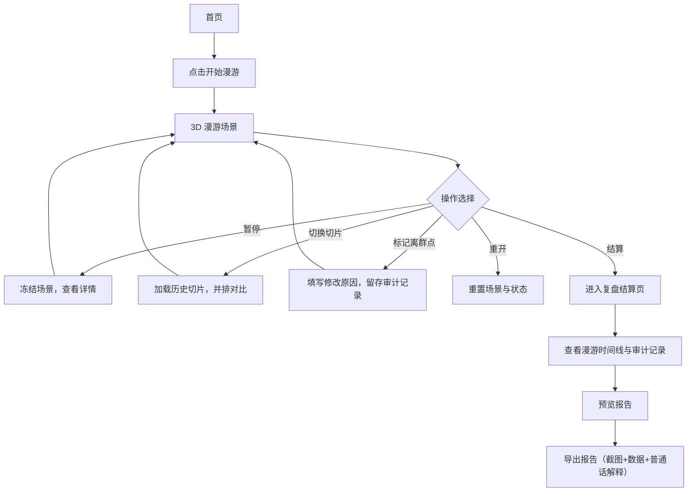

## 1. 产品概述

数据库索引树 3D 漫游是一款浏览器端交互式可视化工具，将抽象的数据库 B+ 树索引结构转化为可探索的 3D 点云空间，帮助甲方决策者直观理解数据库性能、帮助运维主管留存审计证据、帮助技术人员快速定位异常节点。

- 目标用户：甲方决策者（看结果）、运维主管（存证据）、DBA/技术人员（查异常）
- 核心价值：把枯燥的索引性能数据变成"能玩一局"的沉浸式体验，同时满足审计追溯与报告输出需求

---

## 2. 核心功能

### 2.1 用户角色

| 角色 | 核心诉求 | 典型使用场景 |
|------|----------|--------------|
| 甲方决策者 | 快速看到结论与效果 | 演示会议中漫游索引树，直观感受优化前后对比 |
| 运维主管 | 留存可审计的操作证据 | 导出包含普通话解释的报告，作为变更记录存档 |
| DBA/技术人员 | 定位离群点与异常 | 顺着异常路径回溯，查到切片数据与处理意见 |

### 2.2 功能模块

1. **首页/开始页**：场景介绍、操作说明、开始按钮
2. **3D 漫游主场景**：B+ 树点云可视化、节点交互、相机控制
3. **游戏控制栏**：开始、暂停、重开、结算、复盘按钮
4. **点云切片面板**：当前切片视图、历史切片并排对比
5. **离群点管理**：漂浮离群点标记、复核操作、修改原因记录
6. **结算/复盘面板**：漫游记录时间线、异常节点列表、处理意见
7. **报告导出**：截图 + 处理记录 + 普通话解释，一键导出

### 2.3 页面详情

| 页面名称 | 模块名称 | 功能描述 |
|----------|----------|----------|
| 首页 | Hero 区 | 产品标题、副标题、动态粒子背景、开始漫游按钮 |
| 首页 | 操作说明卡 | 键盘/鼠标操作指引、三种角色使用说明 |
| 3D 漫游页 | 3D 画布 | Three.js 渲染的 B+ 树点云，支持旋转、缩放、飞行漫游 |
| 3D 漫游页 | 顶部控制栏 | 开始/暂停/重开/结算/复盘按钮组 + 计时器 + 状态栏 |
| 3D 漫游页 | 左侧切片面板 | 当前点云切片数据，历史切片左右并排对比 |
| 3D 漫游页 | 右侧节点详情 | 选中节点的键值、层级、命中统计、离群标记 |
| 3D 漫游页 | 底部离群点列表 | 漂浮离群点卡片，支持标记复核、填写修改原因 |
| 结算页 | 漫游概览 | 本次漫游时长、访问节点数、发现异常数、切片版本数 |
| 结算页 | 时间线复盘 | 漫游轨迹时间轴，点击回溯到对应相机视角与切片 |
| 结算页 | 审计记录 | 每次复核操作的操作人、时间、原因，不可篡改展示 |
| 报告预览页 | 报告内容 | 截图 + 结构化数据 + 可复制的普通话解释段落 |
| 报告预览页 | 导出按钮 | 导出 PDF/PNG + JSON 原始数据 |

---

## 3. 核心流程

用户从首页进入，点击"开始漫游"后进入 3D 场景。在漫游过程中可以随时暂停、切换点云切片版本、标记离群点并填写复核意见。结束后进入结算页查看复盘时间线，最后导出包含截图、处理记录与普通话解释的完整报告。

---

## 4. 用户界面设计

### 4.1 设计风格

- **主色调**：深邃科技蓝 `#0A1628` 作为背景，霓虹青 `#00F5D4` 作为主交互色，警示橙 `#FF8C42` 标记离群点，确认绿 `#38E54D` 标记正常节点
- **按钮风格**：半透明玻璃拟态按钮，带霓虹发光描边，圆角 8px，悬停时有脉冲发光动画
- **字体**：标题使用 `Space Mono`（等宽科技感），正文使用 `Noto Sans SC`（中文易读）
- **布局风格**：画布全屏居中，左右面板悬浮于 3D 场景之上，采用半透明深色毛玻璃效果
- **图标风格**：线性细描边图标，统一使用霓虹青发光效果

### 4.2 页面设计概览

| 页面名称 | 模块名称 | UI 元素 |
|----------|----------|----------|
| 首页 | Hero 区 | 全屏动态粒子背景，居中大号发光标题，底部渐变按钮 |
| 3D 漫游页 | 顶部控制栏 | 半透明毛玻璃条，按钮组横向排列，计时器数字跳动效果 |
| 3D 漫游页 | 切片面板 | 左右分栏对比，中间竖线分隔，鼠标悬停高亮差异点 |
| 3D 漫游页 | 节点详情 | 右侧弹出式卡片，数据表格 + 状态指示灯 |
| 结算页 | 时间线 | 垂直时间轴，节点卡片带连接线，点击播放动画回溯 |
| 报告预览页 | 报告卡片 | A4 比例白色卡片，阴影效果，可滚动预览 |

### 4.3 响应式

- 桌面端优先（1440px+），面板并排展示
- 平板端：面板折叠为底部抽屉
- 移动端：仅保留核心漫游与导出功能，面板全部抽屉化

### 4.4 3D 场景指引

- **环境**：深空黑背景 + 微弱星空粒子，HDR 环境光模拟赛博空间感
- **光照**：蓝色环境光 + 青色点光源随相机移动，节点被选中时发射自发光
- **相机**：初始使用透视相机 60° FOV，支持轨道控制模式与飞行漫游模式切换
- **构图**：B+ 树根节点位于场景中央偏下，子节点向上呈扇形展开，整体构成一棵倒置的光之树
- **交互**：鼠标悬停节点高亮发光，点击选中并弹出详情面板，双击飞入节点内部
- **后处理**：Bloom 泛光效果让节点产生霓虹光晕，轻微色差模拟全息投影感
- **资源**：纯程序化生成几何体，无外部模型依赖，目标帧率 60fps
