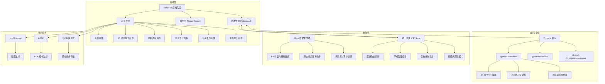
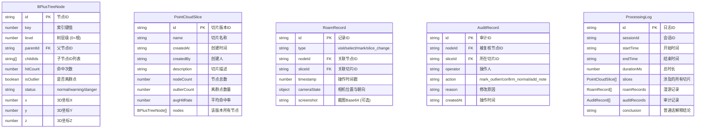

## 1. 架构设计



---

## 2. 技术描述

- **前端框架**：React@18 + TypeScript
- **构建工具**：Vite@5
- **样式方案**：TailwindCSS@3 + CSS Variables（主题色统一管理）
- **3D 渲染**：Three.js + @react-three/fiber + @react-three/drei + @react-three/postprocessing
- **状态管理**：Zustand（轻量级，统一管理处理记录与游戏状态）
- **路由**：React Router@6
- **导出功能**：html2canvas（截图） + jsPDF（报告）
- **图标**：Lucide React（线性图标，与霓虹风格适配）
- **后端**：无后端，全部使用程序化生成的 Mock 数据
- **数据库**：不使用，数据全部存储于前端状态与 localStorage

---

## 3. 路由定义

| 路由 | 页面组件 | 用途 |
|------|----------|------|
| `/` | `HomePage` | 首页，产品介绍与开始入口 |
| `/roam` | `RoamPage` | 3D 漫游主场景，包含所有控制面板 |
| `/settle` | `SettlePage` | 结算复盘页，展示时间线与审计记录 |
| `/report` | `ReportPage` | 报告预览与导出页 |

---

## 4. 数据模型

### 4.1 核心数据结构



### 4.2 Zustand Store 设计

```typescript
interface GameState {
  status: 'idle' | 'playing' | 'paused' | 'settled';
  startTime: number | null;
  elapsedTime: number;
  currentSliceId: string;
  selectedNodeId: string | null;
  slices: PointCloudSlice[];
  roamRecords: RoamRecord[];
  auditRecords: AuditRecord[];
  cameraSnapshot: object | null;
  
  start: () => void;
  pause: () => void;
  resume: () => void;
  reset: () => void;
  settle: () => ProcessingLog;
  
  selectSlice: (id: string) => void;
  selectNode: (id: string | null) => void;
  markOutlier: (nodeId: string, reason: string, operator: string) => void;
  confirmNormal: (nodeId: string, reason: string, operator: string) => void;
  addRoamRecord: (record: Omit<RoamRecord, 'id' | 'timestamp'>) => void;
  generateConclusion: () => string;
}
```

---

## 5. 组件层级结构

```
App
├── Router
│   ├── HomePage
│   │   ├── ParticleBackground
│   │   ├── HeroSection
│   │   └── InstructionsCard
│   │
│   ├── RoamPage
│   │   ├── TopControlBar
│   │   │   ├── GameTimer
│   │   │   ├── ControlButtons (开始/暂停/重开/结算/复盘)
│   │   │   └── StatusIndicator
│   │   │
│   │   ├── ThreeCanvas
│   │   │   ├── BPlusTreeScene
│   │   │   │   ├── TreeNode (递归渲染)
│   │   │   │   ├── TreeEdges
│   │   │   │   └── OutlierFloaters
│   │   │   ├── PointCloudParticles
│   │   │   ├── CameraController
│   │   │   └── PostProcessingEffects
│   │   │
│   │   ├── SliceComparePanel (左侧)
│   │   │   ├── SliceSelector
│   │   │   ├── SliceView (左)
│   │   │   ├── SliceView (右)
│   │   │   └── DiffHighlighter
│   │   │
│   │   ├── NodeDetailPanel (右侧)
│   │   │   ├── NodeInfoTable
│   │   │   ├── StatusBadge
│   │   │   └── OutlierActions
│   │   │
│   │   └── OutlierList (底部)
│   │       ├── OutlierCard
│   │       └── ReviewModal
│   │
│   ├── SettlePage
│   │   ├── OverviewStats
│   │   ├── RoamTimeline
│   │   │   └── TimelineEvent
│   │   ├── AuditTable
│   │   └── ActionButtons (返回/导出报告)
│   │
│   └── ReportPage
│       ├── ReportPreview
│       │   ├── ReportHeader
│       │   ├── ScreenshotSection
│       │   ├── StatsSection
│       │   ├── AuditSection
│       │   └── PlainTextConclusion
│       └── ExportButtons (PNG/PDF/JSON)
```

---

## 6. 关键技术决策

1. **统一处理记录源**：所有 UI 面板、3D 渲染、报告导出均从同一个 Zustand Store (`ProcessingLog`) 读取数据，确保"界面、报告各算各的"问题不出现
2. **切片版本管理**：每次切片变更都完整深拷贝节点数据存入历史数组，对比时直接取两个版本做 diff
3. **审计记录不可变**：`AuditRecord` 一旦创建不可修改，展示时做哈希校验提示完整性
4. **相机状态序列化**：复盘回溯时将 `{position, rotation, target}` 存入 RoamRecord，支持动画过渡回放
5. **截图与状态绑定**：每次关键操作自动截取 canvas，与 RoamRecord 绑定存储，报告中直接复用
6. **普通话解释生成器**：基于统计数据（异常率、改善度、节点分布）用模板字符串生成可直接复制的中文段落
