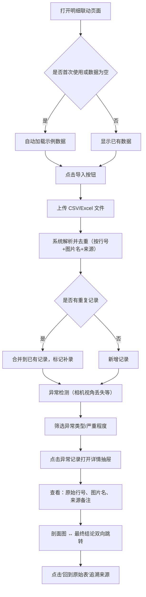

## 1. 产品概述

大模型特征空间投影是一款面向城市规划设计师的专业数据审查工具，用于批量核验 AI 辅助生成的空间投影结果，快速定位"相机视角丢失"等异常记录，并支持从结论追溯到原始数据源。

- 解决痛点：规划设计师被反复追问异常来源、重复导入导致结论混乱、人工查表效率低下
- 核心价值：导入即出结论、异常可追溯、结论不重复、评审有示例

## 2. 核心功能

### 2.1 用户角色

| 角色 | 注册方式 | 核心权限 |
|------|----------|----------|
| 规划设计师 | 本地工具直接使用 | 导入数据、筛选异常、查看详情、导出结论 |
| 评审方 | 打开演示模式查看示例 | 浏览示例数据、时间回放、交叉验证 |

### 2.2 功能模块

1. **明细联动（日常入口）**：数据导入、异常筛选、异常列表、详情抽屉、来源追溯
2. **时间回放（月底/课前入口）**：时间轴导航、版本对比、过程回放
3. **交叉跳转**：剖面图 ↔ 最终结论双向跳转、原始行号/图片名定位
4. **数据一致性**：重复导入检测、补录合并、同事件去重
5. **首次示例数据**：首次打开自动加载演示数据集

### 2.3 页面详情

| 页面名称 | 模块名称 | 功能描述 |
|----------|----------|----------|
| 明细联动 | 顶部工具栏 | 导入按钮（CSV/Excel）、筛选条件（异常类型、日期范围、项目）、搜索框 |
| 明细联动 | 异常列表 | 表格展示：行号、图片名、异常类型、严重程度、处理意见、来源备注、操作列 |
| 明细联动 | 详情抽屉 | 左侧原始数据快照（保留原始行号）、右侧处理意见+剖面图、底部结论跳转按钮 |
| 时间回放 | 时间轴控件 | 滑块选择时间点、播放/暂停、版本标签（导入批次） |
| 时间回放 | 回放视图 | 数据变化高亮、异常出现/消失标记、结论变更记录 |
| 详情抽屉 | 来源追溯区 | 原始行号跳转、图片名链接、来源备注卡片、"回到原始表"按钮 |
| 详情抽屉 | 结论跳转区 | 剖面图缩略图可点击跳转到最终结论、结论区可点击回剖面图 |
| 全局 | 首次引导 | 检测为空时自动加载示例数据、提示气泡说明关键功能 |

## 3. 核心流程

用户日常工作流程：打开明细联动 → 导入投影结果 CSV → 系统自动去重并标记异常 → 按异常类型筛选 → 点击某条记录查看详情 → 在详情中查看剖面图和处理意见 → 通过来源备注追溯到原始表 → 如为重复导入则与已有结论合并。

## 4. 用户界面设计

### 4.1 设计风格

- **主色调**：深锌灰色（zinc-900）背景 + 琥珀色（amber-500）异常标记 + 青色（cyan-400）选中态，工业工具感
- **辅助色**：锈红（rose-500）表示严重异常、石灰绿（lime-400）表示已处理
- **按钮风格**：方角、细线边框、hover 时背景微亮、按下有凹陷感
- **字体**：等宽字体（JetBrains Mono）用于数据区（行号、图片名），无衬线黑体（Noto Sans SC）用于标签和说明
- **布局风格**：三栏高密度工业布局（左筛选 + 中列表 + 右抽屉），顶部固定工具栏
- **图标**：Lucide 线性图标，异常项用三角形警告图标

### 4.2 页面设计概述

| 页面名称 | 模块名称 | UI 元素 |
|----------|----------|----------|
| 明细联动 | 顶部工具栏 | 深色方角导入按钮、下拉筛选芯片、搜索框（左侧带放大镜图标） |
| 明细联动 | 异常列表 | 斑马纹表格、异常类型色块标签、严重程度圆点、可点击行 |
| 明细联动 | 详情抽屉 | 右侧滑入、半透明遮罩、内部分隔线、跳转按钮带下划线 |
| 时间回放 | 时间轴控件 | 底部固定滑块、带刻度、批次节点为小圆点、当前时间垂直线 |
| 时间回放 | 回放视图 | 卡片流布局、变化项有边框闪烁、版本标签右上角角标 |
| 全局 | 首次引导 | 半透明浮层、指向关键区域的箭头、琥珀色文字提示 |

### 4.3 响应式

桌面端优先（≥1280px），三栏布局完整呈现。平板端折叠筛选为抽屉，手机端列表单列展示，详情为全屏覆盖。

### 4.4 3D 场景指引

不适用，本产品为数据密集型工具界面。
