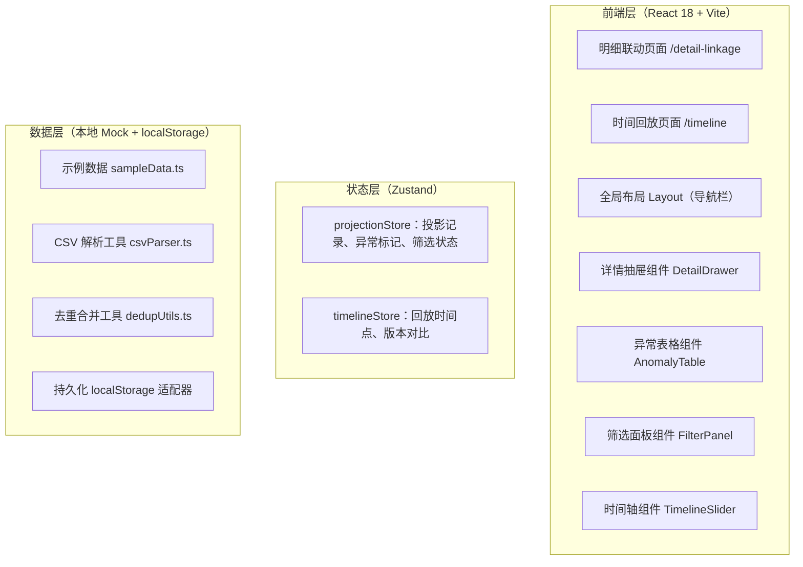
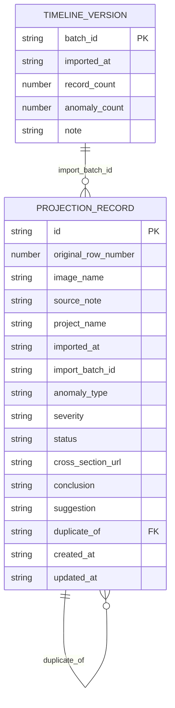

## 1. 架构设计



## 2. 技术描述

- **前端**：React@18 + TypeScript + Tailwind CSS@3 + React Router DOM@6 + Zustand@4 + Lucide React
- **初始化工具**：vite-init，模板选择 react-ts（纯前端）
- **后端**：无，纯前端工具，数据通过 localStorage 持久化，CSV 导入通过 PapaParse
- **数据库**：localStorage 存储 JSON，首次启动注入示例数据
- **额外依赖**：papaparse（CSV 解析）

## 3. 路由定义

| 路由 | 用途 |
|------|------|
| / | 重定向到 /detail-linkage |
| /detail-linkage | 明细联动页面（日常入口，默认页） |
| /timeline | 时间回放页面（月底/课前入口） |

## 4. API 定义

无后端，所有逻辑在前端完成。以下是核心 TypeScript 类型定义：

```typescript
// 投影记录核心类型
type AnomalyType = 'camera_view_lost' | 'projection_distortion' | 'scale_mismatch' | 'normal';
type Severity = 'critical' | 'warning' | 'info';
type RecordStatus = 'new' | 'merged' | 'supplemented' | 'resolved';

interface ProjectionRecord {
  id: string;                    // 内部唯一 ID
  originalRowNumber: number;     // 原始行号（追溯用）
  imageName: string;             // 图片名
  sourceNote: string;            // 来源备注
  projectName: string;           // 项目名
  importedAt: string;            // 导入时间 ISO
  importBatchId: string;         // 导入批次 ID
  anomalyType: AnomalyType;      // 异常类型
  severity: Severity;            // 严重程度
  status: RecordStatus;          // 记录状态
  crossSectionUrl: string;       // 剖面图占位
  conclusion: string;            // 最终结论
  suggestion: string;            // 处理意见
  duplicateOf?: string;          // 若为重复记录，指向原记录 ID
  supplementedFields?: string[]; // 补录字段列表
  createdAt: string;
  updatedAt: string;
}

interface FilterState {
  anomalyTypes: AnomalyType[];
  severities: Severity[];
  projectName?: string;
  dateFrom?: string;
  dateTo?: string;
  keyword?: string;
}

interface TimelineVersion {
  batchId: string;
  importedAt: string;
  recordCount: number;
  anomalyCount: number;
  note: string;
}
```

## 5. 数据模型

### 6.1 数据模型定义



### 6.2 初始数据（示例）

在 `src/data/sampleData.ts` 中预置 20 条示例记录，覆盖：
- 相机视角丢失（critical，含原始行号 7、23、45）
- 投影畸变（warning）
- 比例不匹配（info）
- 正常记录
- 2 个补录批次，用于演示去重合并
- 4 个时间版本，用于时间回放
