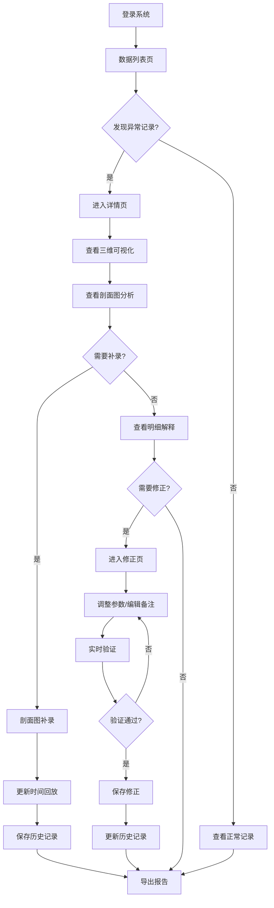

# 救援绳索角度模拟工作台 - 产品需求文档

## 1. 产品概述

救援绳索角度模拟工作台是一个面向展馆讲解员的专业数据复核平台，用于解决时间参数和风险备注不匹配的问题。系统提供直观的数据可视化、智能异常诊断和完整的操作历史追踪，确保讲解员能够快速定位问题、理解原因并采取正确的修正措施。

**核心价值**：
- 消除时间参数与风险备注的不匹配问题，提升数据准确性
- 提供清晰的异常诊断指引，降低讲解员复核难度
- 完整的操作历史记录，支持审计和追溯

## 2. 核心功能

### 2.1 用户角色

| 角色 | 核心权限 |
|------|---------|
| 展馆讲解员 | 查看列表、详情查看、数据修正、历史查看、报告导出 |
| 运维人员 | 查看导出报告、理解异常原因 |

### 2.2 功能模块

1. **数据列表页**：模拟记录列表、筛选搜索、异常标记、快速预览
2. **详情查看页**：完整数据展示、三维可视化、剖面图分析、时间回放
3. **数据修正页**：参数调整、备注编辑、修正原因记录、实时验证
4. **历史记录页**：操作日志、版本对比、变更追踪
5. **报告导出页**：报告生成、格式选择、异常说明、透明遮挡误读原因

### 2.3 页面详情

| 页面名称 | 模块名称 | 功能描述 |
|---------|---------|---------|
| 数据列表页 | 记录列表 | 展示所有救援绳索角度模拟记录，支持按时间、状态、风险等级筛选 |
| 数据列表页 | 异常标记 | 用不同颜色和图标标记异常类型（时间参数不匹配、风险备注缺失等） |
| 数据列表页 | 快速预览 | 鼠标悬停显示关键参数预览，无需进入详情页 |
| 详情查看页 | 三维可视化 | 展示绳索角度的三维模型，支持旋转、缩放、剖面查看 |
| 详情查看页 | 剖面图分析 | 多剖面切分查看，每个剖面独立判断，支持补录和修正 |
| 详情查看页 | 时间回放 | 按时间轴回放模拟过程，剖面图补录后自动更新回放内容 |
| 详情查看页 | 明细解释面板 | 图表/画布/三维视图旁边显示详细解释，不依赖颜色猜测 |
| 数据修正页 | 参数调整 | 调整时间参数、角度参数等，实时验证数据合理性 |
| 数据修正页 | 备注编辑 | 编辑风险备注，系统提示不匹配项 |
| 数据修正页 | 修正原因 | 记录修正原因，支持附件上传 |
| 历史记录页 | 操作日志 | 显示所有操作记录，包括查看、修正、导出等 |
| 历史记录页 | 版本对比 | 对比不同版本的数据差异，高亮变更项 |
| 报告导出页 | 报告生成 | 生成包含所有数据的完整报告，支持 PDF、Excel 格式 |
| 报告导出页 | 异常说明 | 详细说明每项异常的原因，包括透明遮挡误读被拦截的原因 |

## 3. 核心流程

### 3.1 数据复核流程

讲解员登录系统后，进入数据列表页查看所有模拟记录。系统自动标记异常记录（时间参数与风险备注不匹配）。讲解员点击异常记录进入详情页，查看三维可视化和剖面图分析。系统在图表旁边提供详细解释，说明异常原因和下一步操作建议。讲解员根据提示进入修正页面，调整参数或编辑备注。系统实时验证修正后的数据，确保时间参数与风险备注匹配。修正完成后，操作记录自动保存到历史记录页。

### 3.2 剖面图补录流程

讲解员在详情页查看剖面图时，发现某个剖面判断有误。点击该剖面进入补录模式，输入正确的判断结果和原因。系统自动更新时间回放内容，将新的判断结果同步到回放时间轴。历史记录页自动记录此次补录操作。

### 3.3 报告导出流程

运维人员进入报告导出页，选择需要导出的记录范围。系统生成报告，包含所有数据、异常说明和透明遮挡误读被拦截的原因。运维人员下载报告，无需登录系统即可理解异常原因。

## 4. 用户界面设计

### 4.1 设计风格

**主色调**：
- 主色：深蓝色 (#1E3A8A) - 专业、可靠
- 辅助色：橙色 (#F97316) - 警示、注意
- 成功色：绿色 (#10B981) - 正常、通过
- 错误色：红色 (#EF4444) - 异常、错误
- 背景色：浅灰色 (#F9FAFB) - 清爽、易读

**按钮样式**：
- 主要按钮：圆角矩形，深蓝色背景，白色文字
- 次要按钮：圆角矩形，白色背景，深蓝色边框和文字
- 危险按钮：圆角矩形，红色背景，白色文字

**字体**：
- 标题：思源黑体 Bold，24px-32px
- 正文：思源黑体 Regular，14px-16px
- 数据：Roboto Mono，14px（用于数字和代码）

**布局风格**：
- 顶部导航栏：固定高度 64px，包含 Logo、导航菜单、用户信息
- 左侧边栏：宽度 240px，包含功能菜单
- 主内容区：自适应宽度，卡片式布局
- 右侧面板：宽度 320px，显示明细解释和操作提示

**图标风格**：
- 线性图标，2px 描边
- 异常图标：感叹号三角形
- 成功图标：对勾圆形
- 操作图标：齿轮、编辑、下载等

### 4.2 页面设计概览

| 页面名称 | 模块名称 | UI 元素 |
|---------|---------|---------|
| 数据列表页 | 记录列表 | 表格布局，每行显示记录ID、时间、状态、风险等级、操作按钮；异常记录用橙色边框高亮；悬停显示快速预览卡片 |
| 数据列表页 | 筛选搜索 | 顶部筛选栏，包含时间范围选择器、状态下拉框、风险等级下拉框、搜索输入框 |
| 详情查看页 | 三维可视化 | 中央大画布，占据 60% 宽度；支持鼠标拖拽旋转、滚轮缩放；右侧 320px 面板显示明细解释 |
| 详情查看页 | 剖面图分析 | 底部横向排列多个剖面卡片，每个卡片包含剖面图和判断结果；点击卡片展开详细编辑 |
| 详情查看页 | 时间回放 | 底部时间轴，显示关键时间节点；拖动时间轴指针，三维视图同步更新 |
| 数据修正页 | 参数调整 | 左侧表单，包含时间参数、角度参数输入框；右侧实时预览三维模型变化 |
| 数据修正页 | 备注编辑 | 富文本编辑器，支持文本格式、列表、链接 |
| 历史记录页 | 操作日志 | 时间线布局，每条记录显示操作时间、操作人、操作类型、变更内容 |
| 历史记录页 | 版本对比 | 左右分栏，左侧显示旧版本，右侧显示新版本，差异项高亮 |
| 报告导出页 | 报告生成 | 表单选择导出范围、格式；预览区域显示报告内容；异常说明区域详细列出每项异常原因 |

### 4.3 响应式设计

- 桌面优先设计，最小支持 1440px 宽度
- 右侧明细面板可折叠，适应较小屏幕
- 三维可视化支持全屏模式

### 4.4 三维场景指导

**环境设置**：
- HDRI 环境：室内展厅环境，柔和光照
- 背景：浅灰色渐变，突出绳索模型

**光照设置**：
- 主光源：方向光，模拟展厅顶灯，色温 5000K
- 补光：环境光，强度 0.4，均匀照亮阴影区域
- 高光：点光源，突出绳索关键部位

**相机设置**：
- 初始位置：距离模型 5 米，俯视角度 30 度
- 运动控制：鼠标左键旋转，右键平移，滚轮缩放
- 动画：平滑过渡到剖面视角

**交互与动画**：
- 悬停高亮：鼠标悬停在绳索上，高亮显示该段
- 点击选中：点击绳索段，显示详细参数
- 剖面动画：剖面平面从一侧切入，动画时长 0.5 秒

**后处理效果**：
- 抗锯齿：FXAA
- 阴影：PCF 软阴影
- 轮廓线：选中对象显示蓝色轮廓

**性能预算**：
- 模型面数：≤ 10000 面
- 纹理大小：≤ 2048x2048
- 帧率：≥ 30 FPS

## 5. 异常处理设计

### 5.1 异常类型分类

| 异常类型 | 显示方式 | 下一步操作建议 |
|---------|---------|---------------|
| 时间参数与风险备注不匹配 | 橙色边框 + 感叹号图标 | "请检查时间参数是否与风险备注描述一致，或补充缺失的风险备注" |
| 透明遮挡误读 | 红色边框 + 阻挡图标 | "检测到透明遮挡可能导致误读，建议重新测量或调整遮挡物位置" |
| 数据缺失 | 黄色边框 + 问号图标 | "部分数据缺失，请补充完整后重新提交" |
| 参数超出范围 | 紫色边框 + 警告图标 | "参数值超出正常范围，请确认是否需要修正" |

### 5.2 明细解释面板

每个图表、画布或三维视图旁边必须显示明细解释面板，内容包括：
1. **当前状态**：正常/异常/警告
2. **数据说明**：当前显示的数据含义
3. **异常原因**：如果异常，详细说明原因
4. **操作建议**：下一步应该做什么（补材料/改口径/重新测量等）
5. **相关文档链接**：跳转到帮助文档或操作指南

## 6. 非功能性需求

### 6.1 性能要求
- 页面加载时间 ≤ 2 秒
- 三维模型渲染帧率 ≥ 30 FPS
- 数据查询响应时间 ≤ 500ms

### 6.2 可用性要求
- 界面操作简单直观，讲解员无需培训即可上手
- 异常提示清晰明确，不依赖颜色猜测
- 支持键盘快捷键操作

### 6.3 兼容性要求
- 支持 Chrome、Firefox、Edge 最新版本
- 支持 Windows 10+、macOS 10.15+ 操作系统

### 6.4 数据安全要求
- 所有操作记录必须保存，支持审计追溯
- 数据修正必须记录修正原因和操作人
- 敏感数据加密存储