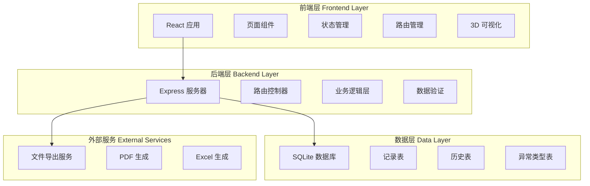
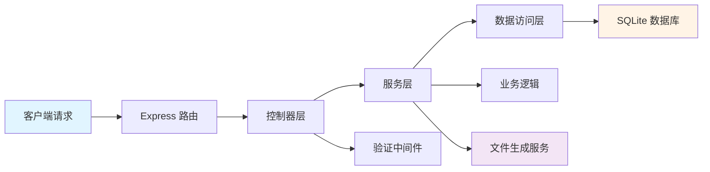
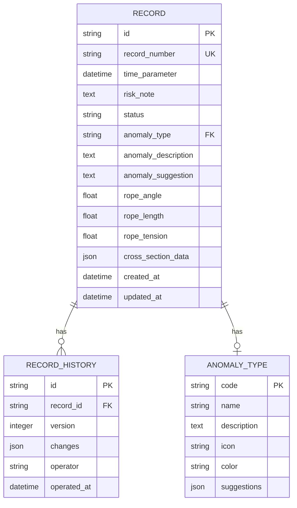

# 救援绳索角度模拟工作台 - 技术架构文档

## 1. 架构设计



## 2. 技术描述

### 2.1 前端技术栈

- **框架**: React 18 + TypeScript
- **构建工具**: Vite
- **样式**: Tailwind CSS 3
- **状态管理**: Zustand（轻量级状态管理）
- **路由**: React Router v6
- **UI 组件库**: Radix UI（无样式组件）+ Tailwind CSS
- **图标**: Lucide React
- **图表**: Recharts
- **3D 可视化**: Three.js + React Three Fiber + React Three Drei
- **表单**: React Hook Form + Zod
- **日期处理**: date-fns
- **HTTP 客户端**: Axios

### 2.2 后端技术栈

- **运行时**: Node.js
- **框架**: Express 4
- **数据库**: SQLite（轻量级本地数据库）
- **ORM**: Prisma
- **验证**: Zod
- **文件生成**: 
  - PDF: Puppeteer
  - Excel: ExcelJS
  - Word: docx

### 2.3 开发工具

- **代码规范**: ESLint + Prettier
- **类型检查**: TypeScript
- **包管理器**: pnpm
- **版本控制**: Git

## 3. 路由定义

### 3.1 前端路由

| 路由路径 | 页面名称 | 功能描述 |
|---------|---------|---------|
| `/` | 重定向到 `/records` | 根路径重定向 |
| `/records` | 记录列表页 | 展示所有记录列表 |
| `/records/:id` | 记录详情页 | 查看单条记录详情 |
| `/records/:id/edit` | 记录修正页 | 修正记录参数 |
| `/records/:id/history` | 历史追溯页 | 查看记录修改历史 |
| `/export` | 报告导出页 | 配置和导出报告 |

### 3.2 后端 API 路由

| HTTP 方法 | 路由路径 | 功能描述 |
|-----------|---------|---------|
| GET | `/api/records` | 获取记录列表（支持分页、筛选） |
| GET | `/api/records/:id` | 获取单条记录详情 |
| POST | `/api/records` | 创建新记录 |
| PUT | `/api/records/:id` | 更新记录 |
| DELETE | `/api/records/:id` | 删除记录 |
| GET | `/api/records/:id/history` | 获取记录修改历史 |
| POST | `/api/records/:id/simulation` | 运行角度模拟 |
| GET | `/api/anomalies` | 获取异常类型列表 |
| GET | `/api/export/pdf` | 导出 PDF 报告 |
| GET | `/api/export/excel` | 导出 Excel 报告 |
| GET | `/api/export/word` | 导出 Word 报告 |

## 4. API 定义

### 4.1 数据类型定义

```typescript
// 记录状态
enum RecordStatus {
  NORMAL = 'normal',           // 正常
  ANOMALY = 'anomaly',         // 异常
  CORRECTED = 'corrected',     // 已修正
  PENDING = 'pending',         // 待处理
}

// 异常类型
enum AnomalyType {
  TIME_MISMATCH = 'TIME_MISMATCH',                     // 时间参数不匹配
  RISK_NOTE_MISSING = 'RISK_NOTE_MISSING',             // 风险备注缺失
  TRANSPARENT_OCCLUSION = 'TRANSPARENT_OCCLUSION',     // 透明遮挡误读
  PARAM_OUT_OF_RANGE = 'PARAM_OUT_OF_RANGE',           // 参数超出范围
  DATA_FORMAT_ERROR = 'DATA_FORMAT_ERROR',             // 数据格式错误
}

// 记录接口
interface Record {
  id: string;
  recordNumber: string;           // 记录编号
  timeParameter: Date;             // 时间参数
  riskNote: string;                // 风险备注
  status: RecordStatus;            // 状态
  anomalyType?: AnomalyType;       // 异常类型
  anomalyDescription?: string;     // 异常描述
  anomalySuggestion?: string;      // 异常处理建议
  ropeAngle: number;               // 绳索角度
  ropeLength: number;              // 绳索长度
  ropeTension: number;             // 绳索张力
  crossSectionData: CrossSectionData; // 剖面图数据
  createdAt: Date;                 // 创建时间
  updatedAt: Date;                 // 更新时间
}

// 剖面图数据
interface CrossSectionData {
  points: Array<{x: number; y: number; z: number}>;  // 剖面点坐标
  parameters: {                                     // 剖面参数
    depth: number;
    width: number;
    height: number;
  };
  annotations: Array<{                              // 标注
    position: {x: number; y: number; z: number};
    text: string;
  }>;
}

// 记录历史
interface RecordHistory {
  id: string;
  recordId: string;
  version: number;
  changes: Array<{
    field: string;
    oldValue: any;
    newValue: any;
  }>;
  operator: string;
  operatedAt: Date;
}

// 异常类型详情
interface AnomalyTypeDetail {
  code: AnomalyType;
  name: string;
  description: string;
  icon: string;
  color: string;
  suggestions: Array<{
    action: string;
    description: string;
  }>;
}

// 导出配置
interface ExportConfig {
  format: 'pdf' | 'excel' | 'word';
  dateRange: {
    start: Date;
    end: Date;
  };
  status?: RecordStatus[];
  anomalyTypes?: AnomalyType[];
  includeHistory: boolean;
  includeCharts: boolean;
}
```

### 4.2 API 请求/响应示例

#### 获取记录列表

**请求**:
```typescript
GET /api/records?page=1&pageSize=20&status=anomaly&anomalyType=TIME_MISMATCH&startDate=2024-01-01&endDate=2024-12-31
```

**响应**:
```typescript
{
  success: true;
  data: {
    records: Record[];
    total: number;
    page: number;
    pageSize: number;
  };
}
```

#### 获取记录详情

**请求**:
```typescript
GET /api/records/:id
```

**响应**:
```typescript
{
  success: true;
  data: {
    record: Record;
    history: RecordHistory[];
    relatedRecords: Record[];
  };
}
```

#### 更新记录

**请求**:
```typescript
PUT /api/records/:id
{
  timeParameter: "2024-06-07T10:30:00Z",
  riskNote: "高风险：角度超过安全阈值",
  crossSectionData: {
    points: [...],
    parameters: {...},
    annotations: [...]
  }
}
```

**响应**:
```typescript
{
  success: true;
  data: {
    record: Record;
    historyEntry: RecordHistory;
  };
}
```

## 5. 服务器架构图



### 5.1 分层说明

1. **路由层 (Router)**: 定义 API 路由，映射到控制器方法
2. **控制器层 (Controller)**: 处理 HTTP 请求，调用服务层
3. **服务层 (Service)**: 实现业务逻辑，协调数据访问
4. **数据访问层 (Repository)**: 封装数据库操作
5. **数据库层 (Database)**: SQLite 数据存储

## 6. 数据模型

### 6.1 数据模型定义



### 6.2 数据定义语言 (DDL)

```sql
-- 异常类型表
CREATE TABLE anomaly_type (
    code TEXT PRIMARY KEY,
    name TEXT NOT NULL,
    description TEXT,
    icon TEXT,
    color TEXT,
    suggestions TEXT,  -- JSON 格式
    created_at DATETIME DEFAULT CURRENT_TIMESTAMP,
    updated_at DATETIME DEFAULT CURRENT_TIMESTAMP
);

-- 记录表
CREATE TABLE record (
    id TEXT PRIMARY KEY,
    record_number TEXT UNIQUE NOT NULL,
    time_parameter DATETIME NOT NULL,
    risk_note TEXT,
    status TEXT NOT NULL DEFAULT 'normal',
    anomaly_type TEXT,
    anomaly_description TEXT,
    anomaly_suggestion TEXT,
    rope_angle REAL,
    rope_length REAL,
    rope_tension REAL,
    cross_section_data TEXT,  -- JSON 格式
    created_at DATETIME DEFAULT CURRENT_TIMESTAMP,
    updated_at DATETIME DEFAULT CURRENT_TIMESTAMP,
    FOREIGN KEY (anomaly_type) REFERENCES anomaly_type(code)
);

-- 记录历史表
CREATE TABLE record_history (
    id TEXT PRIMARY KEY,
    record_id TEXT NOT NULL,
    version INTEGER NOT NULL,
    changes TEXT,  -- JSON 格式
    operator TEXT,
    operated_at DATETIME DEFAULT CURRENT_TIMESTAMP,
    FOREIGN KEY (record_id) REFERENCES record(id) ON DELETE CASCADE
);

-- 创建索引
CREATE INDEX idx_record_status ON record(status);
CREATE INDEX idx_record_anomaly_type ON record(anomaly_type);
CREATE INDEX idx_record_time_parameter ON record(time_parameter);
CREATE INDEX idx_record_created_at ON record(created_at);
CREATE INDEX idx_record_history_record_id ON record_history(record_id);
CREATE INDEX idx_record_history_operated_at ON record_history(operated_at);

-- 初始化异常类型数据
INSERT INTO anomaly_type (code, name, description, icon, color, suggestions) VALUES
('TIME_MISMATCH', '时间参数不匹配', '时间参数与风险备注中的时间不一致', 'clock', '#E74C3C', '[{"action": "修正时间参数", "description": "检查时间参数，修正为一致的时间"}, {"action": "更新风险备注", "description": "更新风险备注中的时间信息"}]'),
('RISK_NOTE_MISSING', '风险备注缺失', '缺少风险备注或备注不完整', 'alert-triangle', '#F39C12', '[{"action": "补充风险备注", "description": "补充风险备注，确保完整性"}]'),
('TRANSPARENT_OCCLUSION', '透明遮挡误读', '透明遮挡导致角度读取错误', 'eye-off', '#9B59B6', '[{"action": "调整遮挡参数", "description": "调整遮挡参数，重新计算角度"}, {"action": "重新测量", "description": "重新进行角度测量"}]'),
('PARAM_OUT_OF_RANGE', '参数超出范围', '参数值超出允许范围', 'trending-up', '#E67E22', '[{"action": "调整参数值", "description": "调整参数值到允许范围内"}]'),
('DATA_FORMAT_ERROR', '数据格式错误', '数据格式不符合要求', 'file-x', '#95A5A6', '[{"action": "修正数据格式", "description": "修正数据格式，确保符合要求"}]');
```

## 7. 核心功能实现方案

### 7.1 角度模拟可视化

使用 Three.js + React Three Fiber 实现 3D 角度模拟：

```typescript
// 角度模拟组件结构
<RopeAngleSimulation>
  <Canvas>
    <PerspectiveCamera />
    <OrbitControls />
    <ambientLight />
    <directionalLight />
    
    {/* 绳索模型 */}
    <RopeModel 
      angle={ropeAngle}
      length={ropeLength}
      tension={ropeTension}
    />
    
    {/* 角度标注 */}
    <AngleAnnotation angle={ropeAngle} />
    
    {/* 参数面板 */}
    <ParameterPanel 
      parameters={{angle, length, tension}}
      onChange={handleParameterChange}
    />
  </Canvas>
  
  {/* 明细解释区 */}
  <DetailExplanation>
    <AngleExplanation angle={ropeAngle} />
    <TensionExplanation tension={ropeTension} />
    <SafetyWarning threshold={SAFETY_THRESHOLD} />
  </DetailExplanation>
</RopeAngleSimulation>
```

### 7.2 剖面图分析

使用 Canvas 2D 或 SVG 实现剖面图：

```typescript
// 剖面图组件结构
<CrossSectionAnalysis>
  <CrossSectionCanvas
    data={crossSectionData}
    onPointAdd={handlePointAdd}
    onPointUpdate={handlePointUpdate}
    editable={true}
  />
  
  {/* 参数标注 */}
  <ParameterAnnotations data={crossSectionData} />
  
  {/* 补录按钮 */}
  <SupplementButton onClick={handleSupplement} />
  
  {/* 明细解释区 */}
  <DetailExplanation>
    <DepthExplanation depth={crossSectionData.parameters.depth} />
    <WidthExplanation width={crossSectionData.parameters.width} />
    <HeightExplanation height={crossSectionData.parameters.height} />
  </DetailExplanation>
</CrossSectionAnalysis>
```

### 7.3 时间回放

实现时间回放功能，支持选择任意时间点查看状态：

```typescript
// 时间回放组件结构
<TimePlayback>
  {/* 时间轴 */}
  <Timeline
    history={recordHistory}
    currentTime={playbackTime}
    onTimeChange={handleTimeChange}
  />
  
  {/* 播放控制 */}
  <PlaybackControls
    isPlaying={isPlaying}
    onPlay={handlePlay}
    onPause={handlePause}
    onSpeedChange={handleSpeedChange}
  />
  
  {/* 状态展示 */}
  <StateDisplay
    state={getStateAtTime(playbackTime)}
  />
</TimePlayback>
```

### 7.4 异常说明面板

每个异常都有详细的说明和操作建议：

```typescript
// 异常说明面板组件
<AnomalyExplanationPanel anomaly={anomaly}>
  {/* 异常类型和图标 */}
  <AnomalyHeader 
    type={anomaly.type}
    icon={anomaly.icon}
    color={anomaly.color}
  />
  
  {/* 异常原因 */}
  <AnomalyReason>
    {anomaly.description}
  </AnomalyReason>
  
  {/* 影响范围 */}
  <AnomalyImpact>
    {anomaly.impact}
  </AnomalyImpact>
  
  {/* 下一步操作建议 */}
  <AnomalySuggestions>
    {anomaly.suggestions.map(suggestion => (
      <SuggestionButton
        key={suggestion.action}
        action={suggestion.action}
        description={suggestion.description}
        onClick={() => handleSuggestion(suggestion)}
      />
    ))}
  </AnomalySuggestions>
  
  {/* 参考文档链接 */}
  <ReferenceLink href={anomaly.documentation} />
</AnomalyExplanationPanel>
```

## 8. 性能优化方案

### 8.1 前端优化

1. **代码分割**: 使用 React.lazy 和 Suspense 进行路由级代码分割
2. **虚拟列表**: 使用 react-window 优化长列表渲染
3. **图表优化**: 使用 Recharts 的响应式容器和按需渲染
4. **3D 优化**: 
   - 使用 LOD (Level of Detail) 技术
   - 限制模型面数 < 10,000
   - 使用纹理压缩
   - 实现视锥剔除

### 8.2 后端优化

1. **数据库索引**: 为常用查询字段创建索引
2. **分页查询**: 所有列表查询都支持分页
3. **缓存策略**: 使用内存缓存频繁访问的数据
4. **批量操作**: 支持批量导出和批量更新

## 9. 安全性考虑

### 9.1 数据验证

- 使用 Zod 进行严格的输入验证
- 前后端双重验证
- 参数类型和范围检查

### 9.2 错误处理

- 统一错误处理中间件
- 友好的错误提示信息
- 错误日志记录

### 9.3 数据备份

- SQLite 数据库定期备份
- 导出报告自动保存

## 10. 部署方案

### 10.1 本地部署

- 前端：静态文件部署
- 后端：Node.js 服务
- 数据库：SQLite 文件数据库

### 10.2 启动流程

```bash
# 安装依赖
pnpm install

# 初始化数据库
pnpm run db:init

# 启动后端服务
pnpm run server

# 启动前端开发服务器
pnpm run dev

# 构建生产版本
pnpm run build
```

## 11. 测试策略

### 11.1 单元测试

- 使用 Vitest 进行单元测试
- 测试覆盖率 > 80%

### 11.2 集成测试

- 测试 API 接口
- 测试数据库操作

### 11.3 端到端测试

- 使用 Playwright 进行 E2E 测试
- 测试关键用户流程