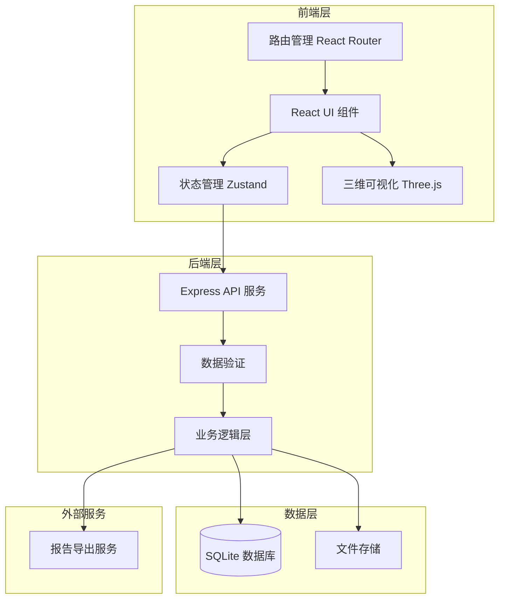
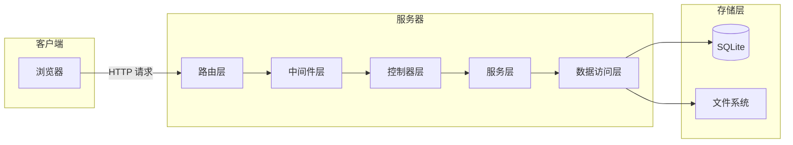
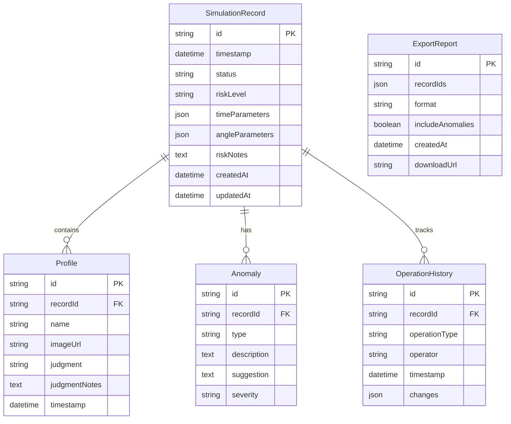

# 救援绳索角度模拟工作台 - 技术架构文档

## 1. 架构设计



## 2. 技术栈说明

### 2.1 前端技术栈

- **框架**: React 18 + TypeScript
- **构建工具**: Vite 5
- **样式方案**: Tailwind CSS 3
- **状态管理**: Zustand（轻量级状态管理）
- **路由**: React Router 6
- **三维可视化**: Three.js + React Three Fiber + React Three Drei
- **图表库**: Recharts（用于剖面图、时间轴等）
- **表单处理**: React Hook Form + Zod
- **HTTP 客户端**: Axios
- **日期处理**: date-fns
- **富文本编辑器**: TipTap（用于备注编辑）
- **PDF 导出**: jsPDF
- **Excel 导出**: xlsx

### 2.2 后端技术栈

- **运行时**: Node.js 18+
- **框架**: Express 4
- **数据库**: SQLite（本地文件数据库）
- **ORM**: Prisma
- **数据验证**: Zod
- **文件上传**: Multer
- **日志**: Winston
- **安全**: Helmet + CORS

### 2.3 开发工具

- **代码规范**: ESLint + Prettier
- **类型检查**: TypeScript
- **测试框架**: Vitest（单元测试）+ Playwright（E2E 测试）
- **版本控制**: Git

## 3. 路由定义

| 路由路径 | 页面名称 | 功能描述 |
|---------|---------|---------|
| `/` | 重定向到列表页 | 默认路由重定向 |
| `/records` | 数据列表页 | 展示所有模拟记录 |
| `/records/:id` | 详情查看页 | 查看单条记录详情 |
| `/records/:id/edit` | 数据修正页 | 修正记录数据 |
| `/history` | 历史记录页 | 查看操作历史 |
| `/export` | 报告导出页 | 导出报告 |

## 4. API 定义

### 4.1 数据类型定义

```typescript
type RecordStatus = 'normal' | 'warning' | 'error';

type RiskLevel = 'low' | 'medium' | 'high' | 'critical';

type AnomalyType = 'time_mismatch' | 'transparent_occlusion' | 'data_missing' | 'parameter_out_of_range';

interface SimulationRecord {
  id: string;
  timestamp: string;
  status: RecordStatus;
  riskLevel: RiskLevel;
  timeParameters: {
    startTime: string;
    endTime: string;
    duration: number;
  };
  angleParameters: {
    ropeAngle: number;
    tensionAngle: number;
    loadAngle: number;
  };
  riskNotes: string;
  anomalies: Anomaly[];
  profiles: Profile[];
  createdAt: string;
  updatedAt: string;
}

interface Anomaly {
  id: string;
  type: AnomalyType;
  description: string;
  suggestion: string;
  severity: 'low' | 'medium' | 'high';
}

interface Profile {
  id: string;
  name: string;
  imageUrl: string;
  judgment: 'pass' | 'fail' | 'pending';
  judgmentNotes: string;
  timestamp: string;
}

interface OperationHistory {
  id: string;
  recordId: string;
  operationType: 'view' | 'edit' | 'export' | 'profile_update';
  operator: string;
  timestamp: string;
  changes: {
    field: string;
    oldValue: string;
    newValue: string;
  }[];
}

interface ExportReport {
  id: string;
  recordIds: string[];
  format: 'pdf' | 'excel';
  includeAnomalies: boolean;
  createdAt: string;
  downloadUrl: string;
}
```

### 4.2 API 端点定义

#### 记录管理 API

```typescript
GET /api/records
Query: {
  page?: number;
  pageSize?: number;
  status?: RecordStatus;
  riskLevel?: RiskLevel;
  startDate?: string;
  endDate?: string;
  search?: string;
}
Response: {
  records: SimulationRecord[];
  total: number;
  page: number;
  pageSize: number;
}

GET /api/records/:id
Response: SimulationRecord

POST /api/records
Body: Omit<SimulationRecord, 'id' | 'createdAt' | 'updatedAt'>
Response: SimulationRecord

PUT /api/records/:id
Body: Partial<SimulationRecord>
Response: SimulationRecord

DELETE /api/records/:id
Response: { success: boolean }
```

#### 剖面图管理 API

```typescript
GET /api/records/:recordId/profiles
Response: Profile[]

POST /api/records/:recordId/profiles
Body: {
  name: string;
  imageUrl: string;
  judgment: 'pass' | 'fail' | 'pending';
  judgmentNotes: string;
}
Response: Profile

PUT /api/records/:recordId/profiles/:profileId
Body: Partial<Profile>
Response: Profile

DELETE /api/records/:recordId/profiles/:profileId
Response: { success: boolean }
```

#### 历史记录 API

```typescript
GET /api/history
Query: {
  recordId?: string;
  operationType?: string;
  startDate?: string;
  endDate?: string;
  page?: number;
  pageSize?: number;
}
Response: {
  history: OperationHistory[];
  total: number;
  page: number;
  pageSize: number;
}

GET /api/history/:id
Response: OperationHistory
```

#### 报告导出 API

```typescript
POST /api/export
Body: {
  recordIds: string[];
  format: 'pdf' | 'excel';
  includeAnomalies: boolean;
}
Response: {
  reportId: string;
  downloadUrl: string;
}

GET /api/export/:reportId
Response: {
  status: 'pending' | 'completed' | 'failed';
  downloadUrl?: string;
}
```

#### 三维模型 API

```typescript
GET /api/records/:id/model
Response: {
  modelUrl: string;
  format: 'glb' | 'gltf';
}

POST /api/records/:id/model
Body: FormData (model file)
Response: {
  modelUrl: string;
}
```

## 5. 服务器架构图



## 6. 数据模型

### 6.1 数据模型定义



### 6.2 数据定义语言（DDL）

```sql
CREATE TABLE simulation_records (
    id TEXT PRIMARY KEY,
    timestamp TEXT NOT NULL,
    status TEXT NOT NULL CHECK(status IN ('normal', 'warning', 'error')),
    risk_level TEXT NOT NULL CHECK(risk_level IN ('low', 'medium', 'high', 'critical')),
    time_parameters TEXT NOT NULL,
    angle_parameters TEXT NOT NULL,
    risk_notes TEXT,
    created_at TEXT NOT NULL DEFAULT (datetime('now')),
    updated_at TEXT NOT NULL DEFAULT (datetime('now'))
);

CREATE TABLE profiles (
    id TEXT PRIMARY KEY,
    record_id TEXT NOT NULL,
    name TEXT NOT NULL,
    image_url TEXT,
    judgment TEXT NOT NULL CHECK(judgment IN ('pass', 'fail', 'pending')),
    judgment_notes TEXT,
    timestamp TEXT NOT NULL,
    FOREIGN KEY (record_id) REFERENCES simulation_records(id) ON DELETE CASCADE
);

CREATE TABLE anomalies (
    id TEXT PRIMARY KEY,
    record_id TEXT NOT NULL,
    type TEXT NOT NULL CHECK(type IN ('time_mismatch', 'transparent_occlusion', 'data_missing', 'parameter_out_of_range')),
    description TEXT NOT NULL,
    suggestion TEXT NOT NULL,
    severity TEXT NOT NULL CHECK(severity IN ('low', 'medium', 'high')),
    FOREIGN KEY (record_id) REFERENCES simulation_records(id) ON DELETE CASCADE
);

CREATE TABLE operation_history (
    id TEXT PRIMARY KEY,
    record_id TEXT,
    operation_type TEXT NOT NULL CHECK(operation_type IN ('view', 'edit', 'export', 'profile_update')),
    operator TEXT NOT NULL,
    timestamp TEXT NOT NULL,
    changes TEXT,
    FOREIGN KEY (record_id) REFERENCES simulation_records(id) ON DELETE SET NULL
);

CREATE TABLE export_reports (
    id TEXT PRIMARY KEY,
    record_ids TEXT NOT NULL,
    format TEXT NOT NULL CHECK(format IN ('pdf', 'excel')),
    include_anomalies INTEGER NOT NULL,
    created_at TEXT NOT NULL DEFAULT (datetime('now')),
    download_url TEXT
);

CREATE INDEX idx_records_timestamp ON simulation_records(timestamp);
CREATE INDEX idx_records_status ON simulation_records(status);
CREATE INDEX idx_records_risk_level ON simulation_records(risk_level);
CREATE INDEX idx_profiles_record_id ON profiles(record_id);
CREATE INDEX idx_anomalies_record_id ON anomalies(record_id);
CREATE INDEX idx_history_record_id ON operation_history(record_id);
CREATE INDEX idx_history_timestamp ON operation_history(timestamp);
```

## 7. 项目目录结构

```
rescue-rope-simulation/
├── frontend/                    # 前端项目
│   ├── src/
│   │   ├── components/         # React 组件
│   │   │   ├── common/         # 通用组件
│   │   │   ├── layout/         # 布局组件
│   │   │   ├── records/        # 记录相关组件
│   │   │   ├── visualization/  # 三维可视化组件
│   │   │   └── export/         # 导出相关组件
│   │   ├── pages/              # 页面组件
│   │   ├── stores/             # Zustand 状态管理
│   │   ├── hooks/              # 自定义 Hooks
│   │   ├── services/           # API 服务
│   │   ├── utils/              # 工具函数
│   │   ├── types/              # TypeScript 类型定义
│   │   ├── styles/             # 全局样式
│   │   ├── App.tsx             # 应用入口
│   │   └── main.tsx            # 渲染入口
│   ├── public/                 # 静态资源
│   ├── index.html              # HTML 模板
│   ├── vite.config.ts          # Vite 配置
│   ├── tailwind.config.js      # Tailwind 配置
│   ├── tsconfig.json           # TypeScript 配置
│   └── package.json            # 依赖配置
├── backend/                     # 后端项目
│   ├── src/
│   │   ├── controllers/        # 控制器
│   │   ├── services/           # 服务层
│   │   ├── repositories/      # 数据访问层
│   │   ├── models/             # 数据模型
│   │   ├── routes/             # 路由定义
│   │   ├── middlewares/        # 中间件
│   │   ├── validators/         # 数据验证
│   │   ├── utils/              # 工具函数
│   │   ├── types/              # TypeScript 类型定义
│   │   └── app.ts              # 应用入口
│   ├── prisma/
│   │   └── schema.prisma       # Prisma 模型定义
│   ├── uploads/                # 上传文件存储
│   ├── exports/                 # 导出文件存储
│   ├── tsconfig.json           # TypeScript 配置
│   └── package.json            # 依赖配置
├── shared/                      # 前后端共享代码
│   └── types/                  # 共享类型定义
├── docs/                        # 文档
├── tests/                       # 测试文件
│   ├── unit/                   # 单元测试
│   └── e2e/                    # E2E 测试
├── .gitignore                  # Git 忽略文件
├── README.md                    # 项目说明
└── package.json                # 根 package.json
```

## 8. 关键技术实现

### 8.1 三维可视化实现

使用 React Three Fiber 实现三维绳索模型可视化：

```typescript
import { Canvas } from '@react-three/fiber';
import { OrbitControls, PerspectiveCamera } from '@react-three/drei';

function RopeVisualization({ angleParameters }) {
  return (
    <Canvas>
      <PerspectiveCamera makeDefault position={[0, 5, 10]} />
      <OrbitControls 
        enablePan={true}
        enableZoom={true}
        enableRotate={true}
      />
      <ambientLight intensity={0.4} />
      <directionalLight position={[10, 10, 5]} intensity={1} />
      <RopeModel angleParameters={angleParameters} />
    </Canvas>
  );
}
```

### 8.2 剖面图分析实现

使用 Recharts 实现剖面图：

```typescript
import { LineChart, Line, XAxis, YAxis, CartesianGrid, Tooltip } from 'recharts';

function ProfileChart({ profileData }) {
  return (
    <LineChart data={profileData}>
      <CartesianGrid strokeDasharray="3 3" />
      <XAxis dataKey="position" />
      <YAxis />
      <Tooltip />
      <Line type="monotone" dataKey="angle" stroke="#1E3A8A" />
    </LineChart>
  );
}
```

### 8.3 时间回放实现

使用时间轴组件实现回放功能：

```typescript
function TimelineReplay({ events, currentTime, onTimeChange }) {
  return (
    <div className="timeline-container">
      <input
        type="range"
        min={0}
        max={events.length - 1}
        value={currentTime}
        onChange={(e) => onTimeChange(parseInt(e.target.value))}
      />
      <div className="timeline-events">
        {events.map((event, index) => (
          <div 
            key={index}
            className={`timeline-event ${index === currentTime ? 'active' : ''}`}
          >
            {event.timestamp}
          </div>
        ))}
      </div>
    </div>
  );
}
```

### 8.4 异常检测逻辑

后端实现异常检测服务：

```typescript
class AnomalyDetectionService {
  detectTimeMismatch(record: SimulationRecord): Anomaly | null {
    const { timeParameters, riskNotes } = record;
    const timeKeywords = this.extractTimeKeywords(riskNotes);
    
    if (!this.validateTimeMatch(timeParameters, timeKeywords)) {
      return {
        id: generateId(),
        type: 'time_mismatch',
        description: '时间参数与风险备注不匹配',
        suggestion: '请检查时间参数是否与风险备注描述一致，或补充缺失的风险备注',
        severity: 'high'
      };
    }
    return null;
  }
  
  detectTransparentOcclusion(record: SimulationRecord): Anomaly | null {
    const { angleParameters, profiles } = record;
    
    for (const profile of profiles) {
      if (this.hasTransparentOcclusion(profile)) {
        return {
          id: generateId(),
          type: 'transparent_occlusion',
          description: '检测到透明遮挡可能导致误读',
          suggestion: '建议重新测量或调整遮挡物位置',
          severity: 'high'
        };
      }
    }
    return null;
  }
}
```

## 9. 性能优化策略

### 9.1 前端优化

- **代码分割**: 使用 React.lazy 和 Suspense 实现路由级代码分割
- **虚拟滚动**: 长列表使用 react-window 实现虚拟滚动
- **缓存策略**: 使用 React Query 缓存 API 请求结果
- **图片懒加载**: 使用 Intersection Observer 实现图片懒加载
- **三维模型优化**: 使用 LOD（Level of Detail）技术，根据距离加载不同精度的模型

### 9.2 后端优化

- **数据库索引**: 为常用查询字段创建索引
- **分页查询**: 所有列表查询支持分页
- **连接池**: 使用数据库连接池管理连接
- **缓存**: 使用内存缓存频繁访问的数据
- **文件压缩**: 导出的 PDF 和 Excel 文件进行压缩

## 10. 安全策略

### 10.1 前端安全

- **XSS 防护**: 使用 React 自动转义 + DOMPurify 清理用户输入
- **CSRF 防护**: 使用 CSRF Token
- **敏感数据**: 不在前端存储敏感信息

### 10.2 后端安全

- **输入验证**: 使用 Zod 验证所有输入数据
- **SQL 注入防护**: 使用 Prisma ORM 参数化查询
- **文件上传**: 限制文件类型和大小，病毒扫描
- **日志审计**: 记录所有操作日志

## 11. 部署方案

### 11.1 开发环境

- 前端：Vite 开发服务器，端口 5173
- 后端：Node.js 服务器，端口 3000
- 数据库：SQLite 本地文件

### 11.2 生产环境

- 前端：构建静态文件，使用 Nginx 托管
- 后端：PM2 管理 Node.js 进程
- 数据库：SQLite 文件定期备份
- 日志：Winston 日志轮转

## 12. 测试策略

### 12.1 单元测试

- 前端：使用 Vitest 测试组件和工具函数
- 后端：使用 Vitest 测试服务和控制器
- 覆盖率目标：≥ 80%

### 12.2 集成测试

- API 集成测试：测试所有 API 端点
- 数据库集成测试：测试数据库操作

### 12.3 E2E 测试

- 使用 Playwright 测试关键用户流程
- 测试场景：
  - 记录列表查看和筛选
  - 记录详情查看和剖面图补录
  - 数据修正和历史记录查看
  - 报告导出