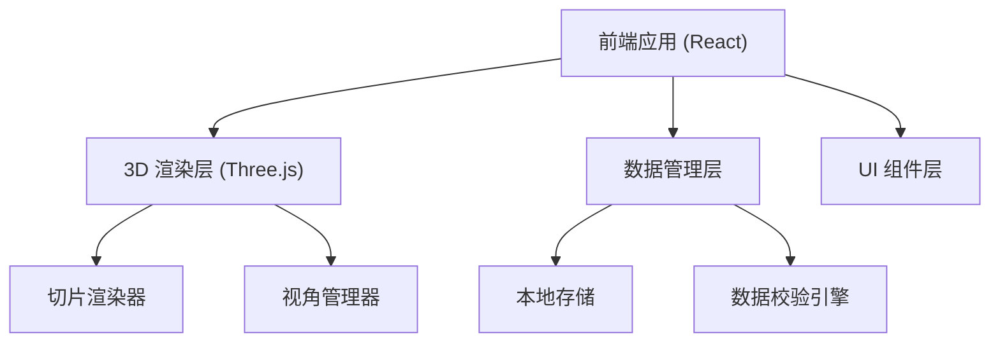
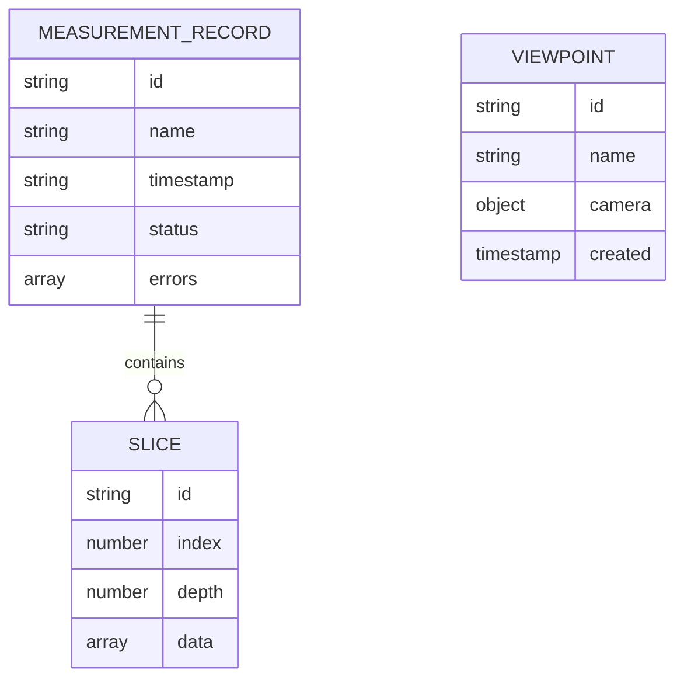

## 1. 架构设计


## 2. 技术描述
- 前端：React@18 + TypeScript + Vite
- 3D 渲染：Three.js
- 样式：Tailwind CSS
- 数据存储：LocalStorage
- 无后端，纯前端应用

## 3. 路由定义
| 路由 | 用途 |
|------|------|
| / | 主界面 |

## 4. 数据模型

### 4.1 数据模型定义


### 4.2 TypeScript 类型定义
```typescript
interface SliceData {
  id: string;
  index: number;
  depth: number;
  data: number[][];
}

interface MeasurementRecord {
  id: string;
  name: string;
  timestamp: string;
  status: 'valid' | 'invalid' | 'review';
  errors: string[];
  slices: SliceData[];
  unit: string;
  metadata: Record&lt;string, any&gt;;
}

interface Viewpoint {
  id: string;
  name: string;
  camera: {
    position: [number, number, number];
    target: [number, number, number];
  };
  created: string;
}
```
