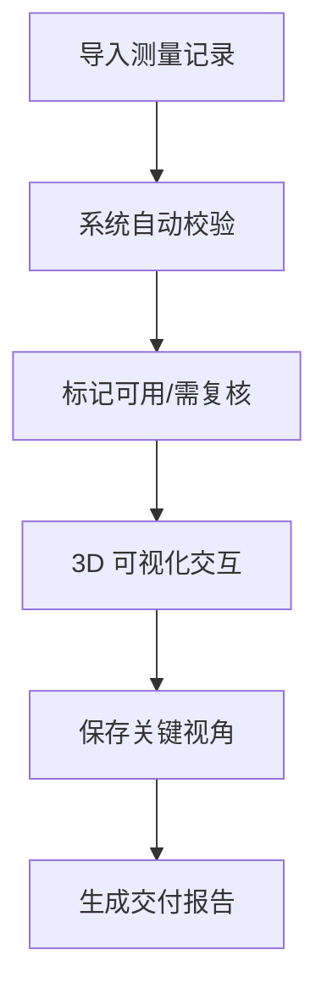

## 1. 产品概述
核磁共振切片堆叠系统，为水利工程师提供测量记录导入、3D可视化、数据校验和甲方交付展示功能。帮助工程师高效管理和复核测量数据，清晰展示成果给甲方。

## 2. 核心功能

### 2.1 用户角色
| 角色 | 注册方式 | 核心权限 |
|------|----------|----------|
| 水利工程师 | 无需注册 | 全部功能使用权限 |
| 甲方 | 无需注册 | 查看功能，无编辑权限 |

### 2.2 功能模块
1. **测量记录导入**：支持批量导入，自动校验单位换算，重复导入检测，单位换算错误标记
2. **数据列表**：展示记录，标记可用/需复核状态，明细联动，一键筛选问题记录
3. **3D 可视化**：核磁共振切片堆叠渲染，视角保存与恢复，颜色图例说明，越界提示，点击溯源到原始记录
4. **数据校验**：错误检测，可操作的错误提示（如缺哪份时间参数），测试场景导入（含重复导入场景）
5. **甲方展示**：结果一目了然，清晰区分可用记录与需复核记录，支持截图导出

### 2.3 页面详情
| 页面名称 | 模块名称 | 功能描述 |
|----------|----------|----------|
| 主界面 | 顶部导航 | 导入记录、保存视角、切换视图、导出报告 |
| 主界面 | 左侧面板 | 测量记录列表，筛选，状态标记 |
| 主界面 | 右侧面板 | 记录详情，数据校验结果 |
| 主界面 | 中间区域 | 3D 切片堆叠渲染，交互控制 |
| 主界面 | 底部状态栏 | 处理状态提示，错误信息展示 |

## 3. 核心流程
水利工程师导入测量记录 → 系统自动校验并标记状态 → 工程师在 3D 视图中查看并保存视角 → 生成报告交付甲方。

## 4. 用户界面设计

### 4.1 设计风格
- 主色调：专业的深蓝色（#0A2463）与青绿色（#3E92CC）
- 辅助色：绿色（#28A745）表示正常，红色（#DC3545）表示错误，橙色（#FFC107）表示需复核
- 字体：Source Sans Pro 作为主字体，清晰易读的无衬线字体
- 布局：侧边栏 + 中心画布 + 详情面板的三栏式布局
- 风格：专业、严谨、工业风，适合工程应用

### 4.2 页面设计概述
| 页面名称 | 模块名称 | UI 元素 |
|----------|----------|---------|
| 主界面 | 记录列表 | 卡片式布局，状态标签高亮显示 |
| 主界面 | 3D 画布 | 深色背景，清晰的坐标轴，交互式缩放旋转 |
| 主界面 | 颜色图例 | 悬浮式图例，可展开收起 |
| 主界面 | 状态提示 | 底部横幅式提示，操作按钮清晰 |

### 4.3 响应式
桌面端优先，1440×900 及以上分辨率最佳体验，支持基本的平板适配。

### 4.4 3D 场景指导
- 环境：深色背景，突出切片数据
- 光照：柔和的顶部光源，提供清晰的立体感
- 相机：初始视角从斜上方 45° 俯看，支持自由旋转
- 交互：支持鼠标拖拽旋转、滚轮缩放、点击切片高亮
- 切片：半透明效果，不同深度用颜色渐变区分
