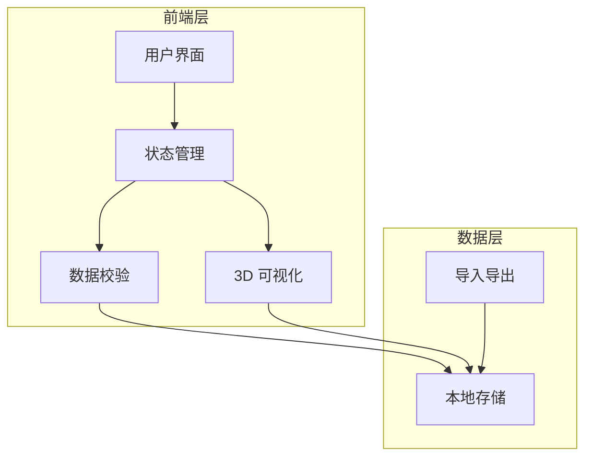
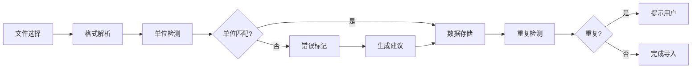
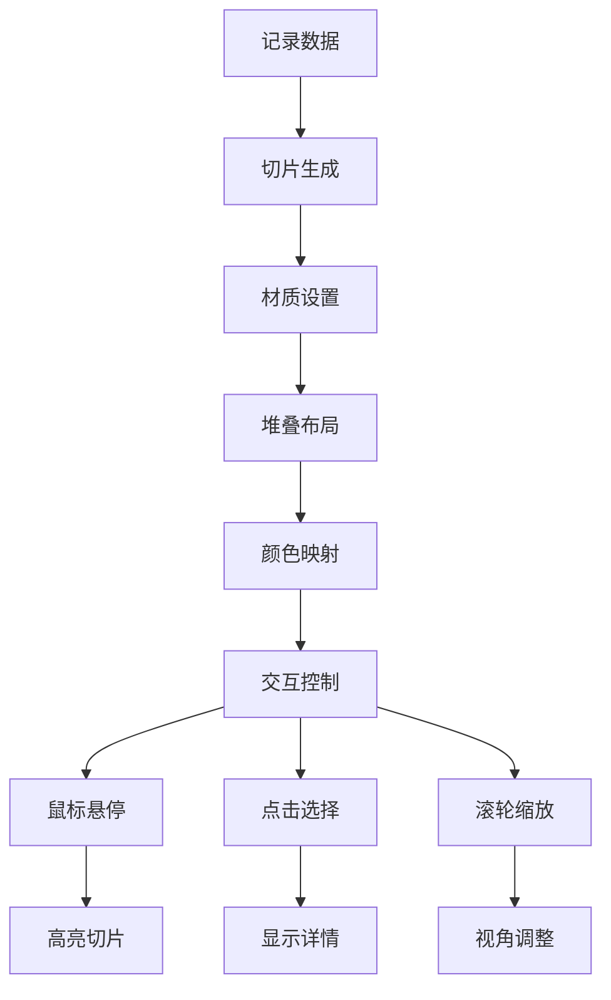

## 1. 架构设计



## 2. 技术描述

- **前端框架**: React@18 + TypeScript
- **样式方案**: Tailwind CSS@3
- **构建工具**: Vite
- **3D 渲染**: Three.js + @react-three/fiber + @react-three/drei
- **状态管理**: Zustand（轻量级状态管理）
- **数据持久化**: LocalStorage（无后端，纯前端应用）
- **文件处理**: XLSX.js（Excel 导入）、Papa Parse（CSV 导入）

## 3. 路由定义

| 路由 | 用途 |
|------|------|
| `/` | 主界面：包含所有功能模块 |
| `/view/:viewId` | 共享视角：通过 ID 恢复保存的视角 |

## 4. 数据模型

### 4.1 测量记录数据模型

```typescript
interface MeasurementRecord {
  id: string;
  fileName: string;
  importTime: number;
  status: 'valid' | 'warning' | 'error';
  unitConversionErrors: UnitConversionError[];
  missingParameters: string[];
  data: {
    sliceIndex: number;
    depth: number;
    value: number;
    unit: string;
    timestamp?: string;
  }[];
  metadata: {
    projectName?: string;
    location?: string;
    operator?: string;
  };
}

interface UnitConversionError {
  field: string;
  expectedUnit: string;
  actualUnit: string;
  value: number;
  suggestion: string;
}

interface SavedView {
  id: string;
  name: string;
  cameraPosition: [number, number, number];
  cameraTarget: [number, number, number];
  zoom: number;
  createdAt: number;
  sliceOpacity: number[];
  highlightSlices: number[];
}
```

### 4.2 本地存储结构

```typescript
interface AppStorage {
  records: MeasurementRecord[];
  savedViews: SavedView[];
  settings: {
    defaultUnit: string;
    colorScheme: 'default' | 'highContrast';
    showGrid: boolean;
  };
}
```

## 5. 核心模块设计

### 5.1 数据导入模块



### 5.2 3D 可视化模块



### 5.3 错误提示模块

```typescript
interface ErrorMessage {
  type: 'error' | 'warning' | 'info';
  code: string;
  title: string;
  description: string;
  actionableSteps: string[];
  relatedRecord?: string;
}

// 示例错误消息
const exampleError: ErrorMessage = {
  type: 'error',
  code: 'MISSING_TIMESTAMP',
  title: '缺少时间参数',
  description: '记录 "钻孔-A01" 缺少时间戳参数',
  actionableSteps: [
    '检查原始数据文件是否包含时间列',
    '确认时间列的表头名称是否正确',
    '如无时间数据，可在导入时选择"跳过时间验证"'
  ],
  relatedRecord: 'record-001'
};
```

## 6. UI 组件结构

```
App
├── Header（顶部导航）
│   ├── ImportButton（导入按钮）
│   ├── ViewSelector（视角选择器）
│   ├── ExportButton（导出按钮）
│   └── RoleSwitcher（角色切换：工程师/甲方）
├── MainContent（主内容区）
│   ├── LeftPanel（左侧面板）
│   │   ├── RecordList（记录列表）
│   │   ├── FilterBar（筛选栏）
│   │   └── StatusSummary（状态汇总）
│   ├── CenterCanvas（中心画布）
│   │   ├── Scene3D（3D 场景）
│   │   ├── ColorLegend（颜色图例）
│   │   ├── AxisHelper（坐标轴）
│   │   └── ViewControls（视角控制）
│   └── RightPanel（右侧面板）
│       ├── RecordDetail（记录详情）
│       ├── ValidationResults（校验结果）
│       └── ActionButtons（操作按钮）
└── Footer（底部状态栏）
    ├── StatusMessage（状态消息）
    └── ErrorBanner（错误横幅）
```

## 7. 性能优化策略

1. **虚拟滚动**：记录列表超过 100 条时启用虚拟滚动
2. **切片 LOD**：根据相机距离动态调整切片细节
3. **懒加载**：3D 场景按需加载，非活跃切片降低渲染质量
4. **内存管理**：导入新数据时自动清理旧数据的 3D 资源
5. **防抖节流**：视角保存、筛选操作使用防抖处理

## 8. 测试场景

### 8.1 重复导入场景
- 导入相同文件两次，系统应检测并提示
- 提供"覆盖"、"保留两者"、"取消"选项
- 记录导入历史，防止意外重复

### 8.2 单位换算错误场景
- 检测常见单位错误（mm vs m, cm vs mm）
- 提供换算建议和自动修正选项
- 在列表中高亮显示错误记录

### 8.3 缺失参数场景
- 检测必需参数缺失
- 提供清晰的缺失项列表
- 给出可操作的补救建议