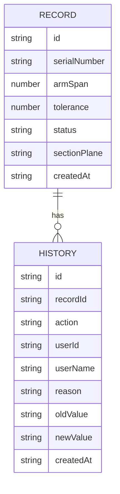

## 1. 架构设计

```mermaid
graph TB
    subgraph "前端层"
        A[React 应用]
        B[组件库]
        C[状态管理]
    end
    
    subgraph "数据层"
        D[LocalStorage]
        E[Mock 数据]
    end
    
    A --&gt; B
    A --&gt; C
    C --&gt; D
    D --&gt; E
```

## 2. 技术描述
- **前端**: React@18 + TypeScript + Tailwind CSS@3 + Vite
- **初始化工具**: Vite
- **后端**: 无（纯前端应用，使用 LocalStorage 存储数据）
- **数据存储**: LocalStorage + Mock 数据
- **可视化**: D3.js / Canvas API 用于剖面图绘制
- **状态管理**: React Context API + useReducer

## 3. 路由定义
| 路由 | 用途 |
|------|------|
| / | 数据仪表盘 |
| /calculator | 计算工具 |
| /viewer/:id | 剖切查看器 |
| /history | 历史记录 |

## 4. 数据模型

### 4.1 数据模型定义



### 4.2 数据结构

```typescript
interface Record {
  id: string;
  serialNumber: string;
  armSpan: number;
  tolerance: number;
  status: 'pending' | 'verified' | 'rejected' | 'outlier';
  sectionPlane: string;
  crossSectionData: number[];
  createdAt: string;
}

interface History {
  id: string;
  recordId: string;
  action: 'create' | 'update' | 'verify' | 'reject';
  userId: string;
  userName: string;
  reason: string;
  oldValue?: any;
  newValue?: any;
  createdAt: string;
}

interface CalculationResult {
  formula: string;
  units: string;
  applicableRange: string;
  result: number;
  isOutOfBounds: boolean;
  failureReason?: string;
}
```
