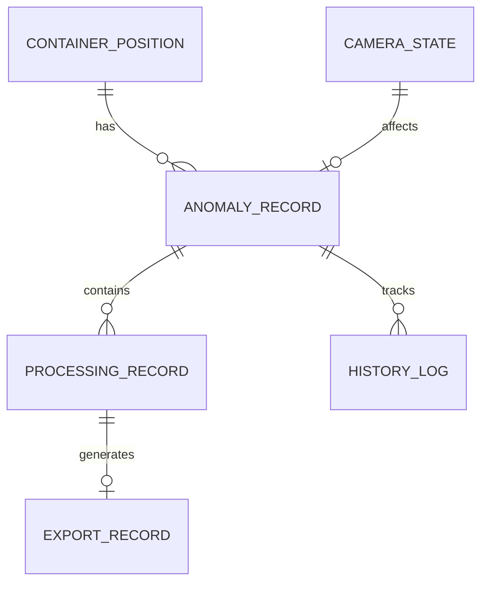

# 港口堆场箱位三维图工具系统 - 技术架构文档

## 1. 系统架构设计

### 1.1 整体架构
采用前后端分离架构，前端负责三维可视化和用户交互，后端负责数据处理和存储。

```
┌─────────────────────────────────────────────┐
│              前端展示层                       │
│  ┌──────────┐ ┌──────────┐ ┌──────────┐     │
│  │三维可视化│ │数据管理  │ │报告导出  │     │
│  └──────────┘ └──────────┘ └──────────┘     │
└────────────────────┬────────────────────────┘
                    │
┌───────────────────┴────────────────────────┐
│              业务逻辑层                      │
│  ┌──────────┐ ┌──────────┐ ┌──────────┐     │
│  │异常检测  │ │处理记录  │ │历史追溯  │     │
│  └──────────┘ └──────────┘ └──────────┘     │
└────────────────────┬────────────────────────┘
                    │
┌───────────────────┴────────────────────────┐
│              数据访问层                      │
│  ┌──────────┐ ┌──────────┐ ┌──────────┐     │
│  │本地存储  │ │文件导入  │ │数据导出  │     │
│  └──────────┘ └──────────┘ └──────────┘     │
└─────────────────────────────────────────────┘
```

### 1.2 技术选型

#### 1.2.1 前端技术栈
- **框架**：Vue 3 + TypeScript
- **三维渲染**：Three.js
- **状态管理**：Pinia
- **UI组件**：Element Plus
- **数据处理**：Lodash
- **图表**：ECharts

#### 1.2.2 数据存储
- **本地存储**：IndexedDB（浏览器端持久化）
- **文件存储**：LocalStorage（配置和缓存）

## 2. 数据模型设计

### 2.1 实体关系图


### 2.2 核心数据模型

#### 2.2.1 箱位位置（ContainerPosition）
```typescript
interface ContainerPosition {
  id: string;                    // 唯一标识
  name: string;                  // 箱位名称
  position: {
    x: number;                   // X坐标
    y: number;                   // Y坐标
    z: number;                   // Z坐标
  };
  size: {
    width: number;               // 宽度
    height: number;              // 高度
    depth: number;              // 深度
  };
  status: 'empty' | 'occupied' | 'reserved';
  metadata: Record<string, any>; // 扩展数据
}
```

#### 2.2.2 异常记录（AnomalyRecord）
```typescript
interface AnomalyRecord {
  id: string;                    // 唯一标识
  type: AnomalyType;             // 异常类型
  severity: 'high' | 'medium' | 'low';  // 严重程度
  status: 'pending' | 'processing' | 'resolved' | 'verified';
  
  // 来源信息
  source: {
    importBatch: string;         // 导入批次
    importTime: Date;           // 导入时间
    dataSource: string;          // 数据来源
  };
  
  // 风险备注
  riskNotes: {
    description: string;         // 风险描述
    impact: string;             // 影响分析
    createdBy: string;          // 记录人
    createdAt: Date;            // 记录时间
  };
  
  // 处理意见
  handlingOpinions: {
    suggestion: string;         // 处理建议
    approach: string;           // 处理方法
    handledBy: string;          // 处理人
    handledAt: Date;            // 处理时间
  };
  
  // 关联数据
  relatedRecords: string[];     // 关联记录ID列表
  position: ContainerPosition;  // 关联的箱位
  
  createdAt: Date;
  updatedAt: Date;
}

type AnomalyType = 
  | 'model_overlap'      // 模型重叠
  | 'camera_lost'        // 相机视角丢失
  | 'size_exceeded'      // 尺寸超限
  | 'position_deviation' // 位置偏移
```

#### 2.2.3 处理记录（ProcessingRecord）
```typescript
interface ProcessingRecord {
  id: string;                    // 唯一标识
  anomalyId: string;            // 关联异常ID
  operator: string;             // 操作人
  operation: OperationType;     // 操作类型
  
  // 操作详情
  details: {
    before: any;                // 操作前状态
    after: any;                 // 操作后状态
    reason: string;             // 操作原因
    notes: string;              // 备注信息
  };
  
  // 关联导出
  exportId?: string;             // 关联的导出记录
  
  timestamp: Date;
}

type OperationType = 
  | 'add_risk_note'      // 添加风险备注
  | 'add_handling_opinion' // 添加处理意见
  | 'update_status'       // 更新状态
  | 'verify'             // 复核确认
  | 'export'             // 导出操作
  | 'snapshot'           // 截图
```

#### 2.2.4 历史日志（HistoryLog）
```typescript
interface HistoryLog {
  id: string;                    // 唯一标识
  targetId: string;             // 目标对象ID
  targetType: 'anomaly' | 'container' | 'camera';
  
  // 修改信息
  modification: {
    modifiedBy: string;         // 修改人
    modifiedAt: Date;          // 修改时间
    modificationType: 'create' | 'update' | 'delete' | 'verify';
    
    before: any;                // 修改前
    after: any;                 // 修改后
    
    reason: string;              // 修改原因
    justification: string;       // 修改说明
  };
  
  // 复核信息（仅用于复核通过的场景）
  verification?: {
    verifiedBy: string;         // 复核人
    verifiedAt: Date;           // 复核时间
    verified: boolean;          // 复核结果
    comments: string;           // 复核意见
  };
  
  metadata: Record<string, any>;
}
```

#### 2.2.5 相机状态（CameraState）
```typescript
interface CameraState {
  id: string;
  name: string;
  position: {
    x: number;
    y: number;
    z: number;
  };
  rotation: {
    x: number;
    y: number;
    z: number;
  };
  zoom: number;
  status: 'normal' | 'lost' | 'error';
  lastUpdate: Date;
  anomalies?: string[];  // 关联的异常ID
}
```

#### 2.2.6 导出记录（ExportRecord）
```typescript
interface ExportRecord {
  id: string;
  type: 'snapshot' | 'report' | 'data';
  
  // 关联的处理记录
  processingRecordId: string;
  
  // 导出详情
  details: {
    format: 'png' | 'jpg' | 'pdf' | 'excel' | 'csv';
    content: any;
    annotations?: any[];
  };
  
  // 截图专用
  snapshot?: {
    viewState: CameraState;
    highlights: string[];  // 高亮的异常ID
  };
  
  exportedBy: string;
  exportedAt: Date;
}
```

## 3. 核心模块设计

### 3.1 三维可视化模块

#### 3.1.1 组件结构
```typescript
// 组件层级
YardContainer3D/
├── SceneManager        // 场景管理器
├── ContainerMesh       // 箱位网格
├── CameraController    // 相机控制器
├── InteractionHandler  // 交互处理
└── AnnotationLayer     // 标注层
```

#### 3.1.2 关键功能实现
1. **场景初始化**
   - 加载Three.js场景
   - 初始化相机、灯光、渲染器
   - 设置坐标系统

2. **箱位渲染**
   - 根据ContainerPosition生成几何体
   - 应用材质和颜色编码
   - 异常位置特殊标记

3. **相机管理**
   - OrbitControls视角控制
   - 视角保存与恢复
   - 状态监控和异常检测

### 3.2 异常检测引擎

#### 3.2.1 检测算法
```typescript
class AnomalyDetector {
  // 模型重叠检测
  detectOverlap(containers: ContainerPosition[]): AnomalyRecord[]
  
  // 尺寸超限检测
  detectSizeExceeded(containers: ContainerPosition[]): AnomalyRecord[]
  
  // 位置偏移检测
  detectPositionDeviation(containers: ContainerPosition[]): AnomalyRecord[]
  
  // 相机状态检测
  detectCameraAnomalies(camera: CameraState): AnomalyRecord[]
}
```

#### 3.2.2 检测规则
- **模型重叠**：相同位置存在多个箱位（位置坐标完全或部分重叠）
- **尺寸超限**：箱位尺寸超出规定的最大/最小范围
- **位置偏移**：箱位位置偏离预定坐标超过阈值
- **相机异常**：相机视角参数异常或丢失

### 3.3 处理记录管理

#### 3.3.1 统一记录机制
```typescript
class UnifiedRecordManager {
  // 所有操作都通过此方法记录
  createRecord(operation: OperationType, details: RecordDetails): ProcessingRecord
  
  // 明细联动和截图导出使用同一记录
  linkWithExport(recordId: string, exportId: string): void
  
  // 查询关联记录
  getRelatedRecords(anomalyId: string): ProcessingRecord[]
}
```

#### 3.3.2 记录关联策略
- 处理记录与导出记录一一对应
- 截图时自动关联当前处理记录
- 报告生成时引用统一记录数据

### 3.4 历史追溯系统

#### 3.4.1 追溯查询
```typescript
class HistoryTracker {
  // 查询历史记录
  queryHistory(filters: HistoryFilters): HistoryLog[]
  
  // 获取修改详情
  getModificationDetail(logId: string): {
    who: string;      // 谁改的
    when: Date;       // 什么时候改的
    what: any;        // 改了什么
    why: string;       // 为什么改
  }
  
  // 生成追溯报告
  generateTraceReport(anomalyId: string): TraceReport
}
```

#### 3.4.2 复核流程
1. 记录修改前后的状态
2. 保存修改原因和说明
3. 复核人确认操作
4. 记录复核时间和意见

## 4. 存储方案

### 4.1 IndexedDB表结构
```javascript
// 数据库：YardContainerDB
// 对象存储：
{
  containers: ContainerPosition[],      // 箱位数据
  anomalies: AnomalyRecord[],          // 异常记录
  processingRecords: ProcessingRecord[], // 处理记录
  historyLogs: HistoryLog[],           // 历史日志
  cameraStates: CameraState[],         // 相机状态
  exportRecords: ExportRecord[],       // 导出记录
  settings: SystemSettings             // 系统设置
}
```

### 4.2 示例数据初始化
```typescript
// 首次打开时自动加载示例数据
const SAMPLE_DATA = {
  containers: [/* 10-20个示例箱位 */],
  anomalies: [/* 3-5个示例异常 */],
  processingRecords: [/* 对应的处理记录 */],
  historyLogs: [/* 历史追溯数据 */]
}
```

## 5. 性能优化策略

### 5.1 三维渲染优化
- **实例化渲染**：大量箱位使用InstancedMesh
- **视锥剔除**：只渲染可见区域的对象
- **LOD策略**：远处对象使用简化模型
- **帧率控制**：限制渲染帧率，降低CPU占用

### 5.2 数据处理优化
- **分批处理**：大数据量分批次导入
- **虚拟滚动**：长列表使用虚拟滚动
- **懒加载**：按需加载异常详情
- **缓存机制**：常用数据缓存到内存

### 5.3 存储优化
- **索引优化**：关键字段建立索引
- **压缩存储**：历史数据压缩
- **定期清理**：自动清理过期数据

## 6. 部署方案

### 6.1 单文件部署
- 打包为单个HTML文件
- 无需服务器，直接浏览器打开
- 数据存储在浏览器IndexedDB

### 6.2 文件结构
```
port-yard-3d/
├── index.html              // 主入口
├── css/
│   └── styles.css         // 样式文件
├── js/
│   ├── app.js             // 主应用
│   ├── components/        // Vue组件
│   ├── three/             // Three.js模块
│   ├── services/          // 业务服务
│   ├── stores/            // Pinia状态
│   └── utils/             // 工具函数
└── assets/
    └── sample-data.json   // 示例数据
```

## 7. API接口设计（预留）

### 7.1 数据操作接口
虽然当前版本使用本地存储，但预留接口便于后续扩展：

```typescript
// 导入数据
POST /api/containers/import
// 获取异常列表
GET /api/anomalies
// 创建处理记录
POST /api/processing-records
// 查询历史
GET /api/history
// 导出报告
POST /api/export
```

## 8. 安全性考虑

### 8.1 数据安全
- 所有数据存储在本地，不上传服务器
- 定期自动备份到本地文件
- 敏感操作需要确认

### 8.2 操作审计
- 完整记录所有操作
- 记录操作人和时间
- 防止数据篡改

### 8.3 异常处理
- 操作失败自动回滚
- 错误信息详细记录
- 提供恢复机制

## 9. 测试策略

### 9.1 功能测试
- 数据导入功能
- 异常检测准确性
- 处理记录完整性
- 导出功能正确性

### 9.2 性能测试
- 大数据量导入速度
- 三维渲染帧率
- 异常检测性能

### 9.3 兼容性测试
- 主流浏览器兼容性
- 不同屏幕尺寸适配
- 不同数据格式支持
