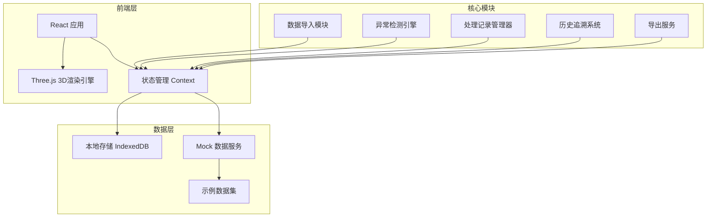
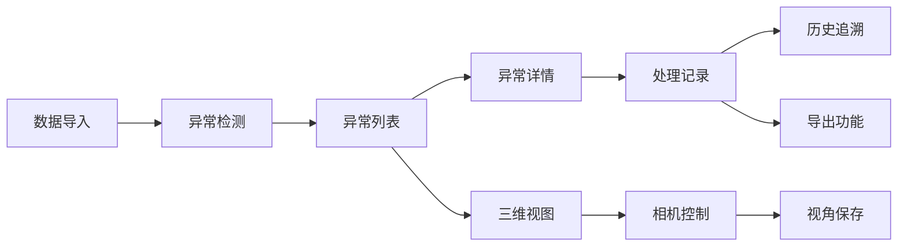

# 港口堆场箱位三维图工具系统 - 技术架构文档

## 1. 架构设计

### 1.1 整体架构



### 1.2 技术选型

- **前端框架**：React@18 + TypeScript
- **样式方案**：TailwindCSS@3
- **3D渲染**：Three.js + @react-three/fiber + @react-three/drei
- **数据存储**：IndexedDB（浏览器本地持久化）
- **构建工具**：Vite
- **状态管理**：React Context + useReducer
- **Mock数据**：内置示例数据集

### 1.3 模块依赖关系



## 2. 路由定义

### 2.1 页面路由

| 路由路径 | 页面名称 | 功能描述 |
|---------|---------|---------|
| `/` | 首页/三维视图 | 显示港口堆场三维图，支持视角控制 |
| `/import` | 数据导入页 | 导入Excel/CSV/JSON文件 |
| `/anomalies` | 异常列表页 | 展示所有异常记录，支持筛选 |
| `/anomalies/:id` | 异常详情页 | 查看单条异常的完整信息和处理历史 |
| `/history` | 历史追溯页 | 查看所有复核通过记录和操作日志 |
| `/settings` | 设置页 | 配置、保存视角等 |

### 2.2 嵌套路由结构

```
/anomalies
  ├── /:id (详情面板)
  └── /:id/process (处理面板)
```

## 3. 核心数据类型定义

### 3.1 箱位位置信息

```typescript
interface ContainerPosition {
  id: string;
  name: string;
  x: number;
  y: number;
  z: number;
  width: number;
  height: number;
  depth: number;
  importBatch: string;
  createdAt: Date;
}
```

### 3.2 异常记录

```typescript
interface AnomalyRecord {
  id: string;
  type: 'model_overlap' | 'camera_lost' | 'size_exceed' | 'position_offset';
  severity: 'high' | 'medium' | 'low';
  status: 'pending' | 'processing' | 'processed' | 'reviewed';
  sourceInfo: {
    importBatch: string;
    importTime: Date;
    sourceFile: string;
  };
  riskNote: string;
  processingSuggestion: string;
  relatedContainerIds: string[];
  cameraState?: CameraState;
  createdAt: Date;
  updatedAt: Date;
}
```

### 3.3 处理记录

```typescript
interface ProcessingRecord {
  id: string;
  anomalyId: string;
  operator: string;
  operatorRole: 'simulation_engineer' | 'operations_team';
  action: 'add_risk_note' | 'add_suggestion' | 'change_status' | 'review' | 'export';
  beforeValue?: string;
  afterValue: string;
  timestamp: Date;
  exportSnapshot?: ExportSnapshot;
}
```

### 3.4 历史日志

```typescript
interface HistoryLog {
  id: string;
  targetType: 'anomaly' | 'container';
  targetId: string;
  operator: string;
  operatorRole: string;
  action: string;
  beforeState: object;
  afterState: object;
  reason: string;
  timestamp: Date;
}
```

### 3.5 相机状态

```typescript
interface CameraState {
  position: { x: number; y: number; z: number };
  rotation: { x: number; y: number; z: number };
  zoom: number;
  isLost: boolean;
  lostReason?: string;
  savedAt?: Date;
}
```

### 3.6 导出快照

```typescript
interface ExportSnapshot {
  type: 'screenshot' | 'report';
  format: 'png' | 'pdf' | 'excel';
  anomalyIds: string[];
  processingRecords: ProcessingRecord[];
  exportedBy: string;
  exportedAt: Date;
}
```

## 4. 状态管理设计

### 4.1 全局状态上下文

```typescript
interface AppState {
  containers: ContainerPosition[];
  anomalies: AnomalyRecord[];
  processingRecords: ProcessingRecord[];
  historyLogs: HistoryLog[];
  currentView: '3d' | 'list';
  selectedAnomaly: AnomalyRecord | null;
  filters: FilterState;
  cameraStates: CameraState[];
}

interface FilterState {
  anomalyType: string[];
  severity: string[];
  status: string[];
  dateRange: { start: Date; end: Date } | null;
  importBatch: string[];
}
```

### 4.2 状态更新Actions

- `IMPORT_DATA`: 导入新数据
- `DETECT_ANOMALIES`: 执行异常检测
- `ADD_PROCESSING_RECORD`: 添加处理记录
- `UPDATE_ANOMALY_STATUS`: 更新异常状态
- `ADD_HISTORY_LOG`: 记录历史操作
- `SAVE_CAMERA_STATE`: 保存相机视角
- `EXPORT_DATA`: 导出数据

## 5. 数据持久化策略

### 5.1 IndexedDB Schema

```typescript
const DB_NAME = 'PortYard3D';
const DB_VERSION = 1;

const stores = {
  containers: 'containers',
  anomalies: 'anomalies',
  processingRecords: 'processingRecords',
  historyLogs: 'historyLogs',
  cameraStates: 'cameraStates',
  exportSnapshots: 'exportSnapshots'
};
```

### 5.2 示例数据初始化

首次使用时自动加载示例数据集，包括：
- 50个模拟箱位
- 8个预设异常（涵盖所有类型）
- 15条处理记录
- 5个相机视角

## 6. 异常检测规则

### 6.1 模型重叠检测

```typescript
function detectOverlap(containers: ContainerPosition[]): AnomalyRecord[] {
  // 检测同一位置是否被多个箱位占用
  // 使用空间哈希网格优化性能
}
```

### 6.2 相机视角丢失检测

```typescript
function detectCameraLost(cameraState: CameraState): boolean {
  // 检测相机位置是否超出有效范围
  // 检测相机参数是否异常
}
```

## 7. 导出功能设计

### 7.1 处理记录关联机制

所有导出（截图、报告）必须关联当前处理记录：
- 导出前检查是否有未关联的处理记录
- 自动将处理记录ID写入导出快照
- 界面展示和报告使用同一数据源

### 7.2 导出格式

| 导出类型 | 格式 | 内容 |
|---------|------|------|
| 截图导出 | PNG | 三维视图截图 + 标注 |
| 异常报告 | PDF/HTML | 异常列表 + 详情 |
| 处理记录 | Excel/CSV | 处理记录明细 |

## 8. 性能优化策略

### 8.1 三维渲染优化

- 使用 InstancedMesh 渲染大量箱位
- 实现视锥体剔除（Frustum Culling）
- 相机遮挡检测
- 延迟加载非可见区域

### 8.2 数据处理优化

- Web Worker 处理异常检测
- 分批处理大文件导入
- 虚拟滚动优化长列表
- 防抖/节流筛选操作

## 9. 安全性和审计

### 9.1 操作日志

所有操作必须记录：
- 操作人身份
- 操作时间（精确到秒）
- 操作类型
- 操作前后状态对比
- 操作原因（必填）

### 9.2 数据完整性

- 关键操作使用事务保证一致性
- 删除前确认机制
- 数据版本控制

## 10. 浏览器兼容性

- Chrome/Edge 90+
- Firefox 88+
- Safari 14+
- WebGL 2.0 支持
