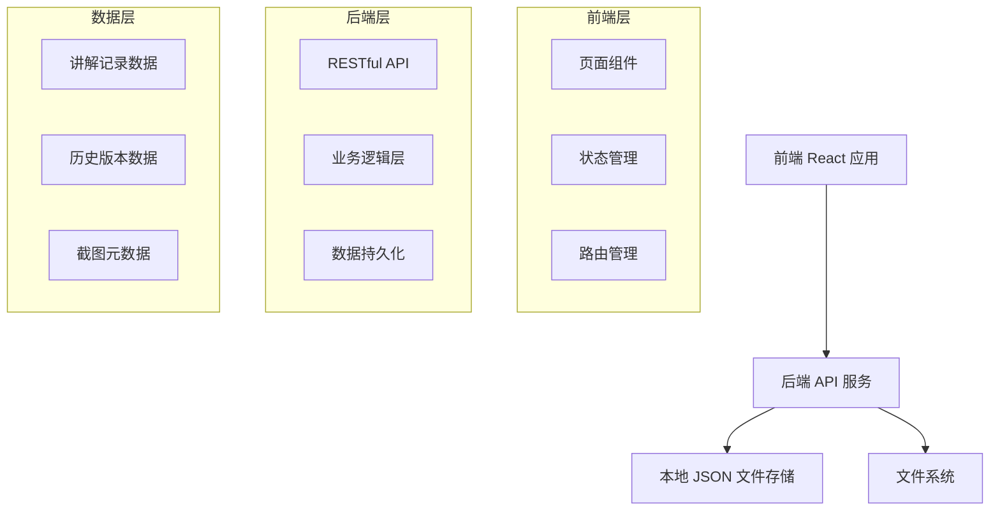
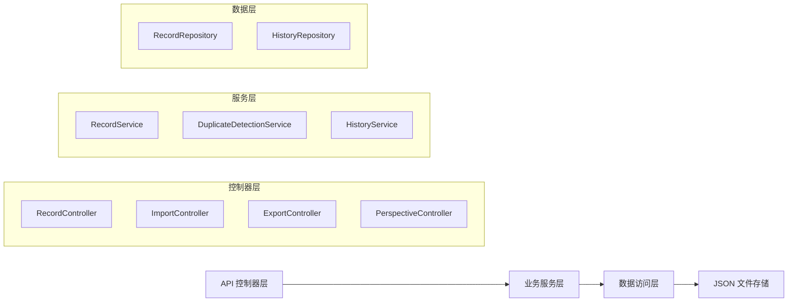
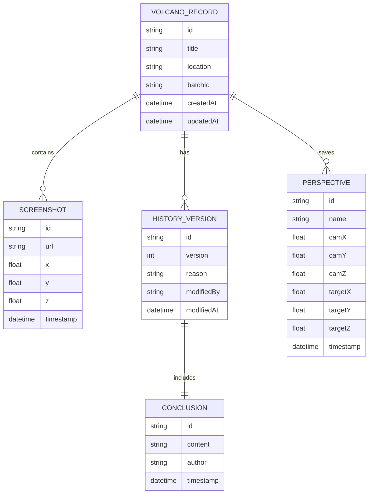

## 1. 架构设计



## 2. 技术描述

- **前端框架**：React@18 + TypeScript + Vite
- **样式方案**：Tailwind CSS@3 + Framer Motion（动画）
- **富文本编辑**：Quill 或 React Quill
- **后端服务**：Express@4 + TypeScript
- **数据存储**：本地 JSON 文件 + lowdb
- **构建工具**：Vite（前端）、ts-node（后端）
- **包管理器**：pnpm

## 3. 路由定义

| 路由 | 用途 |
|------|------|
| / | 时间回放首页（讲解列表） |
| /record/:id | 讲解详情页 |
| /record/:id/edit | 修正记录页 |
| /record/:id/history | 历史版本页 |
| /download | 数据下载页 |
| /test | 测试场景页 |
| /perspective | 视角保存页 |

## 4. API 定义

### 4.1 数据类型定义

```typescript
interface Screenshot {
  id: string;
  url: string;
  deviceCoordinates: {
    x: number;
    y: number;
    z: number;
  };
  timestamp: string;
  description?: string;
}

interface Conclusion {
  id: string;
  content: string;
  author: string;
  timestamp: string;
}

interface HistoryVersion {
  id: string;
  version: number;
  conclusion: Conclusion;
  reason: string;
  modifiedBy: string;
  modifiedAt: string;
}

interface VolcanoRecord {
  id: string;
  title: string;
  location: string;
  timestamp: string;
  batchId: string;
  screenshots: Screenshot[];
  currentConclusion: Conclusion;
  history: HistoryVersion[];
  perspectives?: Perspective[];
  createdAt: string;
  updatedAt: string;
}

interface Perspective {
  id: string;
  name: string;
  cameraPosition: { x: number; y: number; z: number };
  cameraTarget: { x: number; y: number; z: number };
  timestamp: string;
}
```

### 4.2 API 端点

| 方法 | 路径 | 描述 |
|------|------|------|
| GET | /api/records | 获取讲解记录列表 |
| GET | /api/records/:id | 获取单个讲解记录 |
| POST | /api/records | 创建新讲解记录 |
| PUT | /api/records/:id | 更新讲解记录（含结论修正） |
| GET | /api/records/:id/history | 获取历史版本列表 |
| POST | /api/records/:id/restore | 恢复到指定历史版本 |
| POST | /api/import | 导入点云切片数据（含重复检测） |
| GET | /api/export | 导出数据 |
| GET | /api/perspectives | 获取视角保存列表 |

## 5. 服务器架构



## 6. 数据模型

### 6.1 ER 图



### 6.2 数据结构

```typescript
// 数据存储结构
{
  "records": [
    {
      "id": "uuid",
      "title": "讲解标题",
      "location": "火山位置",
      "batchId": "批次标识",
      "screenshots": [],
      "currentConclusion": {},
      "history": [],
      "perspectives": [],
      "createdAt": "ISO时间",
      "updatedAt": "ISO时间"
    }
  ]
}
```

### 6.3 重复检测逻辑

- **检测键**：`batchId`（批次标识）
- **检测策略**：
  1. 导入时提取 batchId
  2. 查询已存在记录
  3. 如存在，进入更新流程
  4. 保存历史版本，防止数据冲突
