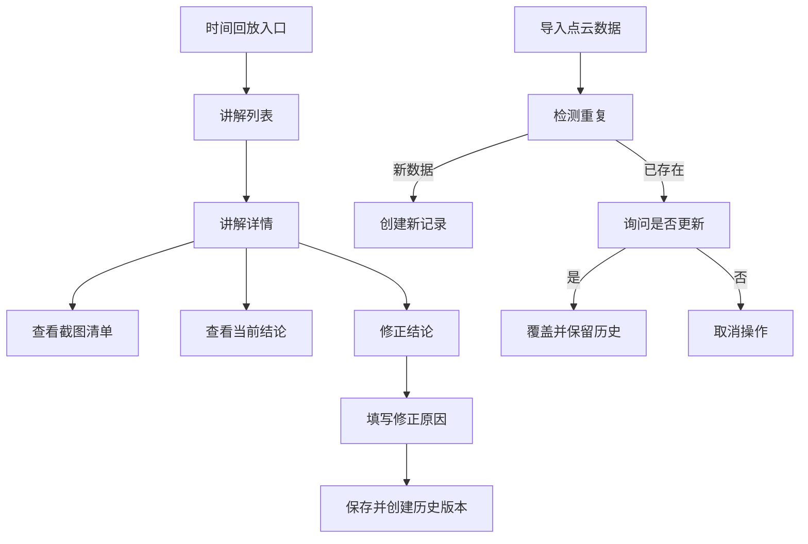

## 1. 产品概述
火山地貌剖切讲解工作台是一个本地Web应用，用于管理火山地貌剖切讲解的截图清单、结论修正、历史追踪和数据下载。解决了截图清单变更导致结论混乱的问题，确保同一件事只有一份权威结论。

- **目标用户**：舞台统筹人员
- **核心价值**：提供历史追溯、修正原因记录、重复导入去重、设备坐标回查功能

## 2. 核心功能

### 2.1 用户角色
| 角色 | 注册方式 | 核心权限 |
|------|----------|----------|
| 舞台统筹 | 本地使用 | 完整功能访问权限 |

### 2.2 功能模块
1. **时间回放首页**：日常入口，展示最新讲解记录列表
2. **讲解详情页**：查看单个讲解的完整信息、截图清单
3. **修正记录页**：修改结论并记录原因
4. **历史版本页**：查看所有历史变更记录
5. **数据下载页**：导出讲解数据
6. **测试场景页**：重复导入测试工具

### 2.3 页面详情
| 页面名称 | 模块名称 | 功能描述 |
|----------|----------|----------|
| 时间回放首页 | 讲解列表 | 分页展示讲解记录，按时间倒序，支持搜索和筛选 |
| 讲解详情页 | 截图清单 | 展示关联的截图列表，支持预览和设备坐标跳转 |
| 讲解详情页 | 结论展示 | 显示当前权威结论和相关数据 |
| 修正记录页 | 结论编辑 | 提供富文本编辑器修改结论，必填修正原因 |
| 修正记录页 | 原因记录 | 强制记录每次修正的原因和时间 |
| 历史版本页 | 版本对比 | 展示所有历史版本，支持版本间对比查看 |
| 数据下载页 | 导出功能 | 支持JSON、CSV格式导出讲解数据 |
| 测试场景页 | 重复导入 | 提供模拟重复导入的测试工具 |
| 视角保存页 | 视角管理 | 月底/课前查看保存的视角数据 |

## 3. 核心流程
### 3.1 日常使用流程
舞台统筹通过时间回放入口查看最新讲解 → 点击进入详情 → 查看截图清单和结论 → 如需修改进入修正页 → 填写修正原因保存 → 系统自动创建历史版本

### 3.2 重复导入处理流程
导入点云切片数据 → 系统检测是否为同一批次 → 如已存在则提示并询问是否更新 → 选择更新则覆盖旧数据，保留历史版本 → 确保只有一份权威结论

## 4. 用户界面设计

### 4.1 设计风格
- **主色调**：火山红 (#E64A19)、岩浆橙 (#FF9800)、岩石灰 (#616161)
- **辅助色**：深灰 (#333333)、浅灰 (#F5F5F5)
- **按钮风格**：圆角矩形，带有轻微阴影，悬停有熔岩流动效果
- **字体**：标题用 Space Grotesk，正文用 Noto Sans SC
- **布局风格**：卡片式布局，左侧导航，右侧内容区
- **图标风格**：地质科学风格，使用 SVG 图标

### 4.2 页面设计概述
| 页面名称 | 模块名称 | UI元素 |
|----------|----------|--------|
| 时间回放首页 | 讲解列表 | 卡片式列表，每个卡片显示时间、地点、结论摘要、状态标签，悬停有上浮动画 |
| 讲解详情页 | 截图清单 | 网格布局展示截图缩略图，点击放大，显示设备坐标标签，可点击跳转 |
| 修正记录页 | 结论编辑 | 分栏布局，左侧编辑器，右侧历史版本快速预览 |
| 历史版本页 | 版本对比 | 左右分栏对比，差异高亮显示，时间轴展示变更历史 |
| 测试场景页 | 重复导入 | 控制台风格界面，显示导入日志和检测结果 |

### 4.3 响应式设计
- **桌面优先**，适配 1280px 以上屏幕
- **平板适配**：左侧导航可折叠
- **触控优化**：关键操作按钮尺寸 ≥ 44px

### 4.4 视觉动效
- 页面加载时的渐入动画
- 卡片悬停的轻微上浮和阴影加深
- 截图查看的平滑缩放过渡
- 版本切换的淡入淡出效果
- 岩浆流动风格的加载指示器
