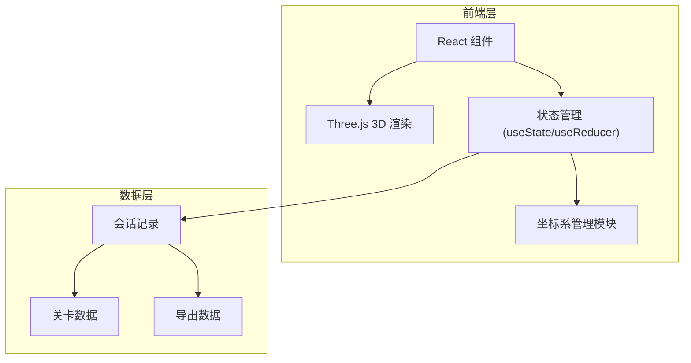

## 1. 架构设计



## 2. 技术描述
- **前端**：React@18 + TypeScript + Vite + Three.js
- **初始化工具**：Vite
- **后端**：无（纯前端应用）
- **数据存储**：LocalStorage（临时保存视角和记录）
- **3D库**：Three.js + OrbitControls
- **样式**：Tailwind CSS

## 3. 路由定义
| 路由 | 用途 |
|------|------|
| / | 巡航主页面 |
| /result | 结算页面 |

## 4. 数据模型

### 4.1 坐标系统一管理
```typescript
interface CoordinateSystem {
    worldToDevice: (world: Vector3) => Vector3;
    deviceToWorld: (device: Vector3) => Vector3;
    validate: (point: Vector3) => { valid: boolean; reason?: string };
}
```

### 4.2 巡航记录
```typescript
interface CruiseRecord {
    id: string;
    timestamp: string;
    levelId: string;
    success: boolean;
    duration: number;
    coordinates: {
        world: Vector3;
        device: Vector3;
        timestamp: number;
    }[];
    boundaryViolations: {
        position: Vector3;
        time: number;
        reason: string;
    }[];
}
```

### 4.3 关卡数据
```typescript
interface Level {
    id: string;
    name: string;
    boundary: { min: Vector3; max: Vector3 };
    targetPosition: Vector3;
    startPosition: Vector3;
}
```
