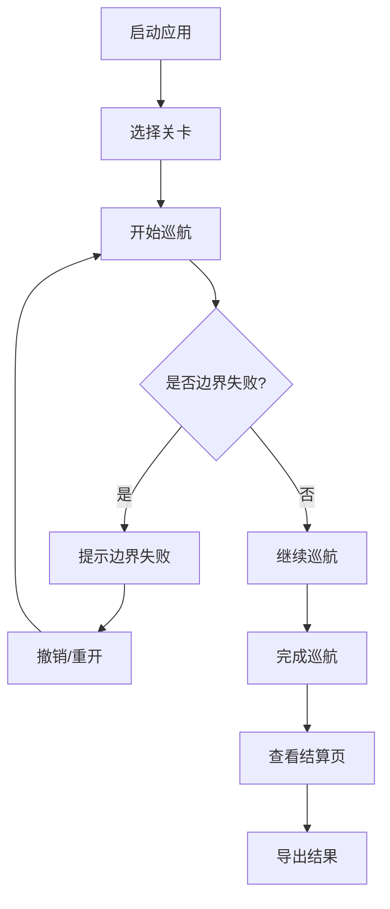

## 1. 产品概述
水下机器人巡航视图是一个用于工程评审的交互式3D模拟系统，解决坐标系混用问题，提供清晰的巡航流程和结果导出功能。主要面向工程评审员，用于测试和验证水下机器人的巡航性能。

## 2. 核心功能

### 2.1 用户角色
| 角色 | 注册方式 | 核心权限 |
|------|----------|----------|
| 工程评审员 | 无需注册 | 完整使用所有功能 |

### 2.2 功能模块
1. **巡航页面**：3D视图、实时坐标显示、控制按钮
2. **结算页面**：巡航结果展示、明细解释、导出功能
3. **导出报告**：坐标系问题说明、运行记录区分

### 2.3 页面详情
| 页面名称 | 模块名称 | 功能描述 |
|---------|---------|---------|
| 巡航页面 | 3D渲染区 | 使用Three.js渲染水下环境和机器人，实时更新视角 |
| 巡航页面 | 坐标系统 | 统一坐标系管理，避免混用，实时显示世界坐标和设备坐标 |
| 巡航页面 | 控制按钮 | 开始、暂停、撤销、重开关卡 |
| 巡航页面 | 关卡系统 | 包含边界失败测试关卡 |
| 结算页面 | 结果展示 | 一页展示完整巡航结果，包含通关状态、时间、坐标数据 |
| 结算页面 | 明细解释 | 每个数据点配有文字说明 |
| 导出功能 | 报告导出 | 支持JSON和文本格式，文件名带时间戳区分运行 |

## 3. 核心流程
用户启动应用 → 开始巡航关卡 → 操作机器人（可能触发边界失败）→ 使用撤销/重开功能 → 完成巡航 → 查看结算页面 → 导出结果报告

## 4. 用户界面设计

### 4.1 设计风格
- **主色调**：深海蓝色 (#0A2463) 和青色 (#3E92CC)，营造水下科技感
- **辅助色**：珊瑚红 (#E63946) 用于警告，薄荷绿 (#2A9D8F) 用于成功
- **按钮风格**：扁平化设计，带轻微圆角，悬停时有水下波纹动效
- **字体**：JetBrains Mono 用于数据显示，Inter 用于说明文字
- **布局风格**：左侧3D视图，右侧控制面板
- **图标**：简洁的科技感线性图标

### 4.2 页面设计概述
| 页面名称 | 模块名称 | UI元素 |
|---------|---------|--------|
| 巡航页面 | 3D视图 | 全屏高度，深色背景，网格辅助线，水下粒子效果 |
| 巡航页面 | 坐标面板 | 固定在右下角，半透明背景，实时更新数据 |
| 巡航页面 | 控制面板 | 右侧侧边栏，垂直排列按钮 |
| 结算页面 | 结果卡片 | 白色背景卡片，带阴影，清晰展示数据 |
| 结算页面 | 明细区域 | 每个条目配文字说明，避免仅靠颜色区分 |

### 4.3 响应式
桌面优先设计，支持窗口缩放，移动端适配基础功能

### 4.4 3D场景指导
- **环境**：水下场景，深蓝色渐变背景，轻微雾气效果
- **光照**：点光源模拟水下探照灯，环境光提供基础照明
- **摄像机**：第三人称视角，跟随机器人移动
- **交互**：鼠标拖拽旋转视角，滚轮缩放，右键平移
- **动画**：机器人推进器动态效果，边界碰撞动画
- **后期处理**：轻微蓝色色调滤镜，模拟水下视觉效果
