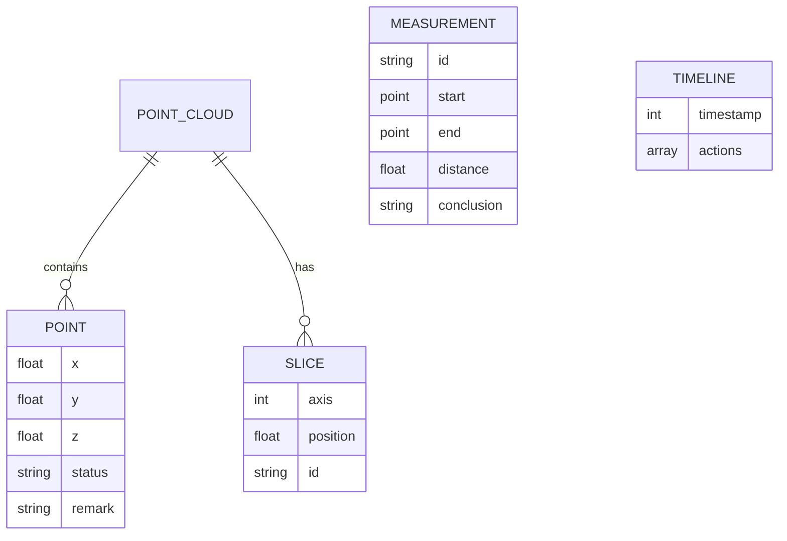

## 1. 架构设计

```mermaid
graph TB
    subgraph "前端层"
        A["React 组件"]
        B["Three.js 3D引擎"]
        C["UI 状态管理"]
    end
    subgraph "数据层"
        D["点云数据管理"]
        E["时间线记录"]
        F["测量记录存储"]
    end
    subgraph "工具层"
        G["碰撞检测"]
        H["数据清洗"]
        I["截图导出"]
    end
    A --&gt; B
    A --&gt; C
    B --&gt; G
    D --&gt; H
    C --&gt; E
    C --&gt; F
    A --&gt; I
```

## 2. 技术描述
- **前端**：React@18 + TypeScript + Vite
- **3D引擎**：Three.js + @react-three/fiber + @react-three/drei
- **样式**：Tailwind CSS
- **状态管理**：React Hooks + useContext
- **构建工具**：Vite

## 3. 路由定义
| 路由 | 用途 |
|------|------|
| / | 主界面，包含所有功能 |

## 4. 数据模型

### 4.1 数据模型定义



### 4.2 数据类型定义

```typescript
// 点云数据点
interface Point {
  x: number;
  y: number;
  z: number;
  status: 'valid' | 'empty' | 'duplicate' | 'remarked';
  remark?: string;
}

// 点云数据
interface PointCloud {
  id: string;
  name: string;
  points: Point[];
  createdAt: number;
}

// 测量记录
interface Measurement {
  id: string;
  start: Point;
  end: Point;
  distance: number;
  conclusion: string;
  timestamp: number;
}

// 时间线记录
interface TimelineFrame {
  timestamp: number;
  cameraPosition: [number, number, number];
  slicePosition: number;
  measurements: Measurement[];
}

// 应用状态
interface AppState {
  isPlaying: boolean;
  currentTime: number;
  timeline: TimelineFrame[];
  pointCloud: PointCloud | null;
  measurements: Measurement[];
}
```

## 5. 核心模块说明

### 5.1 三维渲染模块
- 使用 Three.js 和 @react-three/fiber 渲染点云
- 实现相机轨道控制
- 支持切片平面交互
- 点云着色根据状态区分

### 5.2 时间控制模块
- 播放/暂停/重置功能
- 时间轴管理
- 时间回放和录制
- 帧数据存储

### 5.3 碰撞检测模块
- 射线检测点选
- 距离计算
- 边界检测

### 5.4 数据处理模块
- 空值检测与过滤
- 重复值检测与标记
- 数据清洗功能

### 5.5 导出模块
- Canvas 截图功能
- 测量记录导出
- 数据状态报告

