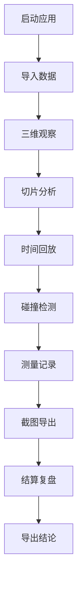

## 1. 产品概述
晶体缺陷三维观察是一个基于浏览器的三维可视化工具，用于分析晶体缺陷数据，支持碰撞检测、时间回放、截图导出和测量记录功能。
- 主要解决运维组在处理不齐的剖面图和三维模型时的沟通效率问题，提供直观的三维观察界面
- 目标用户为运维组人员，产品价值在于降低沟通成本，提高分析效率

## 2. 核心功能

### 2.1 用户角色（如适用）
| 角色 | 注册方式 | 核心权限 |
|------|----------|----------|
| 运维人员 | 无需注册 | 完整功能访问 |

### 2.2 功能模块
1. **主界面**：三维点云可视化、控制面板、状态栏
2. **时间控制**：开始、暂停、重开、结算、复盘
3. **切片观察**：点云切片、空值/重复值处理
4. **测量记录**：距离测量、记录关联、导出
5. **结果展示**：数据状态标记、需复核提示

### 2.3 页面详情
| 页面名称 | 模块名称 | 功能描述 |
|----------|----------|----------|
| 主界面 | 三维视图 | 3D点云渲染、相机控制、碰撞检测 |
| 主界面 | 时间控制 | 播放、暂停、重置、回放、时间轴 |
| 主界面 | 切片工具 | 点云切片、数据清洗（空值/重复） |
| 主界面 | 测量面板 | 距离测量、记录管理、关联结论 |
| 主界面 | 导出功能 | 截图导出、数据导出 |
| 主界面 | 状态显示 | 数据状态标记、需复核标识 |

## 3. 核心流程
用户启动应用 → 导入点云数据 → 三维观察与切片 → 时间回放与碰撞检测 → 测量记录 → 导出结果 → 结算复盘。

## 4. 用户界面设计

### 4.1 设计风格
- **主色调**：深空蓝 (#1a237e) 搭配科技青 (#00bcd4)
- **辅助色**：警告橙 (#ff9800)、错误红 (#f44336)、成功绿 (#4caf50)
- **按钮风格**：圆角矩形，带悬停和点击效果
- **字体**：Noto Sans SC + JetBrains Mono（等宽用于代码/数据）
- **布局**：左右分栏，左侧控制面板，右侧三维视图
- **图标风格**：线性简洁风格，科技感强

### 4.2 页面设计概览
| 页面名称 | 模块名称 | UI 元素 |
|----------|----------|---------|
| 主界面 | 三维视图 | 3D渲染区域、坐标轴、切片平面、点云着色 |
| 主界面 | 控制面板 | 按钮组、滑块、输入框、数据列表 |
| 主界面 | 时间轴 | 进度条、播放按钮、时间标记 |
| 主界面 | 状态栏 | 数据状态标签、需复核提示 |

### 4.3 响应式设计
桌面端为主，适配主流屏幕尺寸，关键控件固定位置，确保操作便捷。

### 4.4 3D场景指导
- **环境**：深色科技背景，低光环境
- **光照**：三点光源系统，突出点云结构
- **相机**：轨道控制，支持缩放、旋转、平移
- **交互**：切片平面可拖动，点云可点击选择
- **后处理**：轻微辉光效果，增强科技感
- **性能**：点云采用LOD优化，确保流畅运行

