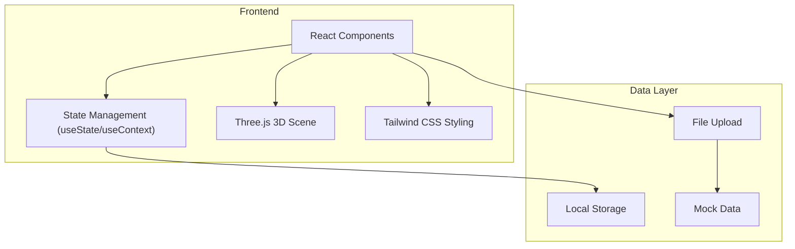

## 1. 架构设计



## 2. 技术描述
- **前端**: React@18 + TypeScript + Vite
- **3D渲染**: Three.js
- **样式**: Tailwind CSS@3
- **初始化工具**: create-vite@latest
- **后端**: 无（纯前端应用）
- **数据库**: LocalStorage + 内存存储（带Mock数据）

## 3. 路由定义
| 路由 | 用途 |
|------|------|
| / | 首页 - 数据导入和概览 |
| /detection | 异常检测页面 |
| /visualization | 3D可视化页面 |
| /timeline | 时间回放页面 |
| /problem-solving | 问题处理页面 |
| /report | 报告页面 |

## 4. 数据模型

### 4.1 核心数据类型

```typescript
// 投篮数据点
interface ShotPoint {
  id: string;
  timestamp: number;
  x: number;
  y: number;
  z: number;
  isOutlier: boolean;
  source: string;
  confidence: number;
}

// 投篮轨迹
interface ShotTrajectory {
  id: string;
  shotId: string;
  points: ShotPoint[];
  createdAt: string;
  cameraAngle: number;
  materialId: string;
}

// 异常记录
interface AnomalyRecord {
  id: string;
  trajectoryId: string;
  pointId: string;
  type: 'outlier' | 'camera_loss' | 'coordinate_error';
  description: string;
  solution: 're-run' | 're-record' | 'manual' | null;
  handledAt: string | null;
  status: 'pending' | 'processing' | 'resolved';
}

// 解决方案记录
interface SolutionHistory {
  id: string;
  anomalyId: string;
  solution: 're-run' | 're-record' | 'manual';
  oldData: ShotPoint[];
  newData: ShotPoint[];
  appliedAt: string;
}
```

### 4.2 数据示例
包含真实的离群点、相机视角丢失等样例数据，模拟日常场景中的真实数据问题。
