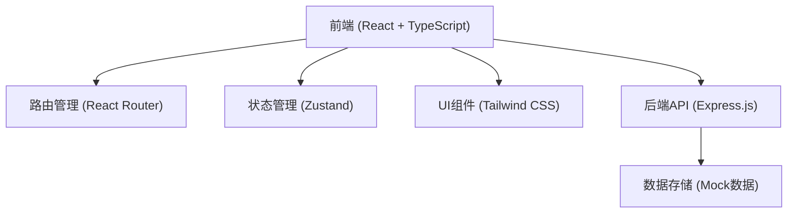
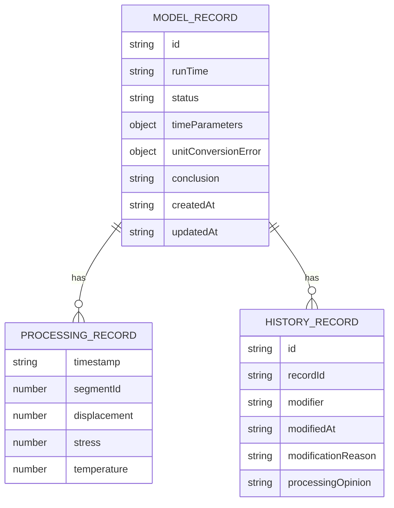

## 1. 架构设计



## 2. 技术描述

- **前端**: React@18 + TypeScript + Tailwind CSS + Vite
- **后端**: Express@4 + TypeScript
- **路由**: React Router DOM
- **状态管理**: Zustand
- **构建工具**: Vite
- **数据存储**: Mock数据（前端模拟后端API）

## 3. 路由定义

| 路由 | 页面名称 | 用途 |
|------|----------|------|
| / | 记录列表页 | 展示所有模型运行记录 |
| /record/:id | 记录详情页 | 展示单条记录详情，时间回放，明细联动 |
| /record/:id/correct | 修正与对比页 | 修正时间参数，并排对比新旧结论 |
| /record/:id/history | 历史记录页 | 查看修改历史 |

## 4. API 定义

### 数据类型定义

```typescript
interface ModelRecord {
  id: string;
  runTime: string;
  status: 'pending' | 'reviewed' | 'approved';
  timeParameters: {
    startTime: string;
    endTime: string;
    samplingInterval: number;
  };
  unitConversionError: {
    hasError: boolean;
    description: string;
    errorDetails: string[];
  };
  processingRecords: ProcessingRecord[];
  conclusion: string;
  createdAt: string;
  updatedAt: string;
}

interface ProcessingRecord {
  timestamp: string;
  segmentId: number;
  displacement: number;
  stress: number;
  temperature: number;
}

interface HistoryRecord {
  id: string;
  recordId: string;
  modifier: string;
  modifiedAt: string;
  modificationReason: string;
  changes: {
    field: string;
    oldValue: any;
    newValue: any;
  }[];
  processingOpinion: string;
}
```

### API 端点

| 方法 | 路径 | 描述 |
|------|------|------|
| GET | /api/records | 获取所有记录列表 |
| GET | /api/records/:id | 获取单条记录详情 |
| PUT | /api/records/:id | 更新记录（修正参数） |
| GET | /api/records/:id/history | 获取记录的历史记录 |
| POST | /api/records/:id/history | 添加历史记录 |
| GET | /api/records/:id/download | 下载结果文件 |

## 5. 数据模型

### 5.1 数据模型定义



### 5.2 初始数据

我们将在前端创建Mock数据来模拟真实的后端数据。
