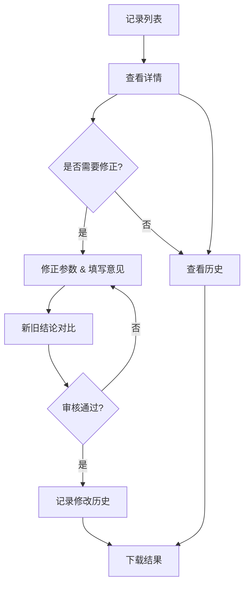

## 1. 产品概述
隧道管片错缝模型Web工作台，用于展馆讲解员复核、修正和管理模型运行记录，解决单位换算错误等问题的审核流程。

## 2. 核心功能

### 2.1 用户角色
| 角色 | 注册方式 | 核心权限 |
|------|----------|----------|
| 展馆讲解员 | 系统分配 | 查看记录、修正参数、审核通过、下载结果、查看历史 |

### 2.2 功能模块
1. **记录列表页**: 展示所有模型运行记录，支持筛选和搜索
2. **记录详情页**: 展示单条记录的详细信息，时间回放，明细联动
3. **修正与对比页**: 修正时间参数，并排对比新旧结论
4. **历史记录页**: 查看修改历史，追踪谁、何时、为何修改
5. **结果下载**: 下载运行结果，文件名可区分版本

### 2.3 页面详情
| 页面名称 | 模块名称 | 功能描述 |
|---------|---------|----------|
| 记录列表页 | 记录卡片列表 | 展示记录ID、时间、状态、关键参数，支持点击进入详情 |
| 记录列表页 | 筛选搜索栏 | 按状态、时间范围搜索记录 |
| 记录详情页 | 基本信息展示 | 显示记录完整信息，包括单位换算错误详情 |
| 记录详情页 | 时间回放模块 | 时间轴播放，与明细数据联动 |
| 记录详情页 | 明细数据展示 | 与时间回放共用同一批处理记录 |
| 修正与对比页 | 参数修改表单 | 修改时间参数，填写处理意见 |
| 修正与对比页 | 新旧结论对比 | 左右并排展示旧结论和新结论，高亮差异 |
| 历史记录页 | 修改历史列表 | 展示修改人、修改时间、修改原因、修改内容 |
| 下载功能 | 文件下载 | 下载结果文件，文件名包含时间戳区分版本 |

## 3. 核心流程
展馆讲解员从记录列表进入详情页，查看单位换算错误问题，可修正时间参数并填写处理意见，系统生成新旧结论对比，审核通过后记录修改历史，可下载结果文件。

## 4. 用户界面设计

### 4.1 设计风格
- **主色调**: 工业蓝(#1e3a5f) + 警示橙(#ff6b35)
- **次要色**: 灰蓝(#e8f4f8) + 深灰(#333333)
- **按钮风格**: 圆角矩形，主按钮实心，次按钮描边
- **字体**: Noto Sans SC - 专业清晰易读
- **布局风格**: 卡片式布局，左右分栏对比
- **图标风格**: 线性图标，简洁专业

### 4.2 页面设计概述
| 页面名称 | 模块名称 | UI元素 |
|---------|---------|--------|
| 记录列表页 | 记录卡片列表 | 卡片网格布局，状态标签色标区分，悬停效果 |
| 记录详情页 | 时间回放模块 | 时间轴滑块，播放/暂停按钮，进度指示器 |
| 修正与对比页 | 新旧结论对比 | 左右分栏，差异高亮，同步滚动 |
| 历史记录页 | 修改历史列表 | 时间线布局，头像+信息卡片 |

### 4.3 响应性
桌面优先设计，适配平板和移动端，关键操作保持可访问性。

