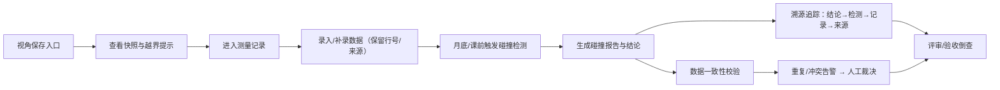

## 1. 产品概述

面向水利工程师的海洋牧场网箱布置专业作业平台，解决传统经验驱动流程中数据溯源不清、点云切片补录后变更不可追溯、评审沟通依赖截图等痛点。核心价值在于建立从测量记录→视角保存→碰撞检测→最终结论的完整可追溯链路，确保每条结论均可回溯至原始数据与处理过程。

## 2. 核心功能

### 2.1 用户角色

| 角色 | 核心权限 |
|------|----------|
| 水利工程师 | 视角保存、测量记录录入/补录、碰撞检测执行、结论导出、全链路溯源 |
| 评审人员 | 查阅视角快照、测量记录、碰撞报告、溯源追踪 |
| 运维组 | 查看数据一致性报告、重复记录排查结果 |

### 2.2 功能模块

1. **视角保存（日常入口首页）**：场景视角快照管理、颜色图例说明、越界区域高亮提示
2. **测量记录**：测量数据表格（保留原始行号）、点云切片补录记录、来源备注、坐标系标记
3. **碰撞检测**：月底/课前检测入口、网箱碰撞分析报告、可解释性标注
4. **溯源追踪**：从结论倒查测量记录→处理记录→原始来源的全链路追溯
5. **数据一致性校验**：重复导入检测、补录冲突识别、坐标系混用告警

### 2.3 页面详情

| 页面名称 | 模块名称 | 功能描述 |
|----------|----------|----------|
| 视角保存首页 | 视角快照列表 | 网格展示已保存视角缩略图，支持按时间/项目筛选，点击跳转对应测量记录 |
| 视角保存首页 | 颜色图例面板 | 悬浮显示颜色含义：正常（蓝绿）/越界（红）/待确认（黄）/已补录（紫边） |
| 视角保存首页 | 越界提示条 | 顶部醒目展示当前视角下越界网箱数量与清单，点击定位 |
| 测量记录页 | 数据表格 | 保留 Excel 原始行号列，每行显示图片名、来源备注、坐标系标记、补录状态 |
| 测量记录页 | 补录记录面板 | 侧栏展示同一条记录的补录历史，高亮差异字段，标注操作人与时间 |
| 测量记录页 | 坐标系标记 | 每行醒目展示所用坐标系（WGS84/CGCS2000/本地），混用记录红色告警 |
| 碰撞检测页 | 检测执行面板 | 支持按项目/时间段选择数据，显示检测进度与状态 |
| 碰撞检测页 | 碰撞报告卡片 | 每组碰撞展示：涉及网箱编号、位置截图、碰撞距离、判定依据说明 |
| 溯源追踪页 | 结论→记录链路 | 以时间线形式展示：最终结论→碰撞检测→测量记录（含原始行号）→原始图片/表格来源 |
| 溯源追踪页 | 坐标系混用倒查 | 专门入口：输入一条坐标系混用记录ID，自动追溯所有关联处理环节 |
| 数据一致性页 | 重复检测结果 | 列表展示疑似重复记录对，显示相似度、差异字段、合并建议 |
| 数据一致性页 | 补录冲突告警 | 展示同一件事存在多份结论的记录，支持人工裁决 |

## 3. 核心流程

水利工程师日常从视角保存入口进入，查看当前项目下已保存的视角快照与越界提示，点击进入对应测量记录进行数据录入或补录。月底或课前进入碰撞检测模块，选择数据范围执行检测并生成可解释的碰撞报告。所有操作均保留处理痕迹，评审时可通过溯源追踪从结论一路回溯至原始测量记录（含原始行号、图片名、来源备注）。数据提交运维组前，通过数据一致性校验排查重复导入与补录冲突。

## 4. 用户界面设计

### 4.1 设计风格
- **主色调**：深海蓝 `#0B3D91` 作为品牌主色，搭配海青绿 `#20B2AA` 作为成功/正常色
- **警示色**：珊瑚红 `#FF6B6B` 标注越界与坐标系混用，琥珀黄 `#FFB347` 标注待确认
- **补录标识**：薰衣草紫 `#9B7ED8` 描边标记已补录数据
- **按钮风格**：微圆角（4px），主色填充配白色文字，悬停时轻微上浮阴影
- **字体**：中文使用"思源宋体"体现专业工程感，数字和英文使用"JetBrains Mono"等宽字体便于表格对齐
- **布局风格**：左侧固定导航栏，主内容区卡片式布局，数据密集区采用工程表格样式
- **图标风格**：线性图标，搭配工程领域语义（量尺、锚、网、坐标系）

### 4.2 页面设计概览

| 页面名称 | 模块名称 | UI 元素 |
|----------|----------|----------|
| 视角保存首页 | 视角快照卡片 | 缩略图带紫边标记补录、红角标标记越界数量、底部显示原始行号范围；悬停显示颜色图例浮层 |
| 视角保存首页 | 越界提示横幅 | 深海蓝背景配珊瑚红警示图标，滚动列出越界网箱编号，点击跳转 |
| 测量记录页 | 工程数据表格 | 左侧冻结原始行号列，坐标系列带色标，补录行紫色背景，行高紧凑便于审阅 |
| 测量记录页 | 补录侧栏 | 右侧抽屉式面板，时间线展示补录历史，差异字段高亮对比 |
| 碰撞检测页 | 报告卡片 | 左右分栏：左侧碰撞示意图+颜色标注，右侧判定依据可解释文本 |
| 溯源追踪页 | 全链路时间线 | 垂直时间线带节点图标，每个节点可点击展开详情，来源链接直接跳转 |
| 数据一致性页 | 重复对比卡片 | 左右对比布局，中间连线标注相似度，底部操作按钮 |

### 4.3 响应式设计
- 桌面端优先（≥1280px）：三栏布局（导航+主内容+侧栏）
- 平板端（768-1279px）：两栏布局，侧栏改为抽屉
- 移动端（<768px）：单栏布局，导航折叠为底部标签栏

### 4.4 场景交互引导
- 页面加载时视角快照采用瀑布流渐入动画（staggered 50ms）
- 越界提示横幅轻微脉冲呼吸效果提醒注意
- 溯源追踪时间线节点展开时配合平滑滚动与高亮描边
- 表格行悬停显示该记录关联的视角快照缩略图预览
- 补录数据与原始数据差异处采用闪烁高亮一次后渐变为紫色背景
