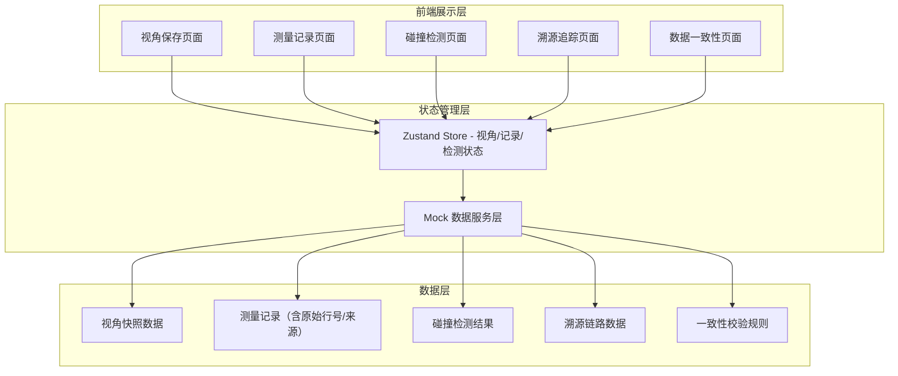
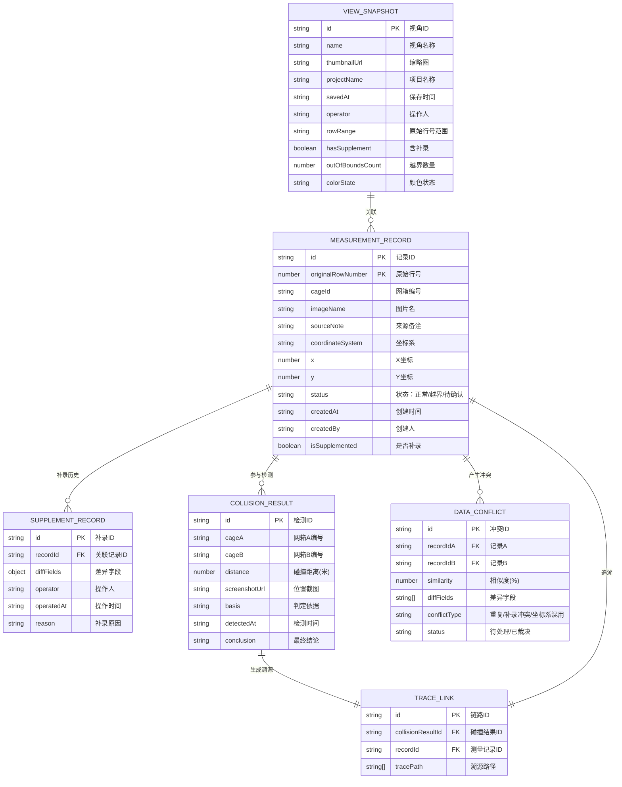

## 1. 架构设计



## 2. 技术说明

- **前端框架**：React@18 + TypeScript + Vite
- **样式方案**：Tailwind CSS 3 + 自定义 CSS 变量（海洋工程主题色）
- **状态管理**：Zustand
- **路由管理**：React Router DOM
- **图标库**：lucide-react
- **数据来源**：前端 Mock 数据（模拟测量记录、视角快照、碰撞检测结果等）
- **无后端服务**：纯前端实现，所有数据使用 TypeScript 类型定义的 Mock 数据

## 3. 路由定义

| 路由 | 页面名称 | 用途 |
|------|----------|------|
| / | 视角保存首页 | 日常入口，展示视角快照与越界提示 |
| /records | 测量记录页 | 展示测量数据表，含原始行号、坐标系、补录历史 |
| /collision | 碰撞检测页 | 月底/课前检测入口，展示碰撞报告 |
| /trace | 溯源追踪页 | 结论→记录→来源全链路追溯 |
| /consistency | 数据一致性页 | 重复导入检测、补录冲突告警 |

## 4. 数据模型定义

### 4.1 实体关系图



### 4.2 TypeScript 类型定义

```typescript
export type CoordinateSystem = 'WGS84' | 'CGCS2000' | 'LOCAL';
export type RecordStatus = 'normal' | 'out-of-bounds' | 'pending';
export type ConflictType = 'duplicate' | 'supplement-conflict' | 'coordinate-mismatch';

export interface ViewSnapshot {
  id: string;
  name: string;
  thumbnailUrl: string;
  projectName: string;
  savedAt: string;
  operator: string;
  rowRange: string;
  hasSupplement: boolean;
  outOfBoundsCount: number;
  recordIds: string[];
}

export interface MeasurementRecord {
  id: string;
  originalRowNumber: number;
  cageId: string;
  imageName: string;
  sourceNote: string;
  coordinateSystem: CoordinateSystem;
  x: number;
  y: number;
  status: RecordStatus;
  createdAt: string;
  createdBy: string;
  isSupplemented: boolean;
}

export interface SupplementRecord {
  id: string;
  recordId: string;
  diffFields: Record<string, { old: any; new: any }>;
  operator: string;
  operatedAt: string;
  reason: string;
}

export interface CollisionResult {
  id: string;
  cageA: string;
  cageB: string;
  distance: number;
  screenshotUrl: string;
  basis: string;
  detectedAt: string;
  conclusion: string;
  relatedRecordIds: string[];
}

export interface DataConflict {
  id: string;
  recordIdA: string;
  recordIdB: string;
  similarity: number;
  diffFields: string[];
  conflictType: ConflictType;
  status: 'pending' | 'resolved';
}
```

## 5. 前端工程结构

```
src/
├── components/
│   ├── layout/
│   │   ├── SidebarNav.tsx       # 左侧导航栏
│   │   └── PageHeader.tsx       # 页面顶部标题栏
│   ├── view/
│   │   ├── ViewSnapshotCard.tsx # 视角快照卡片
│   │   ├── ColorLegend.tsx      # 颜色图例说明
│   │   └── OutOfBoundsBanner.tsx# 越界提示横幅
│   ├── record/
│   │   ├── RecordTable.tsx      # 测量记录表格
│   │   ├── CoordBadge.tsx       # 坐标系标记徽章
│   │   └── SupplementSidebar.tsx# 补录记录侧栏
│   ├── collision/
│   │   ├── DetectionPanel.tsx   # 检测执行面板
│   │   └── CollisionReportCard.tsx # 碰撞报告卡片
│   ├── trace/
│   │   ├── TraceTimeline.tsx    # 溯源时间线
│   │   └── CoordMismatchSearch.tsx # 坐标系混用倒查
│   └── consistency/
│       ├── DuplicateCompareCard.tsx # 重复对比卡片
│       └── ConflictAlertList.tsx    # 冲突告警列表
├── pages/
│   ├── ViewSnapshotPage.tsx      # 视角保存首页
│   ├── RecordPage.tsx            # 测量记录页
│   ├── CollisionPage.tsx         # 碰撞检测页
│   ├── TracePage.tsx             # 溯源追踪页
│   └── ConsistencyPage.tsx       # 数据一致性页
├── store/
│   └── useAppStore.ts            # Zustand 全局状态
├── data/
│   └── mockData.ts               # Mock 数据
├── types/
│   └── index.ts                  # TypeScript 类型定义
├── App.tsx
├── main.tsx
└── index.css
```
