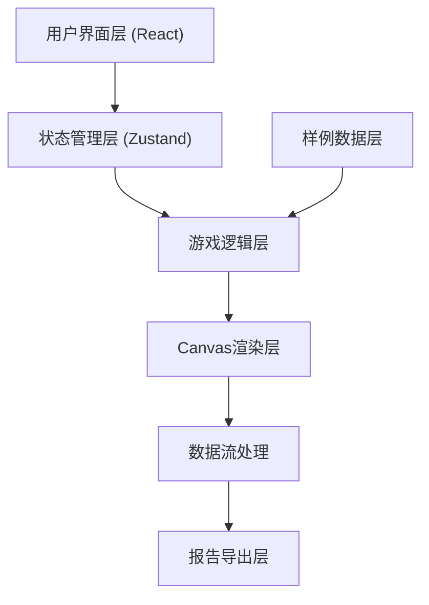
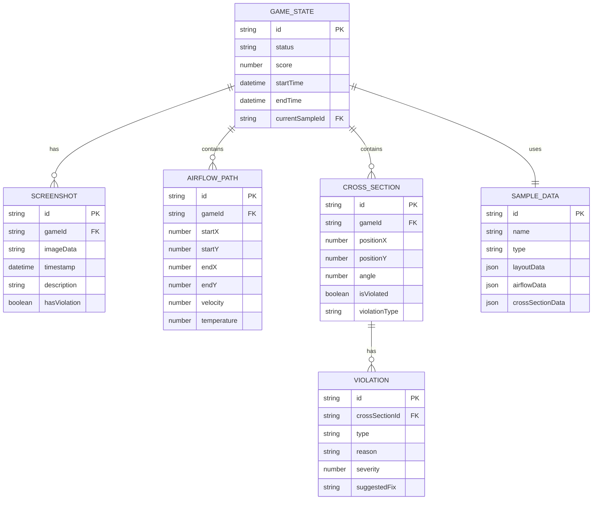
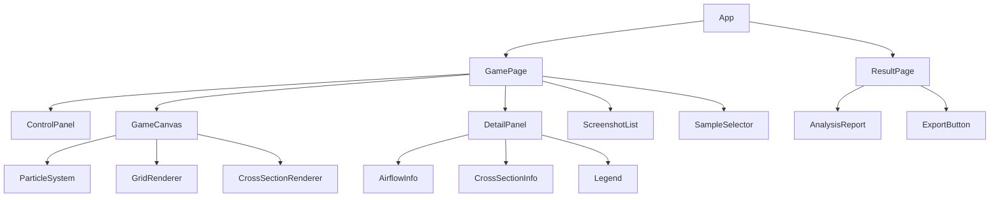

## 1. 架构设计


## 2. 技术说明
- **Frontend**: React@18 + TypeScript + TailwindCSS@3 + Vite
- **State Management**: Zustand
- **Icons**: Lucide React
- **Canvas**: 原生Canvas 2D API
- **Initialization Tool**: vite-init
- **Backend**: None（纯前端应用）
- **Database**: 本地mock数据

## 3. 路由定义
| Route | 用途 |
|-------|------|
| / | 主游戏页面 |
| /result | 结算页面 |

## 4. 数据模型

### 4.1 数据模型定义


### 4.2 数据定义语言

```typescript
interface GameState {
  id: string
  status: 'idle' | 'running' | 'paused' | 'finished'
  score: number
  startTime: Date | null
  endTime: Date | null
  currentSampleId: string
  screenshots: Screenshot[]
  airflowPaths: AirflowPath[]
  crossSections: CrossSection[]
}

interface Screenshot {
  id: string
  gameId: string
  imageData: string
  timestamp: Date
  description: string
  hasViolation: boolean
}

interface AirflowPath {
  id: string
  gameId: string
  startX: number
  startY: number
  endX: number
  endY: number
  velocity: number
  temperature: number
  pathNodes: PathNode[]
}

interface PathNode {
  x: number
  y: number
  velocity: number
  temperature: number
}

interface CrossSection {
  id: string
  gameId: string
  positionX: number
  positionY: number
  angle: number
  isViolated: boolean
  violationType: 'none' | 'warning' | 'critical'
  violations: Violation[]
}

interface Violation {
  id: string
  crossSectionId: string
  type: string
  reason: string
  severity: number
  suggestedFix: string
}

interface SampleData {
  id: string
  name: string
  type: 'success' | 'warning' | 'error'
  layoutData: LayoutData
  airflowData: AirflowData
  crossSectionData: CrossSectionData[]
}

interface LayoutData {
  gridWidth: number
  gridHeight: number
  obstacles: Obstacle[]
}

interface Obstacle {
  x: number
  y: number
  width: number
  height: number
  type: string
}

interface AirflowData {
  startPoints: Point[]
  endPoints: Point[]
  pathNodes: PathNode[][]
}

interface Point {
  x: number
  y: number
}

interface CrossSectionData {
  positionX: number
  positionY: number
  angle: number
  expectedViolation: boolean
}
```

## 5. 状态管理设计

### 5.1 Zustand Store 结构
```typescript
interface GameStore {
  gameState: GameState | null
  currentSample: SampleData | null
  screenshots: Screenshot[]
  
  startGame: (sampleId: string) => void
  pauseGame: () => void
  resumeGame: () => void
  resetGame: () => void
  finishGame: () => void
  
  addScreenshot: (screenshot: Screenshot) => void
  removeScreenshot: (id: string) => void
  updateCollisionDetection: () => void
  
  loadSample: (sampleId: string) => void
}
```

## 6. 组件架构

### 6.1 主要组件


### 6.2 组件职责
| 组件名称 | 职责 |
|---------|------|
| GamePage | 主游戏页面容器，协调各子组件 |
| ControlPanel | 游戏控制按钮（开始、暂停、重开、结算、复盘） |
| GameCanvas | Canvas渲染容器，处理绘制逻辑 |
| ParticleSystem | 气流粒子动画系统 |
| GridRenderer | 机房网格布局渲染 |
| CrossSectionRenderer | 剖切面渲染和越界检测 |
| DetailPanel | 右侧明细面板容器 |
| AirflowInfo | 气流速度、温度等实时数据展示 |
| CrossSectionInfo | 剖切面状态和越界信息展示 |
| Legend | 图例说明，配合文字解释颜色含义 |
| ScreenshotList | 截图清单管理 |
| SampleSelector | 样例数据选择器 |
| ResultPage | 结算页面容器 |
| AnalysisReport | 越界分析报告展示 |
| ExportButton | 导出报告功能 |

## 7. 核心算法

### 7.1 碰撞检测算法
```typescript
function detectCollision(
  crossSection: CrossSection,
  airflowPath: AirflowPath
): Violation | null {
  const distance = calculateDistance(crossSection, airflowPath)
  const threshold = getThreshold(crossSection.violationType)
  
  if (distance < threshold) {
    return {
      id: generateId(),
      crossSectionId: crossSection.id,
      type: 'boundary_violation',
      reason: `剖切面距离气流路径过近，距离为 ${distance.toFixed(2)}m`,
      severity: calculateSeverity(distance, threshold),
      suggestedFix: '建议调整剖切面位置或气流路径'
    }
  }
  return null
}
```

### 7.2 粒子系统算法
```typescript
class ParticleSystem {
  particles: Particle[]
  maxParticles: number = 200
  
  update(deltaTime: number) {
    this.particles.forEach(particle => {
      particle.x += particle.vx * deltaTime
      particle.y += particle.vy * deltaTime
      particle.life -= deltaTime
      
      if (particle.life <= 0) {
        this.respawnParticle(particle)
      }
    })
  }
  
  render(ctx: CanvasRenderingContext2D) {
    this.particles.forEach(particle => {
      ctx.beginPath()
      ctx.arc(particle.x, particle.y, particle.size, 0, Math.PI * 2)
      ctx.fillStyle = particle.color
      ctx.fill()
    })
  }
}
```

## 8. 性能优化策略

### 8.1 Canvas 渲染优化
- 使用 requestAnimationFrame 保证60fps
- 离屏Canvas预渲染静态元素
- 粒子数量限制在200个以内
- 使用对象池复用粒子对象

### 8.2 状态更新优化
- 使用 Zustand 的选择性订阅
- 避免不必要的重渲染
- 使用 React.memo 优化组件

### 8.3 数据处理优化
- 碰撞检测使用空间分区算法
- 截图数据使用懒加载
- 大数据集使用虚拟滚动