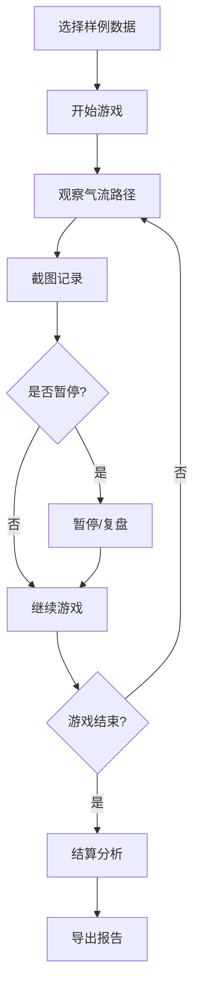

## 1. 产品概述
大型机房气流路径可视化游戏化工具，解决物理老师需要手工清洗剖面图和标注剖切面越界的繁琐问题。通过游戏化界面让用户直观地理解气流路径和越界问题，支持截图清单补录、碰撞检测动态更新，以及生成可读性强的导出报告。

## 2. 核心功能

### 2.1 用户角色
| 角色 | 注册方式 | 核心权限 |
|------|---------|---------|
| 普通用户 | 无需注册 | 完整使用所有功能 |

### 2.2 功能模块
1. **主游戏页面**: 游戏画布、控制面板、状态显示、气流路径明细、截图清单
2. **结算页面**: 游戏结束后的详细分析报告

### 2.3 页面详情
| 页面名称 | 模块名称 | 功能描述 |
|---------|---------|---------|
| 主游戏页面 | 游戏画布 | 可视化展示机房布局、气流路径、剖切面越界检测，使用粒子动画展示气流 |
| 主游戏页面 | 控制面板 | 开始、暂停、重开、结算、复盘五个核心按钮，实时状态指示器 |
| 主游戏页面 | 明细面板 | 实时显示气流速度、温度、剖切面状态等详细数据，配合文字说明和图例 |
| 主游戏页面 | 截图清单 | 记录游戏过程中的截图，支持补录新截图，碰撞检测随截图清单动态更新 |
| 主游戏页面 | 样例选择 | 提供三条样例数据：顺利记录、待确认记录、明显坏数据 |
| 结算页面 | 分析报告 | 显示剖切面越界的详细分析，包含越界原因、位置坐标、影响范围 |
| 结算页面 | 导出功能 | 生成HTML格式报告，包含完整的越界分析和截图证据 |

## 3. 核心流程
游戏主流程：选择样例数据 → 开始游戏 → 观察气流路径 → 截图记录关键节点 → 暂停/复盘分析 → 结算分析 → 导出报告

## 4. 用户界面设计

### 4.1 设计风格
- **主色调**: 深蓝色系（科技感、专业）#1e293b，辅助青色 #06b6d4，警告红色 #ef4444
- **按钮风格**: 圆角矩形，带轻微阴影和悬停动画效果
- **字体**: Inter 为主，配合 Fira Code 显示代码和数据
- **布局风格**: 卡片式布局，左右分栏（左侧游戏画布，右侧明细面板）
- **图标风格**: Lucide React 线性图标，简洁现代

### 4.2 页面设计概览
| 页面名称 | 模块名称 | UI元素 |
|---------|---------|--------|
| 主游戏页面 | 游戏画布 | 600x500像素Canvas，机房布局网格，气流粒子动画，剖切面越界高亮，鼠标悬停提示 |
| 主游戏页面 | 控制面板 | 顶部操作栏，5个主要功能按钮，状态指示器（运行/暂停/结束） |
| 主游戏页面 | 明细面板 | 数据卡片，实时数值显示，图例说明，状态颜色标识，文字解释 |
| 主游戏页面 | 截图清单 | 缩略图列表，支持删除、重命名，碰撞检测状态标签，补录按钮 |
| 主游戏页面 | 样例选择 | 下拉选择器，三条样例数据预览，快速切换 |
| 结算页面 | 分析报告 | 越界列表，详细原因说明，位置坐标图示，影响范围评估 |
| 结算页面 | 导出功能 | 导出按钮，报告预览，格式选择（HTML） |

### 4.3 响应式设计
桌面端优先设计，在平板和手机上自动调整为上下分栏布局。

### 4.4 2D场景指导
- **环境**: 科技感深蓝背景，轻微网格纹理，营造专业氛围
- **动画**: 气流粒子平滑流动，越界区域红色闪烁警告，粒子轨迹渐变
- **交互**: 鼠标悬停显示详细数据，点击剖切面查看分析，拖拽截图清单排序
- **性能**: 使用Canvas 2D实现，60fps流畅度，优化粒子数量（最多200个粒子）
- **可访问性**: 所有颜色变化都有文字说明，不依赖颜色传达信息

## 5. 样例数据设计

### 5.1 样例数据说明
提供三条精心设计的样例数据，覆盖不同场景：

| 样例名称 | 数据状态 | 气流路径 | 剖切面状态 | 教学目的 |
|---------|---------|---------|-----------|---------|
| 顺利记录 | 正常数据 | 气流路径顺畅，无越界 | 所有剖切面在安全范围内 | 展示理想状态 |
| 待确认记录 | 边界情况 | 气流路径接近边界 | 部分剖切面接近越界阈值 | 展示需要人工确认的场景 |
| 明显坏数据 | 异常数据 | 气流路径多处越界 | 多个剖切面明显越界 | 展示典型问题案例 |

### 5.2 数据字段说明
每条样例数据包含：
- 机房布局数据（网格尺寸、障碍物位置）
- 气流路径数据（起点、终点、路径节点）
- 剖切面数据（位置、角度、越界状态）
- 环境参数（温度、湿度、压力）

## 6. 导出报告设计

### 6.1 报告结构
导出的HTML报告包含以下内容：
1. **报告标题和生成时间**
2. **样例数据概览**: 数据来源、分析时间、总体状态
3. **剖切面越界详情**: 
   - 越界位置坐标（带图示）
   - 越界原因说明（文字描述）
   - 影响范围评估（数值数据）
   - 建议修正方案
4. **截图证据**: 关键节点的截图展示
5. **总结和建议**: 整体评估和改进建议

### 6.2 报告可读性
- 使用清晰的标题层级
- 配合图表和文字说明
- 颜色标识都有文字注释
- 专业术语附带解释
- 适合非技术人员阅读