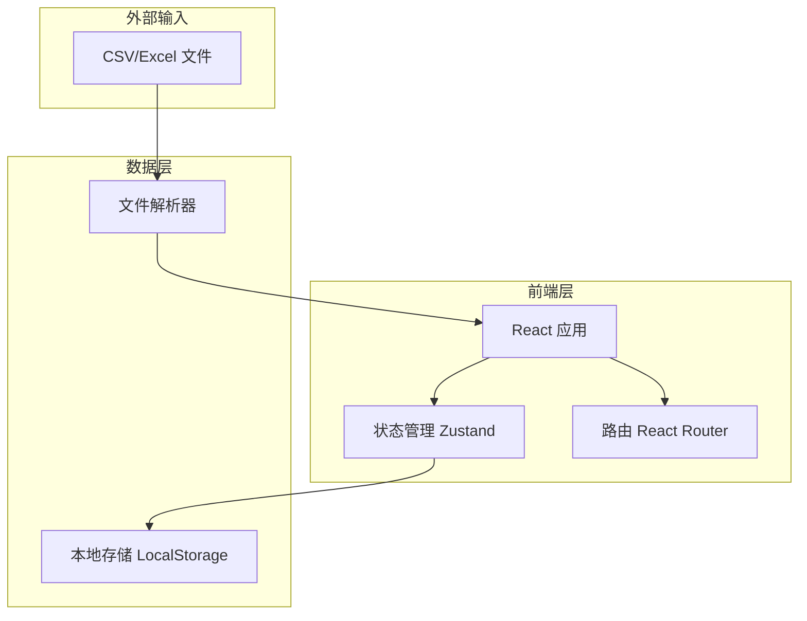

# 药物结合口袋浏览器 - 技术架构文档

## 1. 架构设计



## 2. 技术栈说明

### 2.1 前端技术
- **框架**: React 18 + TypeScript
- **构建工具**: Vite
- **样式**: Tailwind CSS 3
- **状态管理**: Zustand
- **路由**: React Router DOM v6
- **UI 组件**: 自定义组件 + Lucide React 图标
- **文件处理**: 
  - Papa Parse (CSV 解析)
  - XLSX (Excel 解析)

### 2.2 数据存储
- **本地存储**: LocalStorage（用于持久化记录数据）
- **会话存储**: SessionStorage（用于临时筛选状态）

### 2.3 开发工具
- **包管理器**: pnpm（如可用）或 npm
- **类型检查**: TypeScript
- **代码规范**: ESLint

## 3. 路由定义

| 路由 | 用途 | 组件 |
|------|------|------|
| `/` | 主页面 - 数据表格视图 | HomePage |
| `/record/:id` | 记录详情页 | RecordDetailPage |
| `/import` | 数据导入页面 | ImportPage |
| `/test` | 测试场景页面 | TestPage |

## 4. 数据模型

### 4.1 核心数据结构

```typescript
interface PocketRecord {
  id: string;
  originalRowNumber: number;
  sourceFile: string;
  proteinName: string;
  pocketCoordinates: {
    x: number;
    y: number;
    z: number;
  };
  affinity: number;
  cameraAngle?: {
    azimuth: number;
    elevation: number;
    distance: number;
  };
  anomalyType?: 'camera_lost' | 'data_conflict' | 'format_error';
  anomalyNote?: string;
  reviewStatus: 'usable' | 'pending' | 'unusable';
  reviewNote?: string;
  processingOpinion?: string;
  createdAt: string;
  updatedAt: string;
}

interface ImportHistory {
  id: string;
  fileName: string;
  importTime: string;
  recordCount: number;
  duplicateCount: number;
}

interface ViewState {
  cameraAngle?: {
    azimuth: number;
    elevation: number;
    distance: number;
  };
  filters: {
    status?: string;
    anomalyType?: string;
  };
  sortBy?: string;
  sortOrder?: 'asc' | 'desc';
}
```

### 4.2 状态管理结构

```typescript
interface AppStore {
  records: PocketRecord[];
  selectedRecordId: string | null;
  importHistory: ImportHistory[];
  viewState: ViewState;
  
  addRecords: (records: PocketRecord[]) => void;
  updateRecord: (id: string, updates: Partial<PocketRecord>) => void;
  deleteRecord: (id: string) => void;
  setSelectedRecord: (id: string | null) => void;
  updateViewState: (view: Partial<ViewState>) => void;
  detectAnomalies: () => void;
  checkDuplicateImport: (fileName: string) => boolean;
}
```

## 5. 核心功能模块

### 5.1 数据导入模块
- **文件解析**: 支持 CSV 和 Excel 格式
- **字段映射**: 自动识别标准字段，支持手动映射
- **重复检测**: 基于原始行号和文件名检测重复导入
- **异常检测**: 导入时自动检测数据异常

### 5.2 异常检测引擎
```typescript
function detectAnomalies(record: PocketRecord): AnomalyResult {
  const anomalies = [];
  
  if (!record.cameraAngle) {
    anomalies.push({
      type: 'camera_lost',
      note: '相机视角参数缺失'
    });
  }
  
  if (hasDataConflict(record)) {
    anomalies.push({
      type: 'data_conflict',
      note: '三维模型与点云切片参数不一致'
    });
  }
  
  if (!validateFormat(record)) {
    anomalies.push({
      type: 'format_error',
      note: '数据格式错误或必填字段缺失'
    });
  }
  
  return anomalies;
}
```

### 5.3 参数联动系统
- 监听关键参数变化
- 自动更新相关联字段
- 记录参数修改历史

### 5.4 视角保存与恢复
- 保存当前相机视角到记录
- 支持一键恢复到保存的视角
- 视角状态持久化到 LocalStorage

## 6. 项目结构

```
y12680/
├── src/
│   ├── components/          # UI 组件
│   │   ├── DataTable/       # 数据表格组件
│   │   ├── RecordDetail/    # 记录详情组件
│   │   ├── ImportPanel/     # 导入面板组件
│   │   ├── FilterBar/       # 筛选工具栏
│   │   └── StatusBadge/     # 状态标签组件
│   ├── pages/               # 页面组件
│   │   ├── HomePage/        # 主页面
│   │   ├── RecordDetailPage/ # 详情页面
│   │   ├── ImportPage/      # 导入页面
│   │   └── TestPage/        # 测试页面
│   ├── hooks/               # 自定义 Hooks
│   │   ├── useRecords.ts    # 记录数据管理
│   │   ├── useImport.ts     # 导入逻辑
│   │   └── useViewState.ts  # 视图状态管理
│   ├── utils/               # 工具函数
│   │   ├── parser.ts        # 文件解析器
│   │   ├── anomalyDetector.ts # 异常检测
│   │   └── storage.ts       # 存储工具
│   ├── store/               # Zustand 状态管理
│   │   └── useAppStore.ts   # 主状态 store
│   ├── types/               # TypeScript 类型定义
│   │   └── index.ts         # 类型定义文件
│   ├── App.tsx              # 应用入口
│   └── main.tsx             # React 挂载点
├── public/                  # 静态资源
├── .trae/
│   └── documents/           # 文档目录
├── package.json
├── tsconfig.json
├── vite.config.ts
└── tailwind.config.js
```

## 7. 关键技术实现

### 7.1 数据持久化
```typescript
const STORAGE_KEY = 'pocket-browser-records';

function saveToStorage(records: PocketRecord[]) {
  localStorage.setItem(STORAGE_KEY, JSON.stringify(records));
}

function loadFromStorage(): PocketRecord[] {
  const data = localStorage.getItem(STORAGE_KEY);
  return data ? JSON.parse(data) : [];
}
```

### 7.2 重复导入检测
```typescript
function checkDuplicateImport(
  fileName: string,
  existingRecords: PocketRecord[]
): boolean {
  return existingRecords.some(r => r.sourceFile === fileName);
}
```

### 7.3 状态标签渲染
```typescript
const STATUS_CONFIG = {
  usable: {
    label: '可直接使用',
    color: 'bg-green-500',
    textColor: 'text-white'
  },
  pending: {
    label: '待复核',
    color: 'bg-yellow-500',
    textColor: 'text-black'
  },
  unusable: {
    label: '不可用',
    color: 'bg-red-500',
    textColor: 'text-white'
  }
};
```

## 8. 性能优化

### 8.1 大数据量处理
- 虚拟滚动：使用 react-window 处理大量记录
- 分页加载：默认每页 50 条记录
- 懒加载：详情面板按需加载

### 8.2 渲染优化
- React.memo 优化表格行组件
- useMemo 缓存筛选结果
- useCallback 缓存事件处理函数

## 9. 测试场景

### 9.1 重复导入测试
- 场景：连续导入相同文件两次
- 预期：第二次导入时提示重复，不覆盖原有数据
- 验证：检查记录数量和原始行号是否保持一致

### 9.2 异常检测测试
- 场景：导入包含各种异常的数据
- 预期：正确识别相机视角丢失、数据冲突、格式错误
- 验证：异常记录高亮显示，附带正确说明

### 9.3 视角保存测试
- 场景：修改相机视角并保存
- 预期：视角参数正确保存到记录
- 验证：刷新页面后能恢复保存的视角