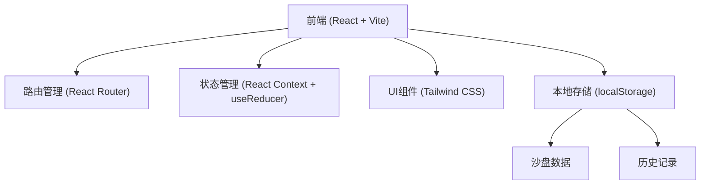
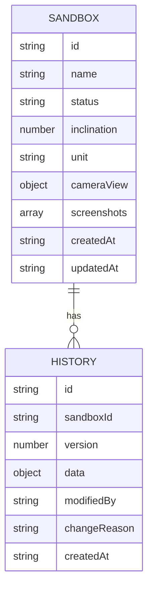

## 1. 架构设计


## 2. 技术描述
- 前端：React@18 + TypeScript + Tailwind CSS@3 + Vite
- 初始化工具：vite-init
- 后端：无（本地应用，使用 localStorage 存储数据）
- 数据存储：localStorage + JSON 格式
- 路由：React Router v6
- 图标：lucide-react

## 3. 路由定义
| 路由 | 用途 |
|------|------|
| / | 沙盘列表页 |
| /sandbox/:id | 沙盘详情页 |
| /sandbox/:id/edit | 修正页面 |
| /sandbox/:id/history | 历史记录页 |
| /sandbox/:id/compare | 版本对比页 |

## 4. 数据模型
### 4.1 数据模型定义


### 4.2 TypeScript 类型定义
```typescript
interface Screenshot {
  id: string;
  url: string;
  description: string;
  timestamp: string;
}

interface CameraView {
  x: number;
  y: number;
  z: number;
  zoom: number;
}

interface Sandbox {
  id: string;
  name: string;
  status: 'draft' | 'reviewing' | 'confirmed';
  inclination: number;
  unit: 'degree' | 'radian';
  cameraView: CameraView;
  screenshots: Screenshot[];
  createdAt: string;
  updatedAt: string;
}

interface History {
  id: string;
  sandboxId: string;
  version: number;
  data: Sandbox;
  modifiedBy: string;
  changeReason: string;
  createdAt: string;
}
```

## 5. 核心功能实现
- 数据存储：使用 localStorage 持久化存储沙盘和历史记录
- 版本对比：使用 deep diff 算法检测数据变化并高亮显示
- 截图管理：支持本地图片预览和描述编辑
- 边界案例：预设3个典型问题案例
