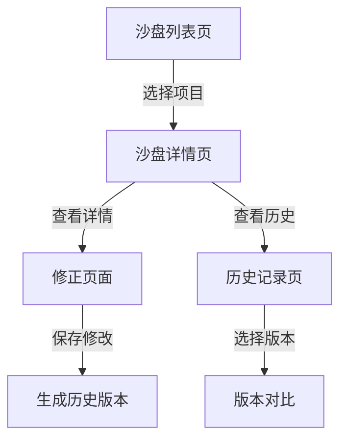

## 1. 产品概述
天文轨道倾角沙盘本地Web工作台，用于舞台统筹管理沙盘的导入、修正、确认和历史追溯。解决课堂演示前频繁修改导致的版本混乱问题，确保每次变更都有完整记录。

## 2. 核心功能

### 2.1 用户角色
| 角色 | 注册方法 | 核心权限 |
|------|---------|---------|
| 舞台统筹 | 本地登录 | 所有功能：导入、修正、确认、历史查看、下载 |

### 2.2 功能模块
1. **沙盘列表页**：展示所有沙盘项目，支持筛选和搜索
2. **沙盘详情页**：查看单个沙盘的完整信息、截图清单、视角参数
3. **修正页面**：编辑沙盘数据，包括单位换算、视角参数、截图清单
4. **历史记录页**：查看所有变更历史，支持并排对比新旧版本
5. **下载功能**：导出沙盘配置和截图

### 2.3 页面详情
| 页面名称 | 模块名称 | 功能描述 |
|---------|---------|---------|
| 沙盘列表页 | 项目列表 | 展示所有沙盘项目，按时间排序，支持搜索和筛选 |
| 沙盘详情页 | 基本信息 | 显示沙盘名称、创建时间、当前状态 |
| 沙盘详情页 | 截图清单 | 展示所有截图，支持点击查看详情 |
| 沙盘详情页 | 视角参数 | 显示当前视角配置 |
| 修正页面 | 数据编辑 | 编辑单位换算、视角参数、截图清单 |
| 修正页面 | 变更原因 | 记录修改原因和操作人 |
| 历史记录页 | 变更列表 | 显示所有历史版本，按时间倒序 |
| 历史记录页 | 版本对比 | 并排展示新旧版本的差异 |

## 3. 核心流程
舞台统筹从列表页选择沙盘，进入详情页查看当前状态，如需要修改则进入修正页面。修正时填写变更原因，保存后生成新历史版本。可随时查看历史记录，对比不同版本的差异。

## 4. 用户界面设计
### 4.1 设计风格
- 主色调：深空蓝 (#0A1628) 配合金色 (#D4AF37) 强调
- 按钮风格：圆角矩形，带有细微阴影
- 字体：使用 Noto Sans SC 作为主要字体，搭配 JetBrains Mono 用于代码/数据展示
- 布局风格：卡片式布局，左侧导航，内容区卡片堆叠
- 图标风格：简洁的线性图标，带有太空/天文主题

### 4.2 页面设计概述
| 页面名称 | 模块名称 | UI元素 |
|---------|---------|-------|
| 沙盘列表页 | 项目列表 | 深色背景，卡片式项目展示，悬停时金色高亮 |
| 沙盘详情页 | 截图清单 | 网格布局，图片带有悬停放大效果 |
| 历史记录页 | 版本对比 | 左右分栏布局，差异部分高亮显示 |

### 4.3 响应性
桌面优先设计，适配平板和移动端，确保在不同设备上都能正常使用。

### 4.4 边界案例样例
提供2-3个真实边界案例：
1. 单位换算错误（度/弧度混淆）
2. 模型重叠问题
3. 视角参数异常
