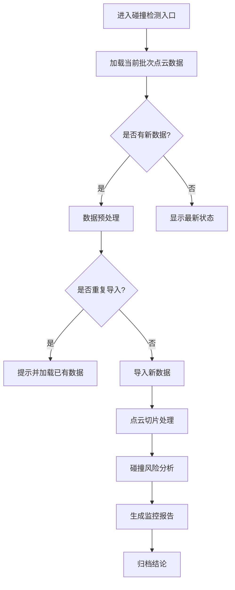
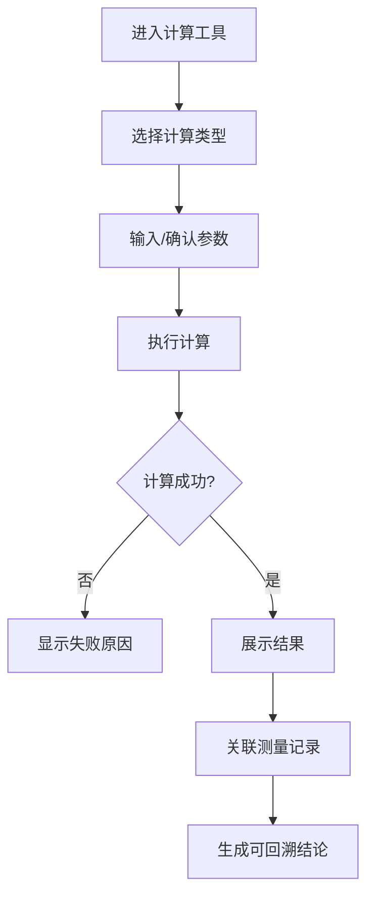
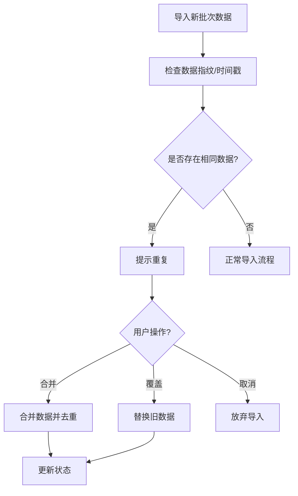

# 船舶压载水三维监控 PRD

## 1. 产品概述

面向运维主管的船舶压载水三维监控计算工具，用于日常点云切片整理与出问题时回看剖面图。

- 解决运维人员对压载水舱点云数据的整理、分析与归档需求
- 提供人可读懂的公式、单位、适用范围和失败原因说明
- 支持测量记录与最终结论的双向关联回溯

## 2. 核心功能

### 2.1 用户角色

| 角色 | 使用场景 | 核心功能 |
|------|---------|---------|
| 运维主管 | 日常点云切片整理、出问题时的剖面图回看 | 数据导入、切片处理、碰撞检测、结论归档 |
| 评审人员 | 评审会前的数据核算 | 计算工具、参数联动验证 |

### 2.2 功能模块

1. **碰撞检测入口** - 日常入口，用于压载水舱的点云数据监控
2. **点云切片处理** - 核心处理入口，整理切片、出问题时回看剖面
3. **计算工具** - 评审会前核算用，含公式、单位、适用范围、失败原因
4. **参数联动说明** - 月底/课前复盘用，解释参数间关系
5. **数据管理** - 重复导入检测、补录处理、去重机制

## 3. 核心流程

### 3.1 日常监控流程（碰撞检测入口）

### 3.2 评审会前核算流程

### 3.3 重复导入处理流程

## 4. 界面设计

### 4.1 设计风格

- **主色调**: 深海蓝 #1a365d + 科技灰 #2d3748
- **强调色**: 警示橙 #dd6b20（异常）| 通过绿 #38a169（正常）
- **按钮风格**: 圆角矩形，3D 立体感，带微光效果
- **字体**: 思源黑体（标题）+ 思源宋体（正文），便于技术文档阅读
- **布局**: 左侧导航 + 主内容区，采用卡片式信息组织

### 4.2 页面设计概览

| 页面名称 | 模块名称 | 界面元素 |
|---------|---------|---------|
| 碰撞检测入口 | 主监控面板 | 3D 点云预览、实时状态卡片、碰撞风险指示器 |
| 点云切片处理 | 切片管理 | 切片列表、剖面图切换、测量工具栏 |
| 计算工具 | 公式计算区 | 参数输入、公式展示、结果输出、失败原因提示 |
| 参数联动说明 | 参数关系图 | 可视化参数关系、联动逻辑说明、示例数据 |
| 数据管理 | 导入历史 | 导入记录表、去重状态、测量记录与结论映射 |

### 4.3 响应式设计

- **桌面优先**: 针对运维工作站优化
- **关键操作区**: 固定在视口左侧，便于快速切换
- **数据展示区**: 自适应宽度，最大化利用空间

## 5. 示例数据设计

### 5.1 首次加载示例

系统首次打开时预置以下示例数据：
- 3个压载水舱的模拟点云切片
- 2条历史测量记录
- 1份完整结论示例（含可点击回溯）

### 5.2 示例数据用途

- 运维主管无需手动造表即可理解工具
- 演示测量记录与结论的双向关联
- 展示重复导入提示的交互流程

## 6. 数据一致性保障

### 6.1 去重机制

- 数据导入时检查指纹/时间戳
- 相同数据拒绝重复入库
- 用户可选择合并或覆盖策略

### 6.2 状态同步

- 测量记录变更自动同步至关联结论
- 结论修改可回溯原始测量数据
- 避免同一事件出现两份独立结论

## 7. 测试场景

### 7.1 重复导入测试路径

1. 导入第一批示例数据
2. 再次导入相同数据 → 应提示重复
3. 选择合并 → 检查数据是否正确去重
4. 验证合并后结论是否唯一

### 7.2 补录测试路径

1. 导入不完整数据
2. 手动补录缺失测量值
3. 验证补录后数据与原始记录的关系
4. 检查是否出现两份独立结论
