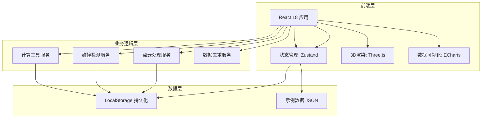
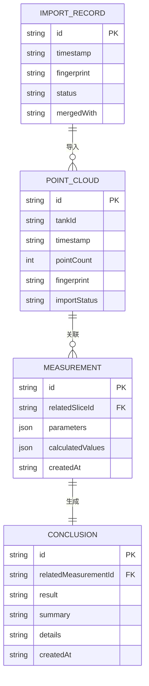

# 船舶压载水三维监控 技术架构

## 1. 架构设计



## 2. 技术选型

| 技术 | 版本 | 用途 |
|------|------|------|
| React | 18.x | UI 框架 |
| Vite | 5.x | 构建工具 |
| TailwindCSS | 3.x | 样式框架 |
| Three.js | 最新稳定版 | 3D 点云渲染 |
| ECharts | 5.x | 数据可视化 |
| Zustand | 4.x | 状态管理 |
| TypeScript | 5.x | 类型安全 |

## 3. 路由定义

| 路由 | 页面名称 | 功能描述 |
|------|---------|---------|
| / | 碰撞检测入口 | 日常监控主入口，点云数据加载与监控 |
| /slices | 点云切片处理 | 切片整理、剖面图查看、测量记录 |
| /calculator | 计算工具 | 公式计算、参数输入、结果展示 |
| /parameters | 参数联动说明 | 参数关系可视化、联动逻辑说明 |
| /data-management | 数据管理 | 导入历史、去重状态、结论映射 |

## 4. 页面详细设计

### 4.1 碰撞检测入口（首页）

```
┌─────────────────────────────────────────────────────────┐
│  [导航栏]                                                │
├─────────────────────────────────────────────────────────┤
│ ┌─────────────────┐ ┌─────────────────────────────────┐ │
│ │                 │ │ 实时状态面板                     │ │
│ │   3D 点云预览   │ │ - 当前批次: WB-TANK-01           │ │
│ │   (Three.js)    │ │ - 点数: 12,456                   │ │
│ │                 │ │ - 碰撞风险: 中                   │ │
│ │                 │ │ - 最后更新: 2026-06-07 10:30     │ │
│ └─────────────────┘ └─────────────────────────────────┘ │
│ ┌──────────────────────────────────────────────────────┐│
│ │ [导入新数据] [查看切片] [生成报告]                     ││
│ └──────────────────────────────────────────────────────┘│
└─────────────────────────────────────────────────────────┘
```

### 4.2 计算工具页面

```
┌─────────────────────────────────────────────────────────┐
│ 计算工具 - 压载水容量核算                                 │
├─────────────────────────────────────────────────────────┤
│ ┌──────────────────────────────────────────────────────┐│
│ │ 计算类型: [压载水容量 ▼]                               ││
│ ├──────────────────────────────────────────────────────┤│
│ │ 公式: V = π × r² × h                                  ││
│ │ 单位: 立方米 (m³)                                      ││
│ │ 适用范围: 圆柱形舱体，误差 < 3%                        ││
│ └──────────────────────────────────────────────────────┘│
│ ┌──────────────────────────────────────────────────────┐│
│ │ 参数输入:                                             ││
│ │ - 半径 r: [____] m                                    ││
│ │ - 高度 h: [____] m                                    ││
│ │                    [开始计算]                         ││
│ └──────────────────────────────────────────────────────┘│
│ ┌──────────────────────────────────────────────────────┐│
│ │ 计算结果: 125.6 m³                                    ││
│ │ 关联测量记录: [MR-2026-001] ← 点击回溯                 ││
│ │ 生成结论: [CL-2026-001] ← 点击回溯                     ││
│ └──────────────────────────────────────────────────────┘│
│ ┌──────────────────────────────────────────────────────┐│
│ │ ⚠️ 失败原因 (当计算失败时显示):                        ││
│ │ - 参数超出适用范围                                     ││
│ │ - 输入值非法 (负数、非数字)                             ││
│ └──────────────────────────────────────────────────────┘│
└─────────────────────────────────────────────────────────┘
```

## 5. 数据模型

### 5.1 核心实体

```typescript
// 点云切片
interface PointCloudSlice {
  id: string;
  tankId: string;
  timestamp: string;
  pointCount: number;
  crossSection: CrossSectionData;
  importStatus: 'new' | 'duplicate' | 'merged';
  fingerprint: string; // 用于去重检测
}

// 测量记录
interface MeasurementRecord {
  id: string;
  relatedSliceId: string;
  parameters: Record<string, number>;
  calculatedValues: Record<string, number>;
  createdAt: string;
  updatedAt: string;
}

// 结论
interface Conclusion {
  id: string;
  relatedMeasurementId: string;
  result: 'pass' | 'fail' | 'warning';
  summary: string;
  details: string;
  createdAt: string;
}

// 导入记录
interface ImportRecord {
  id: string;
  timestamp: string;
  fingerprint: string;
  status: 'success' | 'duplicate_detected' | 'failed';
  mergedWith?: string; // 合并到的记录ID
}
```

### 5.2 数据关系图



## 6. 示例数据结构

### 6.1 预置示例数据

```json
{
  "tanks": [
    {
      "id": "WB-TANK-01",
      "name": "1号压载舱",
      "capacity": 500,
      "currentFill": 350
    },
    {
      "id": "WB-TANK-02", 
      "name": "2号压载舱",
      "capacity": 500,
      "currentFill": 420
    },
    {
      "id": "WB-TANK-03",
      "name": "3号压载舱", 
      "capacity": 500,
      "currentFill": 280
    }
  ],
  "measurements": [
    {
      "id": "MR-2026-001",
      "tankId": "WB-TANK-01",
      "radius": 3.5,
      "height": 12.0,
      "volume": 461.8,
      "recordedAt": "2026-06-01T09:00:00Z"
    },
    {
      "id": "MR-2026-002",
      "tankId": "WB-TANK-02", 
      "radius": 3.5,
      "height": 12.0,
      "volume": 461.8,
      "recordedAt": "2026-06-05T14:30:00Z"
    }
  ],
  "conclusions": [
    {
      "id": "CL-2026-001",
      "measurementId": "MR-2026-001",
      "result": "pass",
      "summary": "1号压载舱容量正常",
      "details": "实际容积461.8m³，在标准范围内(±5%)"
    }
  ]
}
```

## 7. 关键业务逻辑

### 7.1 重复导入检测算法

```typescript
function checkDuplicate(newData: PointCloudSlice): DuplicateCheckResult {
  const existingData = getStoredData();
  const newFingerprint = generateFingerprint(newData);
  
  const duplicate = existingData.find(d => 
    d.fingerprint === newFingerprint &&
    d.importStatus !== 'merged'
  );
  
  if (duplicate) {
    return {
      isDuplicate: true,
      existingId: duplicate.id,
      options: ['merge', 'replace', 'cancel']
    };
  }
  
  return { isDuplicate: false };
}
```

### 7.2 数据一致性维护

1. **测量记录变更 → 同步结论**
   - 监听测量记录更新事件
   - 自动重新计算关联结论
   - 记录变更历史

2. **补录数据处理**
   - 标记数据来源为"补录"
   - 保持与原始记录的可追溯关系
   - 合并时保留所有版本引用

3. **去重合并策略**
   - 基于时间戳和指纹识别重复
   - 合并时保留最新值 + 历史版本引用
   - 确保同一事件只有一份有效结论

## 8. 计算工具公式库

### 8.1 压载水容量计算

| 公式名称 | 公式 | 单位 | 适用范围 | 失败原因 |
|---------|------|------|---------|---------|
| 圆柱形舱体容量 | V = π × r² × h | m³ | r > 0, h > 0 | r或h为负数或零 |
| 球形舱体容量 | V = (4/3) × π × r³ | m³ | r > 0 | r为负数或零 |
| 锥形舱体容量 | V = (1/3) × π × r² × h | m³ | r > 0, h > 0 | r或h为负数或零 |

### 8.2 碰撞风险评估

| 参数 | 公式 | 单位 | 正常范围 | 异常阈值 |
|------|------|------|---------|---------|
| 点密度 | ρ = N / V | points/m³ | 100-500 | <50 或 >1000 |
| 间距偏差 | δ = |d - d_avg| / d_avg | % | <15% | >25% |
| 碰撞指数 | CI = (1/V) × Σ(1/d²) | 1/m⁴ | <1000 | >2000 |

## 9. 性能优化

- **点云渲染**: 使用 InstancedMesh，按需加载切片
- **状态更新**: 使用 Immer 不可变更新，避免不必要的重渲染
- **数据存储**: 增量存储 + 压缩，定期清理过期数据
