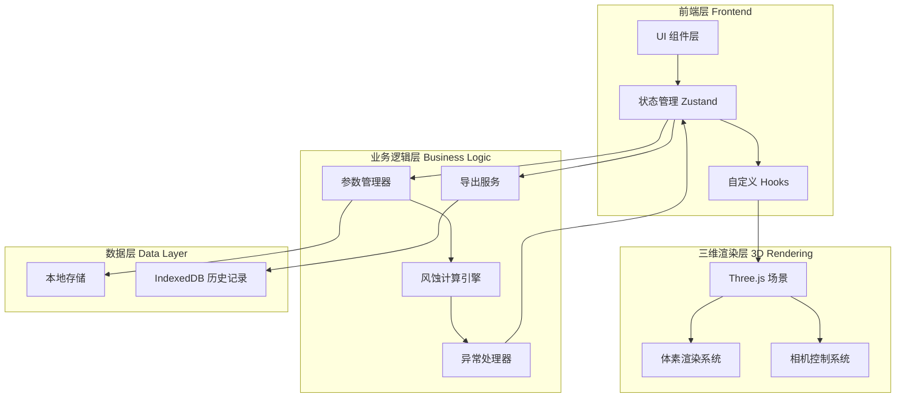
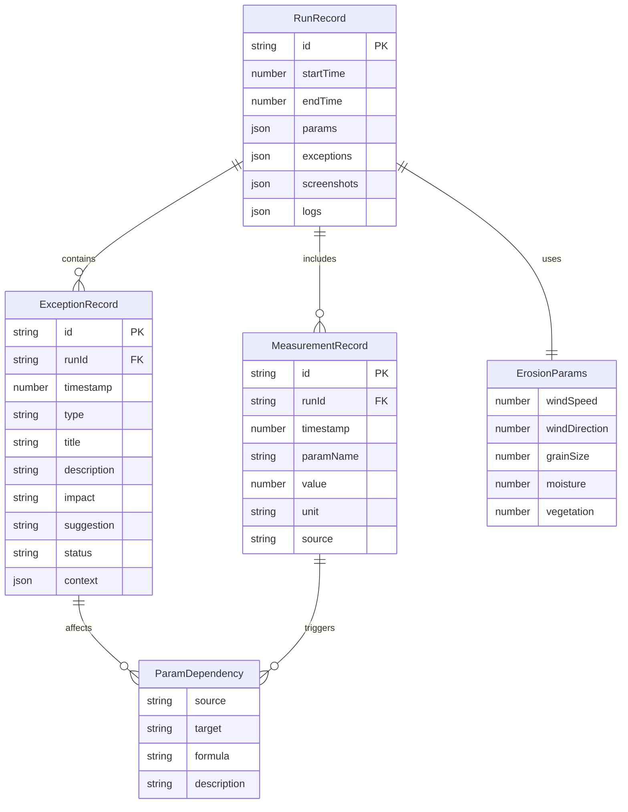

## 1. 架构设计



## 2. 技术说明

- **前端框架**：React 18 + TypeScript + Vite
- **样式方案**：Tailwind CSS 3 + CSS Variables（主题系统）
- **三维渲染**：Three.js + @react-three/fiber + @react-three/drei
- **状态管理**：Zustand（轻量级，支持持久化）
- **数据持久化**：LocalStorage（配置数据）+ IndexedDB（历史记录）
- **构建工具**：Vite 5
- **无后端**：纯前端应用，所有数据存储在本地

## 3. 路由定义

| 路由 | 用途 | 权限 |
|------|------|------|
| `/` | 重定向到三维演示页 | 所有用户 |
| `/demo` | 三维体素演示页面 | 所有用户 |
| `/params` | 参数配置页面 | 规划设计师、教师 |
| `/monitor` | 异常监控中心 | 所有用户 |
| `/export` | 结果导出页面 | 所有用户 |

## 4. 核心模块设计

### 4.1 三维渲染模块

```typescript
interface VoxelConfig {
  position: [number, number, number];
  size: number;
  color: string;
  height: number;
}

interface SceneState {
  voxels: VoxelConfig[];
  cameraPosition: Vector3;
  cameraTarget: Vector3;
  isCameraLost: boolean;
}

interface CameraPreset {
  name: string;
  position: [number, number, number];
  target: [number, number, number];
  description: string;
}
```

### 4.2 参数管理模块

```typescript
interface ErosionParams {
  windSpeed: number;
  windDirection: number;
  grainSize: number;
  moisture: number;
  vegetation: number;
}

interface MeasurementRecord {
  id: string;
  timestamp: number;
  paramName: string;
  value: number;
  unit: string;
  source: string;
}

interface ParamDependency {
  source: string;
  target: string;
  formula: string;
  description: string;
}
```

### 4.3 异常处理模块

```typescript
type ExceptionType = 'param_missing' | 'param_exceed' | 'camera_lost' | 'calc_error' | 'export_fail';

type ExceptionStatus = 'pending' | 'processing' | 'resolved';

interface ExceptionRecord {
  id: string;
  timestamp: number;
  type: ExceptionType;
  title: string;
  description: string;
  impact: string;
  suggestion: string;
  status: ExceptionStatus;
  relatedParams?: string[];
  context?: Record<string, unknown>;
}

interface ExceptionHandler {
  detect: () => ExceptionRecord[];
  classify: (error: Error) => ExceptionType;
  suggest: (type: ExceptionType, context: Record<string, unknown>) => string;
  resolve: (id: string) => void;
}
```

### 4.4 导出服务模块

```typescript
interface ExportConfig {
  includeScreenshots: boolean;
  includeParams: boolean;
  includeExceptions: boolean;
  includeLogs: boolean;
  format: 'pdf' | 'json' | 'html';
}

interface RunRecord {
  id: string;
  startTime: number;
  endTime: number;
  params: ErosionParams;
  exceptions: ExceptionRecord[];
  screenshots: string[];
  logs: LogEntry[];
}

interface ExportService {
  generateReport: (runId: string, config: ExportConfig) => Promise<Blob>;
  getFileName: (runId: string, format: string) => string;
}
```

## 5. 状态管理设计

### 5.1 Store 结构

```typescript
interface AppStore {
  // 场景状态
  scene: SceneState;
  
  // 参数状态
  params: ErosionParams;
  measurements: MeasurementRecord[];
  dependencies: ParamDependency[];
  
  // 异常状态
  exceptions: ExceptionRecord[];
  selectedException: string | null;
  
  // 运行记录
  currentRun: RunRecord | null;
  runHistory: RunRecord[];
  
  // UI 状态
  activeTab: string;
  isLoading: boolean;
  
  // Actions
  updateParams: (params: Partial<ErosionParams>) => void;
  addMeasurement: (record: MeasurementRecord) => void;
  triggerParamLinkage: (paramName: string) => void;
  addException: (exception: ExceptionRecord) => void;
  resolveException: (id: string) => void;
  startRun: () => void;
  endRun: () => void;
  exportReport: (config: ExportConfig) => Promise<void>;
}
```

### 5.2 参数联动机制

```typescript
const paramLinkageRules: ParamDependency[] = [
  {
    source: 'windSpeed',
    target: 'erosionRate',
    formula: 'erosionRate = windSpeed * 0.15',
    description: '风速影响侵蚀速率'
  },
  {
    source: 'grainSize',
    target: 'threshold',
    formula: 'threshold = grainSize * 2.5',
    description: '粒径影响启动阈值'
  },
  {
    source: 'moisture',
    target: 'cohesion',
    formula: 'cohesion = moisture * 0.8 + 0.2',
    description: '湿度影响沙粒粘聚力'
  }
];
```

## 6. 数据模型

### 6.1 实体关系图



### 6.2 IndexedDB Schema

```typescript
const dbSchema = {
  runs: {
    key: 'id',
    indexes: ['startTime', 'endTime']
  },
  exceptions: {
    key: 'id',
    indexes: ['runId', 'type', 'status', 'timestamp']
  },
  measurements: {
    key: 'id',
    indexes: ['runId', 'paramName', 'timestamp']
  }
};
```

## 7. 文件命名规范

导出文件命名格式：`dune_erosion_[时间戳]_[运行ID前8位].[格式]`

示例：
- `dune_erosion_20260607_143052_a3b4c5d6.pdf`
- `dune_erosion_20260607_143052_a3b4c5d6.json`

文件名包含：
1. 项目标识：`dune_erosion`
2. 时间戳：精确到秒，便于区分不同运行
3. 运行ID：前8位，唯一标识
4. 格式后缀：pdf/json/html

## 8. 异常处理策略

### 8.1 异常检测规则

| 异常类型 | 检测条件 | 触发时机 |
|----------|----------|----------|
| 参数缺失 | 必填参数为 null/undefined | 参数提交时、运行开始时 |
| 参数超限 | 参数值超出预设范围 | 参数变更时、运行开始时 |
| 相机视角丢失 | 相机位置/目标为 NaN 或无穷大 | 每帧渲染时 |
| 计算错误 | 风蚀计算抛出异常 | 计算过程中 |
| 导出失败 | 导出服务返回错误 | 导出操作时 |

### 8.2 异常恢复机制

```typescript
const exceptionRecovery: Record<ExceptionType, () => void> = {
  param_missing: () => navigateTo('/params'),
  param_exceed: () => highlightParamInUI(),
  camera_lost: () => resetCameraToDefault(),
  calc_error: () => rollbackToLastValidState(),
  export_fail: () => retryExport()
};
```

## 9. 性能优化策略

1. **体素渲染优化**
   - 使用 InstancedMesh 批量渲染体素
   - LOD（细节层次）根据相机距离动态调整
   - 视锥体剔除（Frustum Culling）

2. **状态更新优化**
   - 参数联动使用防抖（debounce 300ms）
   - 异常检测使用节流（throttle 1s）
   - 大量数据更新使用批量操作

3. **存储优化**
   - 历史记录按时间分片存储
   - 截图使用 WebP 格式压缩
   - 定期清理超过 30 天的记录