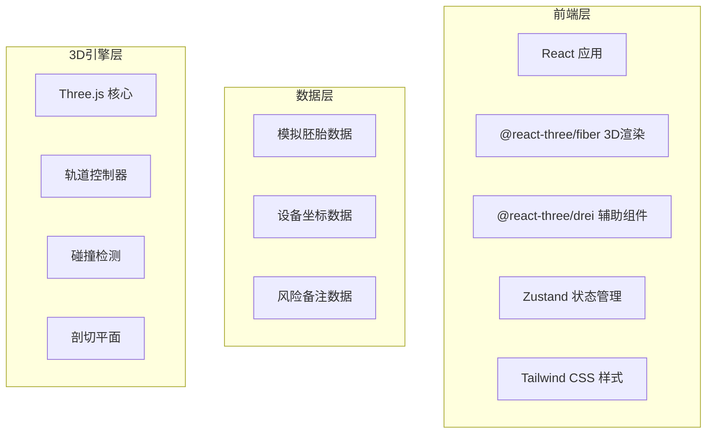
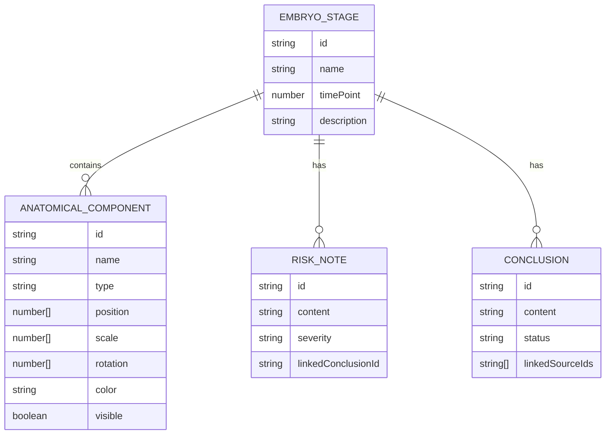

## 1. 架构设计



## 2. 技术描述
- **前端**: React@18 + TypeScript + Tailwind CSS@3 + Vite
- **3D引擎**: three@0.160 + @react-three/fiber@8 + @react-three/drei@9 + @react-three/postprocessing@2
- **状态管理**: zustand@4
- **初始化工具**: vite-init
- **后端**: 无（纯前端应用）
- **数据库**: 无（使用模拟数据）

## 3. 路由定义
| 路由 | 用途 |
|------|------|
| / | 主交互页面 |
| /test | 测试场景页面 |

## 4. 数据模型

### 4.1 数据模型定义



### 4.2 TypeScript 类型定义

```typescript
interface AnatomicalComponent {
  id: string;
  name: string;
  type: 'organ' | 'tissue' | 'structure';
  position: [number, number, number];
  scale: [number, number, number];
  rotation: [number, number, number];
  color: string;
  visible: boolean;
}

interface EmbryoStage {
  id: string;
  name: string;
  timePoint: number;
  description: string;
  components: AnatomicalComponent[];
}

interface RiskNote {
  id: string;
  content: string;
  severity: 'low' | 'medium' | 'high';
  linkedConclusionId: string;
}

interface Conclusion {
  id: string;
  content: string;
  status: 'verified' | 'needs_review';
  linkedSourceIds: string[];
}

interface AppState {
  currentStage: string;
  selectedComponent: string | null;
  isPlaying: boolean;
  timePosition: number;
  clipPlanePosition: [number, number, number];
  clipPlaneNormal: [number, number, number];
  filters: {
    stage?: string;
    type?: string;
  };
}
```
