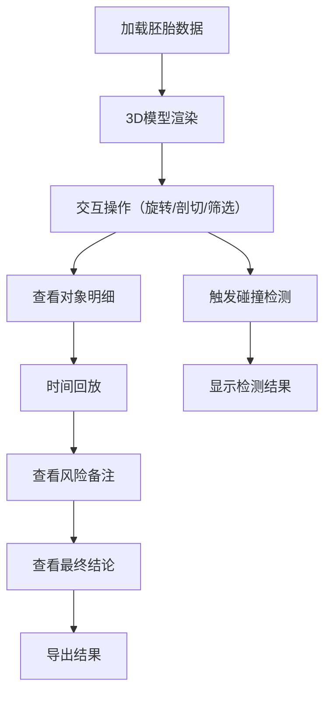

## 1. 产品概述
胚胎发育阶段立体卡是一个基于Three.js的交互式3D展示系统，用于展馆讲解员复核胚胎发育数据。系统解决了传统静态卡片展示方式无法直观查看内部结构和历史数据的问题。

## 2. 核心功能

### 2.1 用户角色
| 角色 | 注册方式 | 核心权限 |
|------|----------|----------|
| 展馆讲解员 | 无需注册 | 完整的查看、操作和导出权限 |

### 2.2 功能模块
1. **3D交互页面**: 胚胎模型旋转、剖切、筛选和对象明细联动
2. **剖切查看**: 可在任意平面剖切3D模型查看内部结构
3. **碰撞检测**: 检测模型组件间的空间关系
4. **时间回放**: 按时间轴回放胚胎发育过程
5. **风险备注与结论联动**: 快速跳转查看来源材料
6. **结果状态标记**: 区分可直接使用和需复核的内容
7. **错误处理**: 提供可操作的错误提示
8. **测试场景**: 内置重复导入测试路径

### 2.3 页面详情
| 页面名称 | 模块名称 | 功能描述 |
|----------|----------|----------|
| 主交互页 | 3D视口 | 展示胚胎模型，支持旋转、缩放、平移 |
| 主交互页 | 剖切控制 | 调节剖切平面位置和角度 |
| 主交互页 | 筛选面板 | 按发育阶段、组织类型筛选组件 |
| 主交互页 | 对象明细 | 显示选中组件的详细信息 |
| 主交互页 | 时间轴 | 回放发育过程，支持前进后退暂停 |
| 主交互页 | 风险备注 | 显示风险信息，支持跳转到结论 |
| 主交互页 | 结论面板 | 显示最终结论，支持返回来源材料 |
| 主交互页 | 状态标签 | 标记结果状态（可使用/需复核） |
| 主交互页 | 错误提示 | 显示具体的错误信息和解决建议 |

## 3. 核心流程

## 4. 用户界面设计

### 4.1 设计风格
- **主色调**: 深蓝 (#1e3a5f) 代表科技感，浅蓝 (#4a90e2) 作为辅助色
- **强调色**: 翡翠绿 (#2ecc71) 表示正常，珊瑚红 (#e74c3c) 表示需注意
- **按钮风格**: 圆角矩形，带有轻微阴影和悬停效果
- **字体**: 使用 Inter 作为主要字体，Fira Code 用于代码/数据展示
- **布局风格**: 左侧控制面板 + 中央3D视口 + 右侧信息面板
- **图标**: 使用 lucide-react 图标库，保持一致的线条风格

### 4.2 页面设计概述
| 页面名称 | 模块名称 | UI元素 |
|----------|----------|--------|
| 主交互页 | 3D视口 | 深色背景，带渐变光晕，居中展示3D模型 |
| 主交互页 | 控制面板 | 卡片式设计，悬停展开，带平滑过渡动画 |
| 主交互页 | 时间轴 | 底部横向布局，带刻度和播放控制按钮 |
| 主交互页 | 状态标签 | 右上角固定，彩色徽章式设计 |

### 4.3 响应性
桌面优先设计，适配1080p及以上分辨率，支持鼠标和触摸操作。

### 4.4 3D场景指导
- **环境**: 使用柔和的HDRI环境光，营造专业的医疗科技氛围
- **光照**: 三点光源设置，主光+补光+背光，突出模型细节
- **相机**: 初始视角为45度斜上方，支持轨道控制
- **交互**: 流畅的旋转和缩放，剖切时有平滑过渡动画
- **后处理**: 轻微的AO和辉光效果，提升视觉质量
- **性能**: 模型使用LOD，保证60fps帧率
