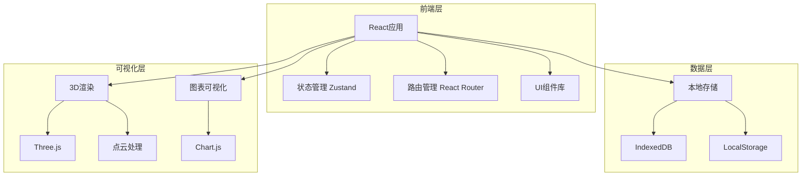
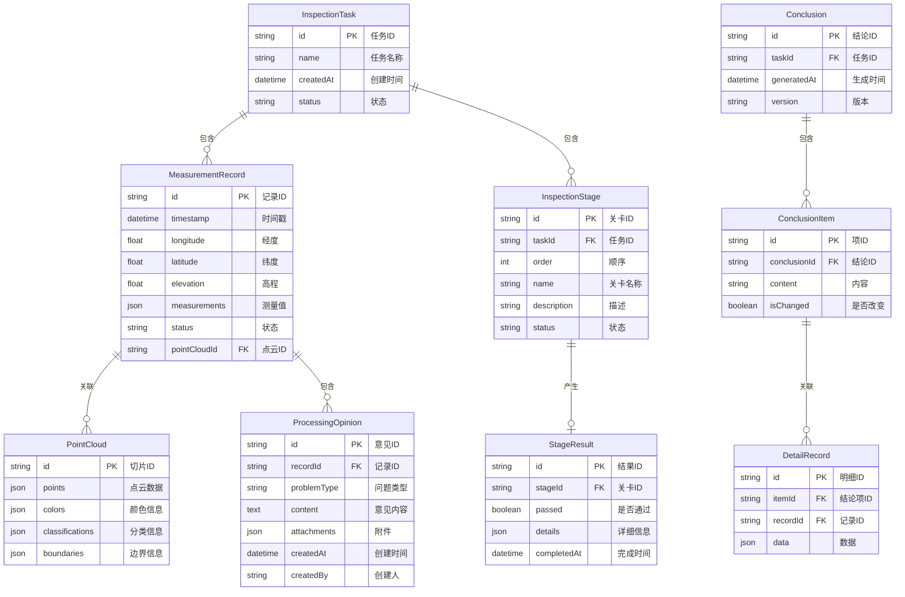

# 训练集嵌入空间巡检工具 - 技术架构文档

## 1. 架构设计



## 2. 技术说明

### 2.1 前端技术栈

- **框架**: React 18 + TypeScript
- **构建工具**: Vite
- **样式方案**: Tailwind CSS 3
- **状态管理**: Zustand
- **路由管理**: React Router DOM 6
- **3D可视化**: Three.js + @react-three/fiber + @react-three/drei
- **图表可视化**: Chart.js + react-chartjs-2
- **UI组件**: 自定义组件 + Lucide React 图标
- **数据存储**: IndexedDB + LocalStorage

### 2.2 初始化工具

- **项目初始化**: vite-init
- **模板选择**: react-ts（纯前端项目）

### 2.3 后端说明

本项目为纯前端应用，所有数据存储在浏览器本地，无需后端服务。

### 2.4 数据库说明

使用浏览器本地存储：
- **IndexedDB**: 存储大量结构化数据（测量记录、点云数据、处理意见）
- **LocalStorage**: 存储用户配置和会话信息

## 3. 路由定义

| 路由 | 用途 |
|-----|------|
| `/` | 重定向到工作台页面 |
| `/workbench` | 巡检工作台主页面 |
| `/inspection` | 巡检流程页面 |
| `/comparison` | 结论对比页面 |
| `/report` | 结算报告页面 |

## 4. 数据模型

### 4.1 数据模型定义



### 4.2 数据定义语言

```typescript
// 测量记录
interface MeasurementRecord {
  id: string;
  timestamp: Date;
  longitude: number;
  latitude: number;
  elevation: number;
  measurements: {
    waterLevel?: number;
    flowRate?: number;
    flowVelocity?: number;
  };
  status: 'normal' | 'abnormal' | 'pending';
  pointCloudId: string;
}

// 点云切片
interface PointCloud {
  id: string;
  points: Array<{ x: number; y: number; z: number }>;
  colors: Array<{ r: number; g: number; b: number }>;
  classifications: Array<string>;
  boundaries: {
    minX: number;
    maxX: number;
    minY: number;
    maxY: number;
    minZ: number;
    maxZ: number;
  };
}

// 处理意见
interface ProcessingOpinion {
  id: string;
  recordId: string;
  problemType: 'data_anomaly' | 'boundary_failure' | 'quality_issue' | 'missing_data' | 'duplicate_data' | 'format_error';
  content: string;
  attachments: Array<{ name: string; url: string; type: string }>;
  createdAt: Date;
  createdBy: string;
}

// 巡检任务
interface InspectionTask {
  id: string;
  name: string;
  createdAt: Date;
  status: 'pending' | 'in_progress' | 'completed';
  records: MeasurementRecord[];
  stages: InspectionStage[];
}

// 巡检关卡
interface InspectionStage {
  id: string;
  taskId: string;
  order: number;
  name: string;
  description: string;
  status: 'pending' | 'in_progress' | 'passed' | 'failed';
  result?: StageResult;
}

// 关卡结果
interface StageResult {
  id: string;
  stageId: string;
  passed: boolean;
  details: {
    failureReason?: string;
    affectedRecords?: string[];
    boundaryViolations?: Array<{ point: string; value: number; limit: number }>;
  };
  completedAt: Date;
}

// 结论
interface Conclusion {
  id: string;
  taskId: string;
  generatedAt: Date;
  version: number;
  items: ConclusionItem[];
}

// 结论项
interface ConclusionItem {
  id: string;
  conclusionId: string;
  content: string;
  isChanged: boolean;
  oldValue?: string;
  newValue?: string;
  details: DetailRecord[];
}

// 明细记录
interface DetailRecord {
  id: string;
  itemId: string;
  recordId: string;
  data: Record<string, any>;
}

// 应用状态
interface AppState {
  currentTask: InspectionTask | null;
  currentStage: InspectionStage | null;
  records: MeasurementRecord[];
  opinions: ProcessingOpinion[];
  conclusions: Conclusion[];
  user: {
    id: string;
    name: string;
    role: 'engineer' | 'reviewer';
  } | null;
}
```

## 5. 组件架构

### 5.1 组件层次结构

```
src/
├── components/
│   ├── common/
│   │   ├── Button.tsx
│   │   ├── Card.tsx
│   │   ├── Modal.tsx
│   │   ├── Table.tsx
│   │   └── Toolbar.tsx
│   ├── workbench/
│   │   ├── MeasurementRecordList.tsx
│   │   ├── PointCloudViewer.tsx
│   │   └── OpinionEditor.tsx
│   ├── inspection/
│   │   ├── StageProgress.tsx
│   │   ├── StagePanel.tsx
│   │   ├── BoundaryFailureDialog.tsx
│   │   └── UndoRedoControl.tsx
│   ├── comparison/
│   │   ├── ConclusionComparison.tsx
│   │   ├── ImpactVisualization.tsx
│   │   └── DetailPanel.tsx
│   └── report/
│       ├── SummaryCard.tsx
│       ├── IssueTable.tsx
│       └── StatisticsChart.tsx
├── pages/
│   ├── Workbench.tsx
│   ├── Inspection.tsx
│   ├── Comparison.tsx
│   └── Report.tsx
├── hooks/
│   ├── useIndexedDB.ts
│   ├── usePointCloud.ts
│   └── useInspection.ts
├── utils/
│   ├── db.ts
│   ├── pointCloudProcessor.ts
│   └── dataGenerator.ts
└── store/
    ├── useTaskStore.ts
    ├── useRecordStore.ts
    └── useUserStore.ts
```

### 5.2 核心组件说明

**PointCloudViewer 组件：**
- 使用 Three.js 和 @react-three/fiber 实现3D点云渲染
- 支持鼠标交互（旋转、缩放、平移）
- 支持在点云上添加标注点
- 使用 InstancedMesh 优化性能，支持百万级点云数据

**StagePanel 组件：**
- 显示当前关卡的检查内容
- 提供通过、失败、撤销、重开等操作按钮
- 自动检测边界条件失败

**ConclusionComparison 组件：**
- 左右分栏布局，并排展示新旧结论
- 差异部分使用高亮颜色标记
- 支持点击结论项联动显示明细记录

## 6. 性能优化策略

### 6.1 点云渲染优化

- **LOD（Level of Detail）**: 根据相机距离动态调整点云密度
- **视锥剔除**: 只渲染视锥内的点云数据
- **点云压缩**: 使用 Draco 压缩算法减少数据量
- **分块加载**: 将大点云分块，按需加载

### 6.2 数据查询优化

- **索引优化**: 在 IndexedDB 中为常用查询字段创建索引
- **分页加载**: 测量记录列表支持分页，避免一次性加载大量数据
- **缓存策略**: 使用 LocalStorage 缓存常用配置和会话信息

### 6.3 渲染性能优化

- **虚拟列表**: 长列表使用虚拟滚动，只渲染可见项
- **防抖节流**: 频繁操作使用防抖和节流
- **懒加载**: 非关键组件延迟加载

## 7. 样例数据生成

### 7.1 样例数据生成策略

系统启动时自动生成样例数据，包含：
- 100条测量记录
- 10个点云切片
- 20条处理意见
- 1个完整的巡检任务（包含5个关卡）
- 5个典型的坏数据案例

### 7.2 坏数据案例设计

1. **边界条件失败案例**：
   - 点云数据中某些点超出预设边界范围
   - 触发边界失败检测
   - 提供撤销和重开操作演示

2. **数据缺失案例**：
   - 测量记录中部分字段为空
   - 触发数据完整性检查
   - 提供补录操作演示

3. **数据异常案例**：
   - 测量值超出合理范围（如水位为负数）
   - 触发数据合理性检查
   - 提供人工确认操作演示

4. **重复数据案例**：
   - 同一位置多次测量结果不一致
   - 触发数据一致性检查
   - 提供重复运行操作演示

5. **格式错误案例**：
   - 数据格式不符合规范（如时间格式错误）
   - 触发格式验证
   - 提供修正操作演示

## 8. 开发计划

### 8.1 第一阶段：基础框架搭建

- 项目初始化和依赖安装
- 路由配置和页面框架
- 状态管理设置
- 数据库初始化

### 8.2 第二阶段：核心功能开发

- 巡检工作台组件开发
- 点云查看器实现
- 巡检流程实现
- 结论对比功能实现

### 8.3 第三阶段：完善和优化

- 结算报告功能实现
- 样例数据生成
- 性能优化
- 测试和调试

### 8.4 第四阶段：部署和交付

- 构建优化
- 用户文档编写
- 最终测试和验收