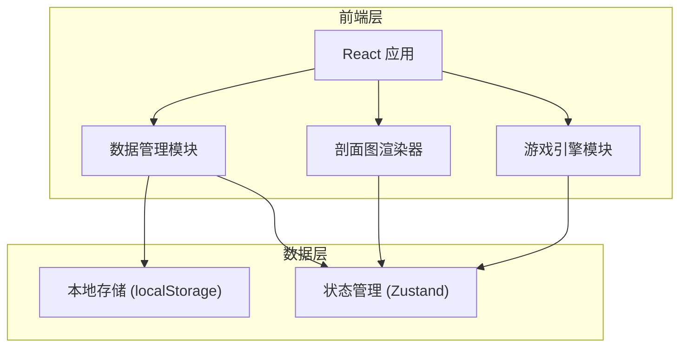
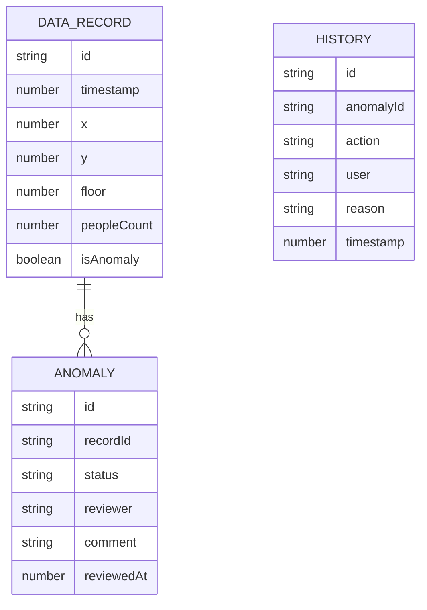

## 1. 架构设计



## 2. 技术描述

- 前端: React@18 + TypeScript + Tailwind CSS + Vite
- 初始化工具: vite-init
- 后端: 无（纯前端应用）
- 数据库: localStorage + 内存状态管理
- 图表库: 使用 Canvas 绘制剖面图
- 状态管理: Zustand

## 3. 路由定义

| 路由 | 用途 |
|-----|------|
| / | 主界面 - 游戏控制和剖面图展示 |
| /compare | 剖面图对比页 |
| /anomalies | 异常处理页 |

## 4. 数据模型

### 4.1 数据模型定义



### 4.2 TypeScript 类型定义

```typescript
interface DataRecord {
  id: string;
  timestamp: number;
  x: number;
  y: number;
  floor: number;
  peopleCount: number;
  isAnomaly: boolean;
}

interface Anomaly {
  id: string;
  recordId: string;
  status: 'pending' | 'confirmed' | 'dismissed';
  reviewer: string;
  comment: string;
  reviewedAt: number;
}

interface HistoryEntry {
  id: string;
  anomalyId: string;
  action: 'created' | 'confirmed' | 'dismissed' | 'updated';
  user: string;
  reason: string;
  timestamp: number;
}

interface ProfileSnapshot {
  id: string;
  timestamp: number;
  data: DataRecord[];
  version: number;
}
```

## 5. 核心模块设计

### 5.1 游戏引擎模块
- 管理游戏状态（开始、暂停、重开、结算、复盘）
- 碰撞检测逻辑
- 视角保存与恢复
- 统一使用同一批处理记录

### 5.2 剖面图渲染器
- Canvas 绘制剖面图
- 支持缩放和平移
- 离群点高亮显示
- 新旧剖面图对比

### 5.3 数据管理模块
- 数据导入导出
- 历史记录管理
- 状态持久化
