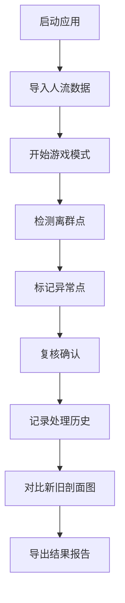

## 1. 产品概述

地铁换乘楼层人流数据分析工具，用于检测、分析和处理换乘楼层人流数据中的异常离群点。通过游戏化的交互方式，让物理老师能够直观地发现、复核和记录数据异常。

## 2. 核心功能

### 2.1 用户角色
| 角色 | 注册方式 | 核心权限 |
|------|---------|---------|
| 物理老师 | 无需注册 | 完整使用所有功能 |

### 2.2 功能模块
1. **主界面**：游戏控制、数据导入、剖面图展示
2. **剖面图对比**：新旧剖面图并排展示
3. **异常处理**：离群点标记、复核、历史记录
4. **结果导出**：处理报告导出

### 2.3 页面详情
| 页面名称 | 模块名称 | 功能描述 |
|---------|---------|---------|
| 主界面 | 游戏控制面板 | 开始、暂停、重开、结算、复盘按钮 |
| 主界面 | 数据导入区 | 导入人流数据记录 |
| 主界面 | 剖面图展示区 | 实时显示人流剖面图 |
| 剖面图对比页 | 左右对比区 | 并排显示新旧剖面图 |
| 异常处理页 | 离群点列表 | 显示所有检测到的离群点 |
| 异常处理页 | 历史记录区 | 显示离群点处理历史 |

## 3. 核心流程

物理老师启动应用 → 导入人流数据 → 开始游戏模式检测离群点 → 发现异常并标记 → 复核确认 → 记录处理意见 → 对比新旧剖面图 → 导出结果报告。

## 4. 用户界面设计

### 4.1 设计风格
- 主色调：深蓝色（#1e3a8a）、青色（#0ea5e9）
- 按钮风格：圆角矩形，悬浮有光影效果
- 字体：JetBrains Mono（代码）和 Noto Sans SC（中文）
- 布局风格：卡片式布局，清晰的模块分隔
- 图标风格：使用 lucide-react 线性图标

### 4.2 页面设计概述
| 页面名称 | 模块名称 | UI元素 |
|---------|---------|--------|
| 主界面 | 游戏控制面板 | 深色背景，明亮按钮，状态指示器 |
| 主界面 | 剖面图展示区 | 渐变背景，网格线，可交互点 |
| 剖面图对比页 | 左右对比区 | 分栏布局，同步缩放 |
| 异常处理页 | 历史记录区 | 时间线样式，清晰的用户和时间信息 |

### 4.3 响应性
桌面端优先，支持平板适配。

### 4.4 视觉效果
- 使用粒子效果模拟人流流动
- 剖面图使用渐变填充和动态线条
- 离群点有高亮闪烁效果
- 按钮点击有反馈动画
