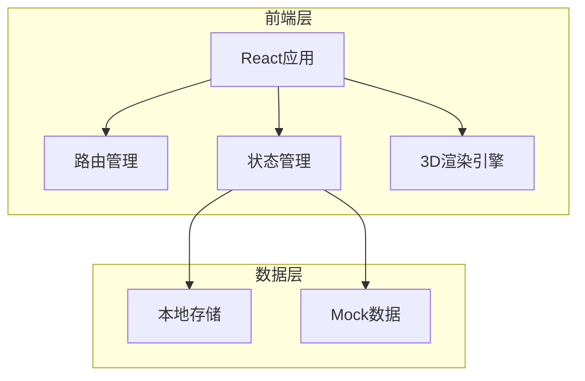
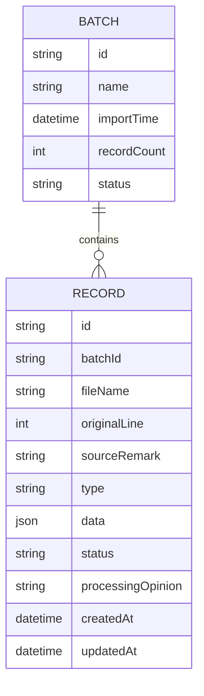

## 1. Architecture Design



## 2. Technology Description
- Frontend: React@18 + TypeScript + tailwindcss@3 + vite
- Initialization Tool: vite-init
- 3D Engine: three.js + @react-three/fiber + @react-three/drei
- State Management: React hooks + localStorage
- File Parsing: xlsx (Excel解析), papaparse (CSV解析)

## 3. Route Definitions
| Route | Purpose |
|-------|---------|
| / | 首页 - 参数联动入口 |
| /import | 数据导入页面 |
| /filter | 异常筛选页面 |
| /detail/:id | 详情页面 |
| /section | 剖切分析页面 |

## 4. Data Model
### 4.1 Data Model Definition


### 4.2 Data Types
```typescript
interface Record {
  id: string;
  batchId: string;
  fileName: string;
  originalLine: number;
  sourceRemark: string;
  type: 'buoy' | 'model' | 'coordinate';
  data: any;
  status: 'normal' | 'duplicate' | 'conflict' | 'missing_camera';
  processingOpinion?: string;
  createdAt: Date;
  updatedAt: Date;
}

interface Batch {
  id: string;
  name: string;
  importTime: Date;
  recordCount: number;
  status: 'processing' | 'completed' | 'error';
}

interface SectionData {
  id: string;
  recordId: string;
  sliceData: any;
  conclusion: string;
}
```
